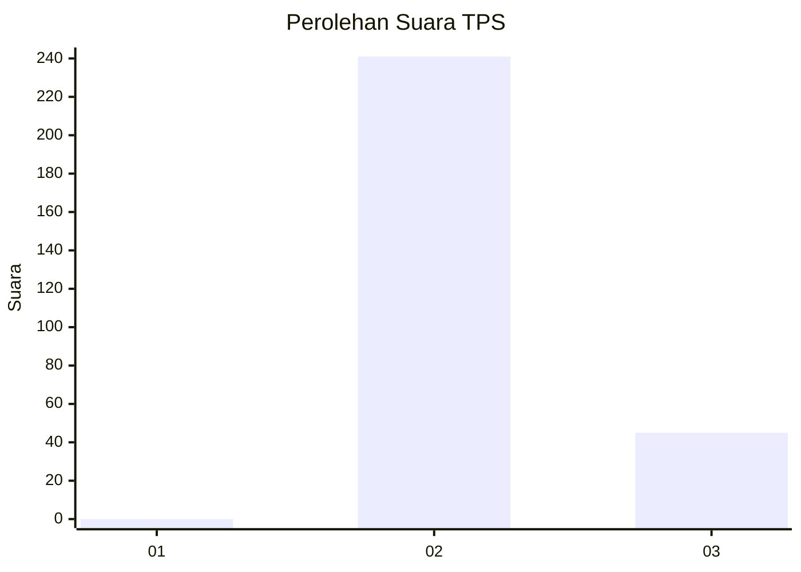
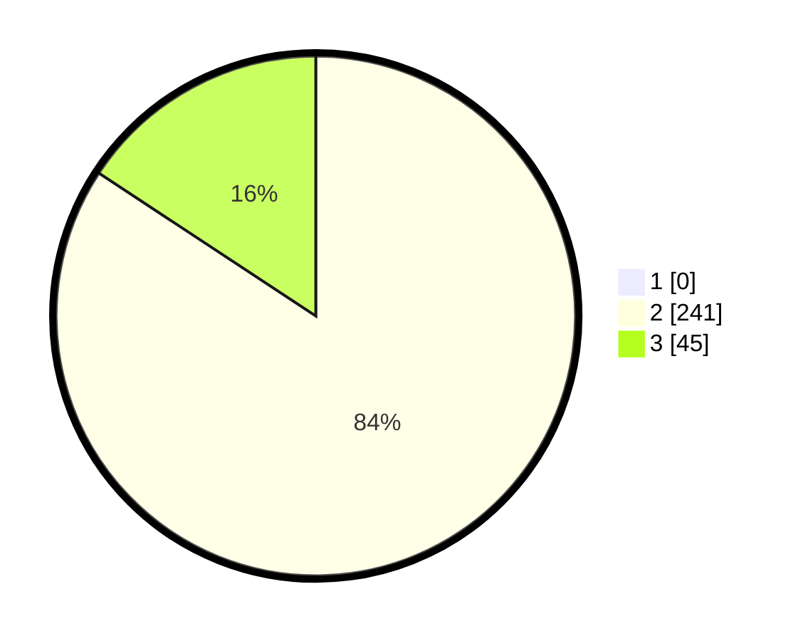

# Hasil

## Grafik

## Tabel

| No. | Nama Paslon    | Suara | Suara (raw) | Persentase |
|:--- |:-------------- | -----:| -----------:| ----------:|
| 1   | ANIES MUHAIMIN | 0     | [0][p-1]    | 0,00       |
| 2   | PRABOWO GIBRAN | 241   | [241][p-2]  | 84,27      |
| 3   | GANJAR MAHFUD  | 45    | [45][p-3]   | 15,73      |

[p-1]: https://github.com/gigit-pemilu/pemilu-2024-35-jawa-timur/blob/main/pilpres/hitung-suara/sub/35-jawa-timur/sub/27-sampang/sub/02-torjun/sub/2012-torjun/sub/015-tps/sub/paslon-1.txt
[p-2]: https://github.com/gigit-pemilu/pemilu-2024-35-jawa-timur/blob/main/pilpres/hitung-suara/sub/35-jawa-timur/sub/27-sampang/sub/02-torjun/sub/2012-torjun/sub/015-tps/sub/paslon-2.txt
[p-3]: https://github.com/gigit-pemilu/pemilu-2024-35-jawa-timur/blob/main/pilpres/hitung-suara/sub/35-jawa-timur/sub/27-sampang/sub/02-torjun/sub/2012-torjun/sub/015-tps/sub/paslon-3.txt

## Foto C Plano

https://sirekap-obj-formc.kpu.go.id/6e6a/pemilu/ppwp/35/27/02/20/12/3527022012015-20240214-230114--17590db2-d9b1-49eb-aceb-56cb47f88ead.jpg

https://sirekap-obj-formc.kpu.go.id/6e6a/pemilu/ppwp/35/27/02/20/12/3527022012015-20240214-230319--1297bbee-e205-421d-84c0-c136b9285f40.jpg

https://sirekap-obj-formc.kpu.go.id/6e6a/pemilu/ppwp/35/27/02/20/12/3527022012015-20240214-230503--a491367e-f060-4292-a5f0-7d6e71413230.jpg

## Metadata

| Key        | Value               |
| ---------- | ------------------- |
| Time Stamp | 2024-02-16 10:00:28 |

