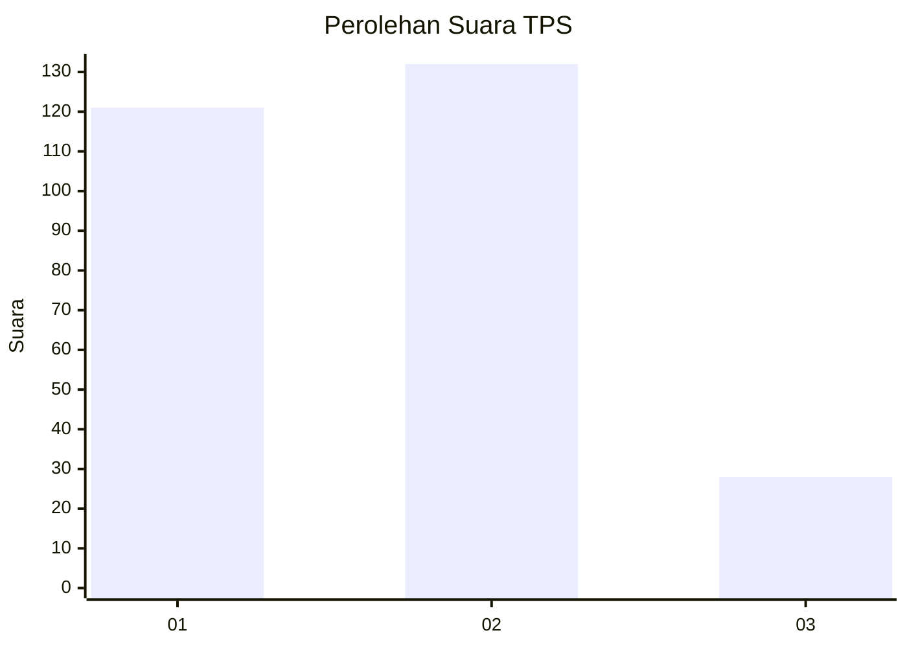
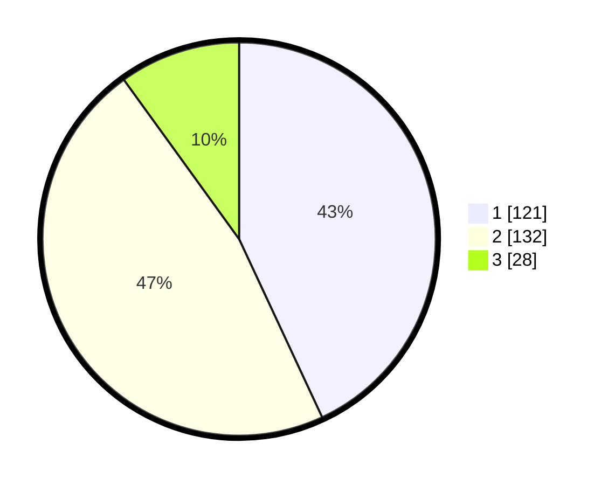

# Hasil

## Grafik

## Tabel

| No. | Nama Paslon    | Suara | Suara (raw) | Persentase |
|:--- |:-------------- | -----:| -----------:| ----------:|
| 1   | ANIES MUHAIMIN | 121   | [121][p-1]  | 43,06      |
| 2   | PRABOWO GIBRAN | 132   | [132][p-2]  | 46,98      |
| 3   | GANJAR MAHFUD  | 28    | [28][p-3]   | 9,96       |

[p-1]: https://github.com/gigit-pemilu/pemilu-2024-35-jawa-timur/blob/main/pilpres/hitung-suara/sub/35-jawa-timur/sub/27-sampang/sub/02-torjun/sub/2014-jeruk-porot/sub/002-tps/sub/paslon-1.txt
[p-2]: https://github.com/gigit-pemilu/pemilu-2024-35-jawa-timur/blob/main/pilpres/hitung-suara/sub/35-jawa-timur/sub/27-sampang/sub/02-torjun/sub/2014-jeruk-porot/sub/002-tps/sub/paslon-2.txt
[p-3]: https://github.com/gigit-pemilu/pemilu-2024-35-jawa-timur/blob/main/pilpres/hitung-suara/sub/35-jawa-timur/sub/27-sampang/sub/02-torjun/sub/2014-jeruk-porot/sub/002-tps/sub/paslon-3.txt

## Foto C Plano

https://sirekap-obj-formc.kpu.go.id/3c9d/pemilu/ppwp/35/27/02/20/14/3527022014002-20240214-194308--d9795bb0-b9d0-450a-8b2f-34cd710dcd3e.jpg

https://sirekap-obj-formc.kpu.go.id/3c9d/pemilu/ppwp/35/27/02/20/14/3527022014002-20240214-141843--016388e6-187a-4bc5-93f7-e12637e320a2.jpg

https://sirekap-obj-formc.kpu.go.id/3c9d/pemilu/ppwp/35/27/02/20/14/3527022014002-20240214-141919--dd6fb852-991e-4ad4-85cf-01f9baeab002.jpg

## Metadata

| Key        | Value               |
| ---------- | ------------------- |
| Time Stamp | 2024-02-16 10:00:28 |

