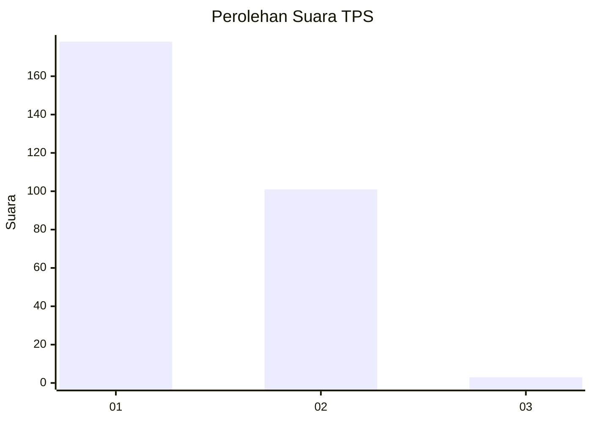
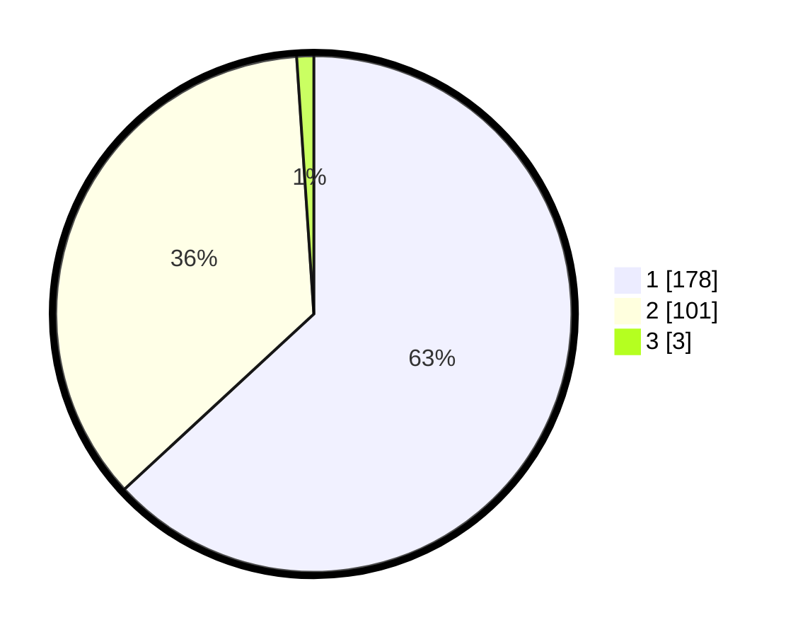

# Hasil

## Grafik

## Tabel

| No. | Nama Paslon    | Suara | Suara (raw) | Persentase |
|:--- |:-------------- | -----:| -----------:| ----------:|
| 1   | ANIES MUHAIMIN | 178   | [178][p-1]  | 63,12      |
| 2   | PRABOWO GIBRAN | 101   | [101][p-2]  | 35,82      |
| 3   | GANJAR MAHFUD  | 3     | [3][p-3]    | 1,06       |

[p-1]: https://github.com/gigit-pemilu/pemilu-2024/blob/main/pilpres/hitung-suara/sub/35-jawa-timur/sub/27-sampang/sub/02-torjun/sub/2014-jeruk-porot/sub/003-tps/sub/paslon-1.txt
[p-2]: https://github.com/gigit-pemilu/pemilu-2024/blob/main/pilpres/hitung-suara/sub/35-jawa-timur/sub/27-sampang/sub/02-torjun/sub/2014-jeruk-porot/sub/003-tps/sub/paslon-2.txt
[p-3]: https://github.com/gigit-pemilu/pemilu-2024/blob/main/pilpres/hitung-suara/sub/35-jawa-timur/sub/27-sampang/sub/02-torjun/sub/2014-jeruk-porot/sub/003-tps/sub/paslon-3.txt

## Foto C Plano

https://sirekap-obj-formc.kpu.go.id/311c/pemilu/ppwp/35/27/02/20/14/3527022014003-20240214-204248--b85cb8f4-6c84-4cec-9594-9781621fe9de.jpg

https://sirekap-obj-formc.kpu.go.id/311c/pemilu/ppwp/35/27/02/20/14/3527022014003-20240214-204302--ec8a63c3-564c-47c9-8391-c8b5ffe2b336.jpg

https://sirekap-obj-formc.kpu.go.id/311c/pemilu/ppwp/35/27/02/20/14/3527022014003-20240214-204341--3134a9c2-ef4e-4de4-af42-a7b804329b1f.jpg

## Metadata

| Key        | Value               |
| ---------- | ------------------- |
| Time Stamp | 2024-02-16 12:51:22 |

