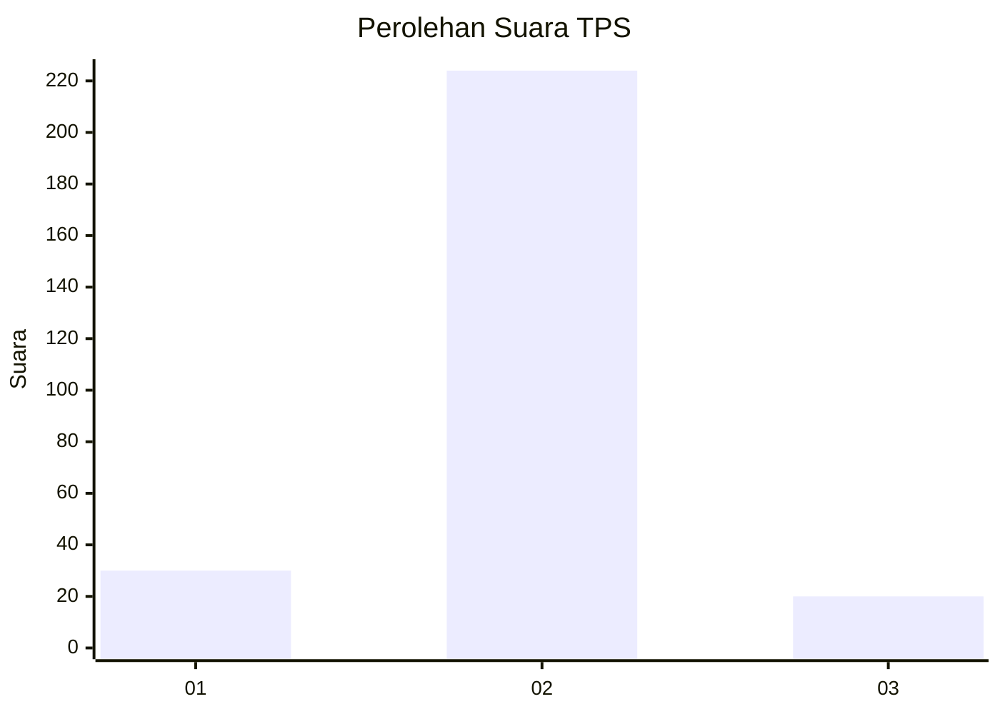
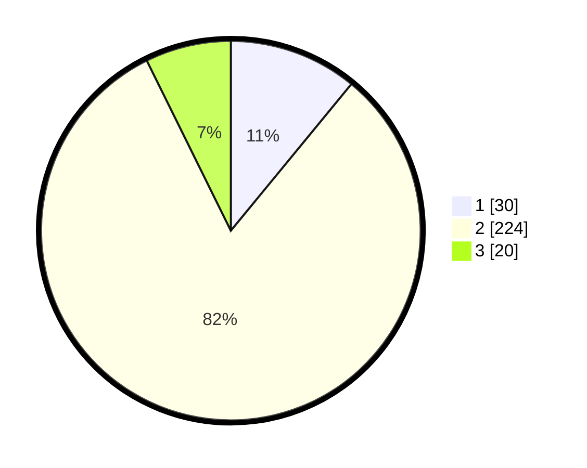

# Hasil

## Grafik

## Tabel

| No. | Nama Paslon    | Suara | Suara (raw) | Persentase |
|:--- |:-------------- | -----:| -----------:| ----------:|
| 1   | ANIES MUHAIMIN | 30    | [30][p-1]   | 10,95      |
| 2   | PRABOWO GIBRAN | 224   | [224][p-2]  | 81,75      |
| 3   | GANJAR MAHFUD  | 20    | [20][p-3]   | 7,30       |

[p-1]: https://github.com/gigit-pemilu/pemilu-2024-35-jawa-timur/blob/main/pilpres/hitung-suara/sub/35-jawa-timur/sub/27-sampang/sub/02-torjun/sub/2015-kodak/sub/001-tps/sub/paslon-1.txt
[p-2]: https://github.com/gigit-pemilu/pemilu-2024-35-jawa-timur/blob/main/pilpres/hitung-suara/sub/35-jawa-timur/sub/27-sampang/sub/02-torjun/sub/2015-kodak/sub/001-tps/sub/paslon-2.txt
[p-3]: https://github.com/gigit-pemilu/pemilu-2024-35-jawa-timur/blob/main/pilpres/hitung-suara/sub/35-jawa-timur/sub/27-sampang/sub/02-torjun/sub/2015-kodak/sub/001-tps/sub/paslon-3.txt

## Foto C Plano

https://sirekap-obj-formc.kpu.go.id/514c/pemilu/ppwp/35/27/02/20/15/3527022015001-20240214-223625--b4c54db1-2b06-4451-8b3a-3ce30e901c24.jpg

https://sirekap-obj-formc.kpu.go.id/514c/pemilu/ppwp/35/27/02/20/15/3527022015001-20240214-223809--970a40a3-36a3-427e-8bfd-4a77d969e840.jpg

https://sirekap-obj-formc.kpu.go.id/514c/pemilu/ppwp/35/27/02/20/15/3527022015001-20240214-223939--c3bae970-7376-40a2-8b97-d57c074b1aaf.jpg

## Metadata

| Key        | Value               |
| ---------- | ------------------- |
| Time Stamp | 2024-02-16 10:00:28 |

