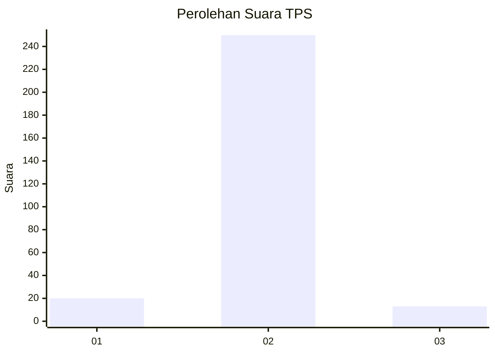
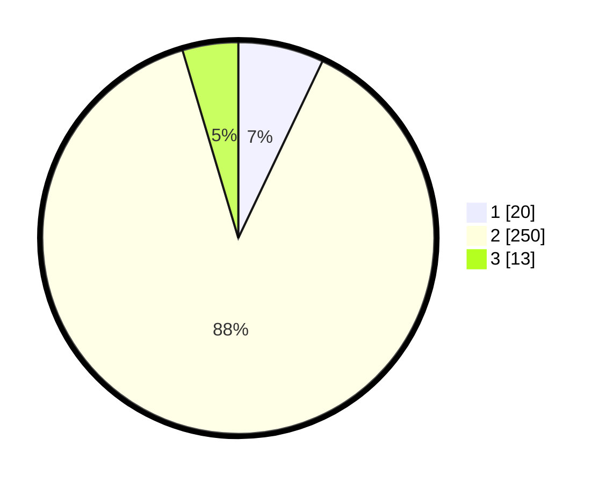

# Hasil

## Grafik

## Tabel

| No. | Nama Paslon    | Suara | Suara (raw) | Persentase |
|:--- |:-------------- | -----:| -----------:| ----------:|
| 1   | ANIES MUHAIMIN | 20    | [20][p-1]   | 7,07       |
| 2   | PRABOWO GIBRAN | 250   | [250][p-2]  | 88,34      |
| 3   | GANJAR MAHFUD  | 13    | [13][p-3]   | 4,59       |

[p-1]: https://github.com/gigit-pemilu/pemilu-2024-35-jawa-timur/blob/main/pilpres/hitung-suara/sub/35-jawa-timur/sub/27-sampang/sub/02-torjun/sub/2015-kodak/sub/002-tps/sub/paslon-1.txt
[p-2]: https://github.com/gigit-pemilu/pemilu-2024-35-jawa-timur/blob/main/pilpres/hitung-suara/sub/35-jawa-timur/sub/27-sampang/sub/02-torjun/sub/2015-kodak/sub/002-tps/sub/paslon-2.txt
[p-3]: https://github.com/gigit-pemilu/pemilu-2024-35-jawa-timur/blob/main/pilpres/hitung-suara/sub/35-jawa-timur/sub/27-sampang/sub/02-torjun/sub/2015-kodak/sub/002-tps/sub/paslon-3.txt

## Foto C Plano

https://sirekap-obj-formc.kpu.go.id/9a57/pemilu/ppwp/35/27/02/20/15/3527022015002-20240214-223444--f54eabfc-bb62-4e1e-b7a5-6357a30f6667.jpg

https://sirekap-obj-formc.kpu.go.id/9a57/pemilu/ppwp/35/27/02/20/15/3527022015002-20240214-224947--bb3080e6-3c26-44df-b08c-b6ff8d69e1be.jpg

https://sirekap-obj-formc.kpu.go.id/9a57/pemilu/ppwp/35/27/02/20/15/3527022015002-20240214-225036--c7db0cda-c38c-496f-b0e1-32a5a8493844.jpg

## Metadata

| Key        | Value               |
| ---------- | ------------------- |
| Time Stamp | 2024-02-16 10:30:29 |

