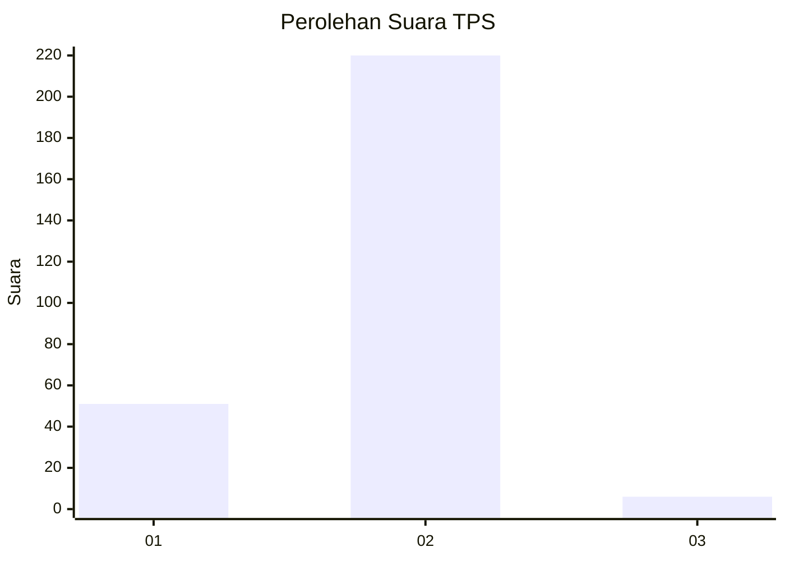
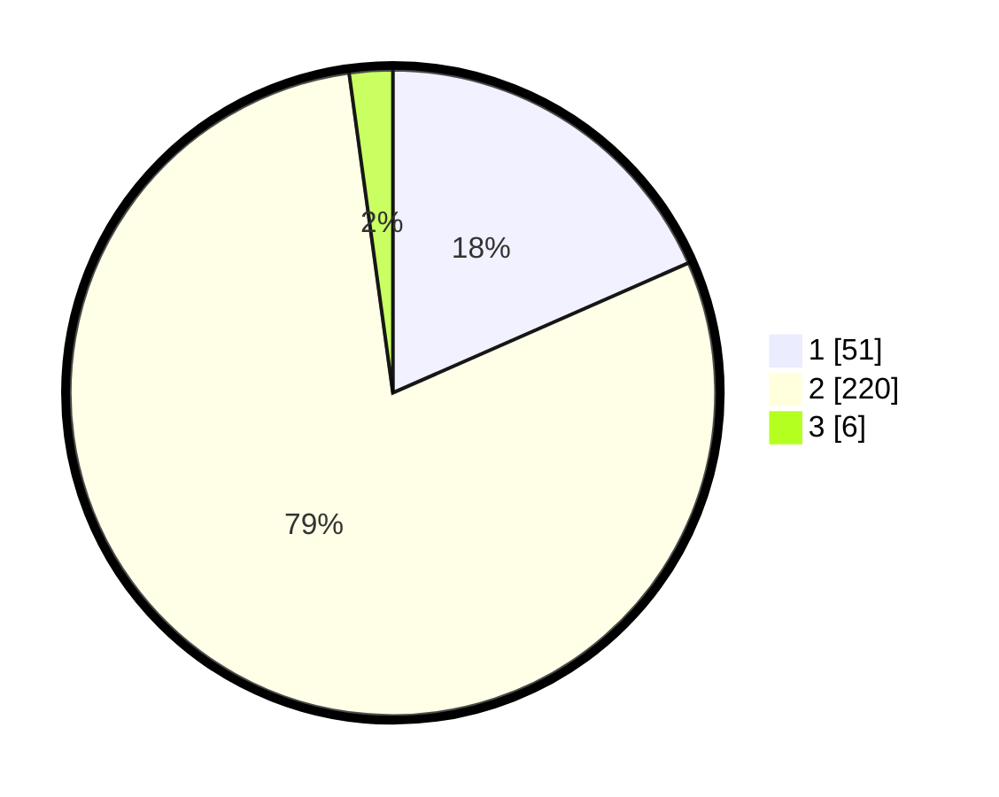

# Hasil

## Grafik

## Tabel

| No. | Nama Paslon    | Suara | Suara (raw) | Persentase |
|:--- |:-------------- | -----:| -----------:| ----------:|
| 1   | ANIES MUHAIMIN | 51    | [51][p-1]   | 18,41      |
| 2   | PRABOWO GIBRAN | 220   | [220][p-2]  | 79,42      |
| 3   | GANJAR MAHFUD  | 6     | [6][p-3]    | 2,17       |

[p-1]: https://github.com/gigit-pemilu/pemilu-2024/blob/main/pilpres/hitung-suara/sub/35-jawa-timur/sub/27-sampang/sub/02-torjun/sub/2015-kodak/sub/003-tps/sub/paslon-1.txt
[p-2]: https://github.com/gigit-pemilu/pemilu-2024/blob/main/pilpres/hitung-suara/sub/35-jawa-timur/sub/27-sampang/sub/02-torjun/sub/2015-kodak/sub/003-tps/sub/paslon-2.txt
[p-3]: https://github.com/gigit-pemilu/pemilu-2024/blob/main/pilpres/hitung-suara/sub/35-jawa-timur/sub/27-sampang/sub/02-torjun/sub/2015-kodak/sub/003-tps/sub/paslon-3.txt

## Foto C Plano

https://sirekap-obj-formc.kpu.go.id/7f4e/pemilu/ppwp/35/27/02/20/15/3527022015003-20240214-220936--9cb75030-b431-45cb-b5e9-ed5e5b7f92e9.jpg

https://sirekap-obj-formc.kpu.go.id/7f4e/pemilu/ppwp/35/27/02/20/15/3527022015003-20240214-221257--205202f8-19c0-46d1-b6f9-0fedddc3298c.jpg

https://sirekap-obj-formc.kpu.go.id/7f4e/pemilu/ppwp/35/27/02/20/15/3527022015003-20240214-221735--88baa50d-d0bc-458c-a878-c2968f868f05.jpg

## Metadata

| Key        | Value               |
| ---------- | ------------------- |
| Time Stamp | 2024-02-16 10:30:29 |

