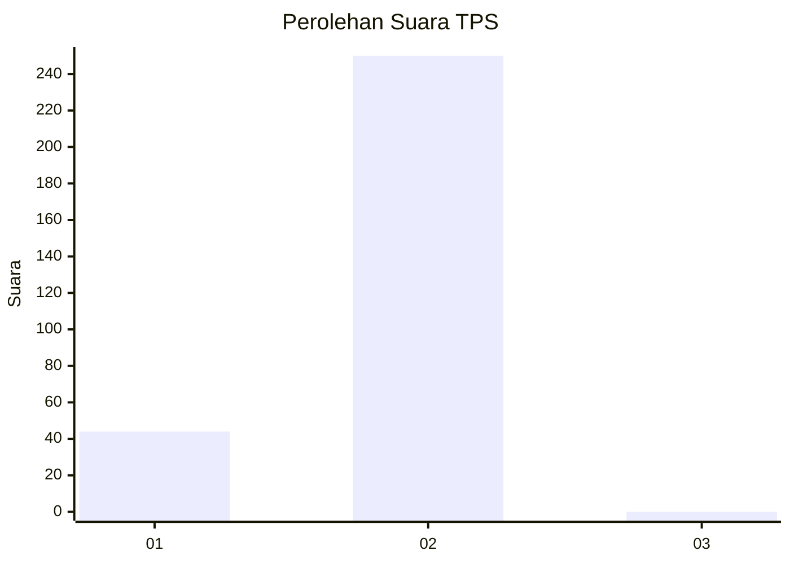
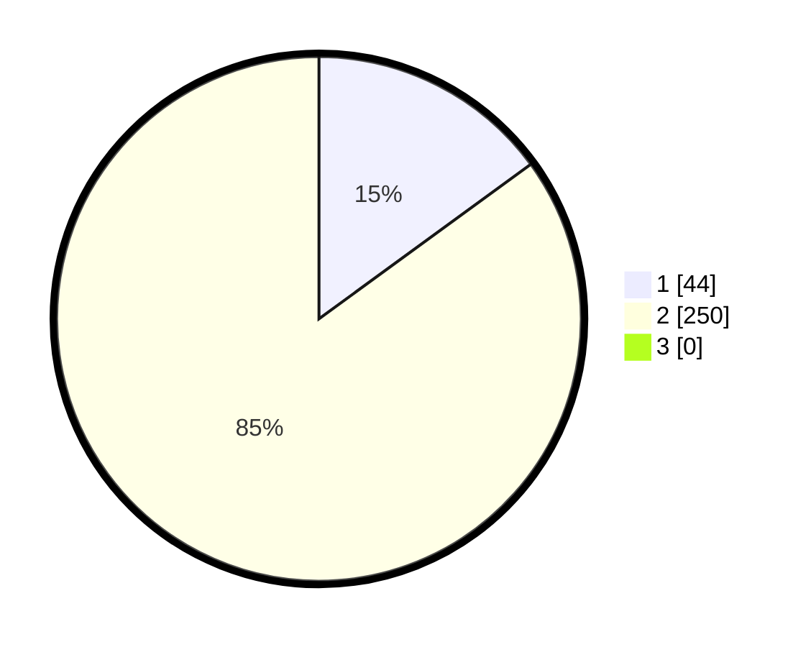

# Hasil

## Grafik

## Tabel

| No. | Nama Paslon    | Suara | Suara (raw) | Persentase |
|:--- |:-------------- | -----:| -----------:| ----------:|
| 1   | ANIES MUHAIMIN | 44    | [44][p-1]   | 14,97      |
| 2   | PRABOWO GIBRAN | 250   | [250][p-2]  | 85,03      |
| 3   | GANJAR MAHFUD  | 0     | [0][p-3]    | 0,00       |

[p-1]: https://github.com/gigit-pemilu/pemilu-2024-35-jawa-timur/blob/main/pilpres/hitung-suara/sub/35-jawa-timur/sub/27-sampang/sub/02-torjun/sub/2015-kodak/sub/005-tps/sub/paslon-1.txt
[p-2]: https://github.com/gigit-pemilu/pemilu-2024-35-jawa-timur/blob/main/pilpres/hitung-suara/sub/35-jawa-timur/sub/27-sampang/sub/02-torjun/sub/2015-kodak/sub/005-tps/sub/paslon-2.txt
[p-3]: https://github.com/gigit-pemilu/pemilu-2024-35-jawa-timur/blob/main/pilpres/hitung-suara/sub/35-jawa-timur/sub/27-sampang/sub/02-torjun/sub/2015-kodak/sub/005-tps/sub/paslon-3.txt

## Foto C Plano

https://sirekap-obj-formc.kpu.go.id/3434/pemilu/ppwp/35/27/02/20/15/3527022015005-20240214-225403--397a9bcf-7e3d-42bc-9af1-d201b0775dc4.jpg

https://sirekap-obj-formc.kpu.go.id/3434/pemilu/ppwp/35/27/02/20/15/3527022015005-20240214-230806--34948088-d767-425d-bdf5-671ce14abad0.jpg

https://sirekap-obj-formc.kpu.go.id/3434/pemilu/ppwp/35/27/02/20/15/3527022015005-20240214-225849--64fbfde7-abfd-4a88-9146-d011d8f41189.jpg

## Metadata

| Key        | Value               |
| ---------- | ------------------- |
| Time Stamp | 2024-02-16 10:30:29 |

