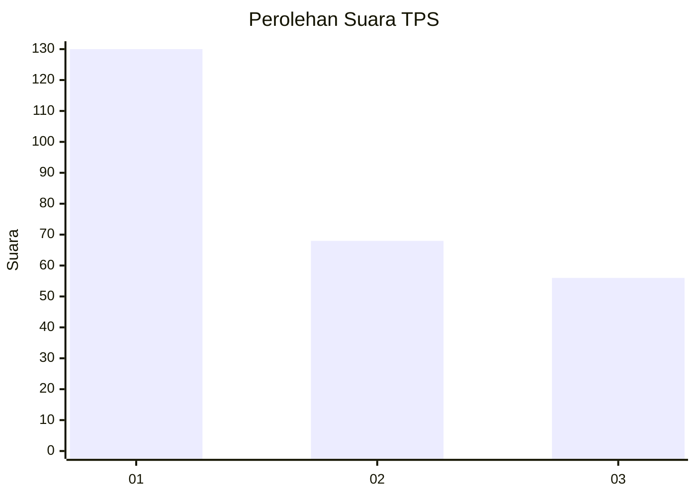
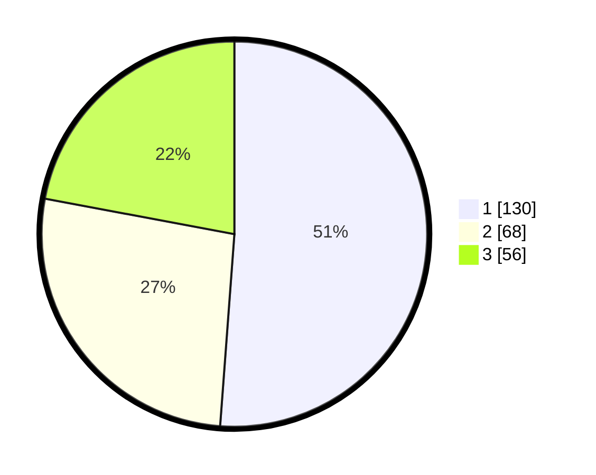

# Hasil

## Grafik

## Tabel

| No. | Nama Paslon    | Suara | Suara (raw) | Persentase |
|:--- |:-------------- | -----:| -----------:| ----------:|
| 1   | ANIES MUHAIMIN | 130   | [130][p-1]  | 51,18      |
| 2   | PRABOWO GIBRAN | 68    | [68][p-2]   | 26,77      |
| 3   | GANJAR MAHFUD  | 56    | [56][p-3]   | 22,05      |

[p-1]: https://github.com/gigit-pemilu/pemilu-2024/blob/main/pilpres/hitung-suara/sub/35-jawa-timur/sub/27-sampang/sub/02-torjun/sub/2017-kara/sub/003-tps/sub/paslon-1.txt
[p-2]: https://github.com/gigit-pemilu/pemilu-2024/blob/main/pilpres/hitung-suara/sub/35-jawa-timur/sub/27-sampang/sub/02-torjun/sub/2017-kara/sub/003-tps/sub/paslon-2.txt
[p-3]: https://github.com/gigit-pemilu/pemilu-2024/blob/main/pilpres/hitung-suara/sub/35-jawa-timur/sub/27-sampang/sub/02-torjun/sub/2017-kara/sub/003-tps/sub/paslon-3.txt

## Foto C Plano

https://sirekap-obj-formc.kpu.go.id/af58/pemilu/ppwp/35/27/02/20/17/3527022017003-20240214-214335--ec87028c-0fd2-4e7c-a49e-f92b34c657a9.jpg

https://sirekap-obj-formc.kpu.go.id/af58/pemilu/ppwp/35/27/02/20/17/3527022017003-20240214-213915--13ee3acd-5cd8-4518-9893-8c0ff3f20bf4.jpg

## Metadata

| Key        | Value               |
| ---------- | ------------------- |
| Time Stamp | 2024-02-24 22:31:28 |

