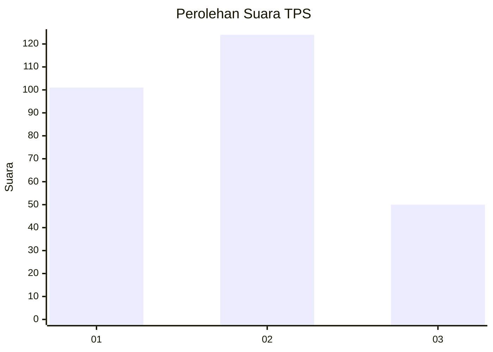
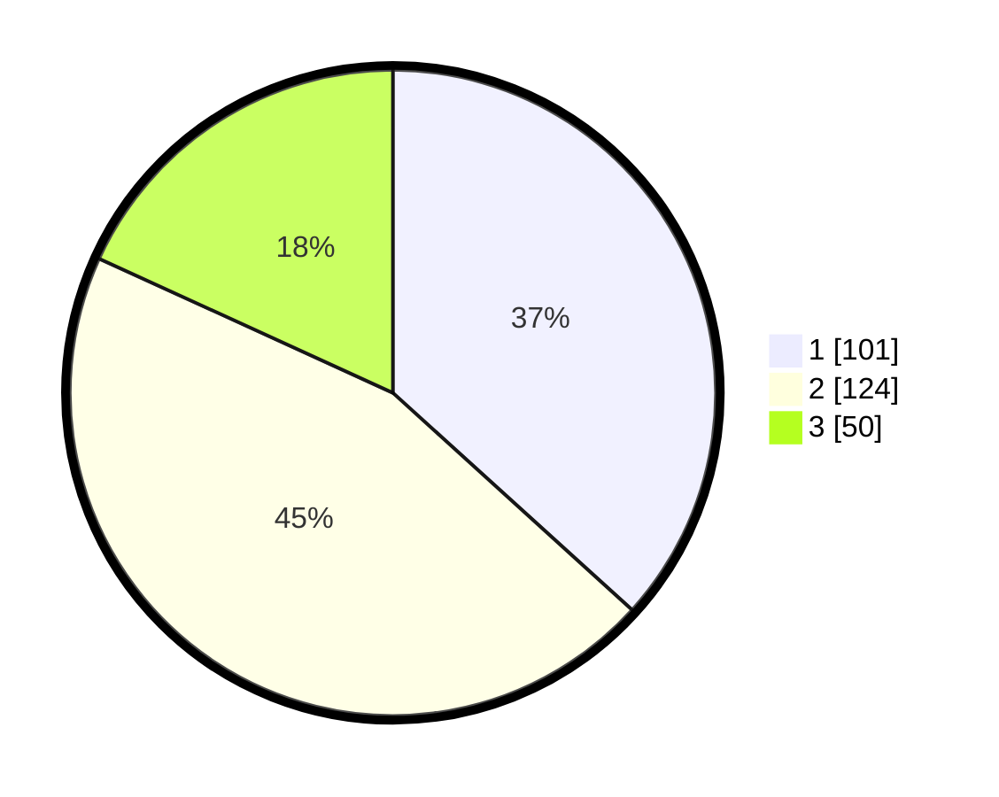

# Hasil

## Grafik

## Tabel

| No. | Nama Paslon    | Suara | Suara (raw) | Persentase |
|:--- |:-------------- | -----:| -----------:| ----------:|
| 1   | ANIES MUHAIMIN | 101   | [101][p-1]  | 36,73      |
| 2   | PRABOWO GIBRAN | 124   | [124][p-2]  | 45,09      |
| 3   | GANJAR MAHFUD  | 50    | [50][p-3]   | 18,18      |

[p-1]: https://github.com/gigit-pemilu/pemilu-2024-35-jawa-timur/blob/main/pilpres/hitung-suara/sub/35-jawa-timur/sub/27-sampang/sub/02-torjun/sub/2018-tanah-merah/sub/001-tps/sub/paslon-1.txt
[p-2]: https://github.com/gigit-pemilu/pemilu-2024-35-jawa-timur/blob/main/pilpres/hitung-suara/sub/35-jawa-timur/sub/27-sampang/sub/02-torjun/sub/2018-tanah-merah/sub/001-tps/sub/paslon-2.txt
[p-3]: https://github.com/gigit-pemilu/pemilu-2024-35-jawa-timur/blob/main/pilpres/hitung-suara/sub/35-jawa-timur/sub/27-sampang/sub/02-torjun/sub/2018-tanah-merah/sub/001-tps/sub/paslon-3.txt

## Foto C Plano

https://sirekap-obj-formc.kpu.go.id/8332/pemilu/ppwp/35/27/02/20/18/3527022018001-20240216-103011--69b26b1d-0fc6-4082-b0ad-097041140b6a.jpg

https://sirekap-obj-formc.kpu.go.id/8332/pemilu/ppwp/35/27/02/20/18/3527022018001-20240216-103234--068eb3da-f13c-42d9-93dd-b27fc8eb67b6.jpg

https://sirekap-obj-formc.kpu.go.id/8332/pemilu/ppwp/35/27/02/20/18/3527022018001-20240216-103414--1a7f0400-4143-45db-9a35-1a1f2494051a.jpg

## Metadata

| Key        | Value               |
| ---------- | ------------------- |
| Time Stamp | 2024-02-16 11:00:29 |

