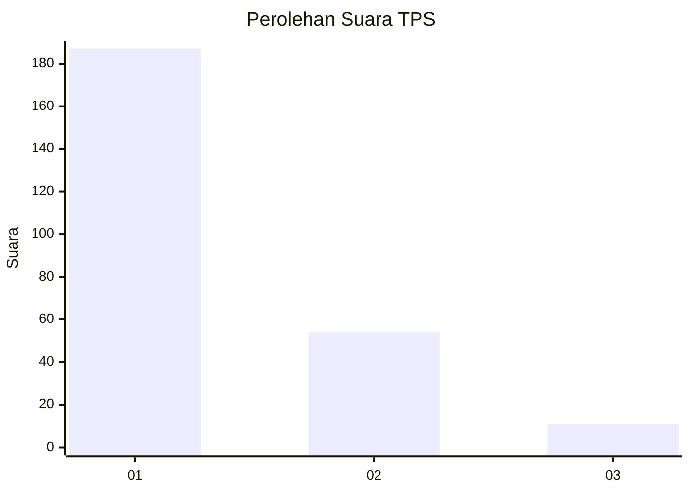
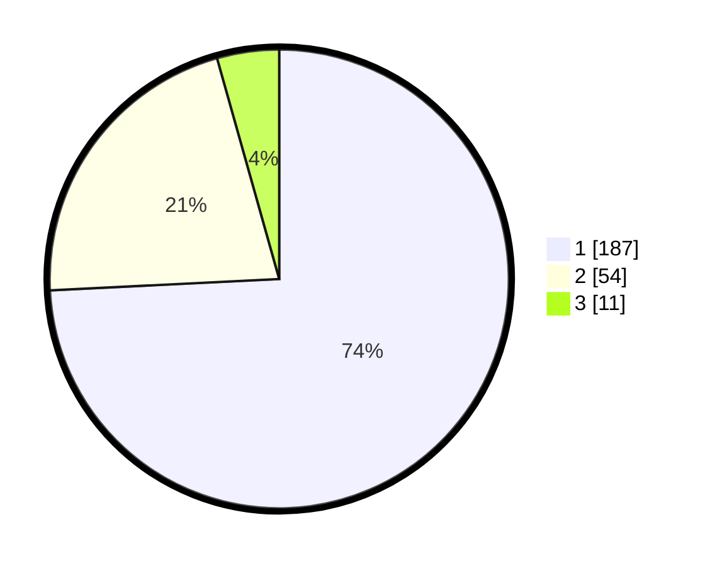

# Hasil

## Grafik

## Tabel

| No. | Nama Paslon    | Suara | Suara (raw) | Persentase |
|:--- |:-------------- | -----:| -----------:| ----------:|
| 1   | ANIES MUHAIMIN | 187   | [187][p-1]  | 74,21      |
| 2   | PRABOWO GIBRAN | 54    | [54][p-2]   | 21,43      |
| 3   | GANJAR MAHFUD  | 11    | [11][p-3]   | 4,37       |

[p-1]: https://github.com/gigit-pemilu/pemilu-2024-35-jawa-timur/blob/main/pilpres/hitung-suara/sub/35-jawa-timur/sub/27-sampang/sub/02-torjun/sub/2018-tanah-merah/sub/005-tps/sub/paslon-1.txt
[p-2]: https://github.com/gigit-pemilu/pemilu-2024-35-jawa-timur/blob/main/pilpres/hitung-suara/sub/35-jawa-timur/sub/27-sampang/sub/02-torjun/sub/2018-tanah-merah/sub/005-tps/sub/paslon-2.txt
[p-3]: https://github.com/gigit-pemilu/pemilu-2024-35-jawa-timur/blob/main/pilpres/hitung-suara/sub/35-jawa-timur/sub/27-sampang/sub/02-torjun/sub/2018-tanah-merah/sub/005-tps/sub/paslon-3.txt

## Foto C Plano

https://sirekap-obj-formc.kpu.go.id/c066/pemilu/ppwp/35/27/02/20/18/3527022018005-20240214-141409--16890447-cdaa-48e7-8966-3e71553e1090.jpg

https://sirekap-obj-formc.kpu.go.id/c066/pemilu/ppwp/35/27/02/20/18/3527022018005-20240214-141523--b86c6699-65e9-4509-97a6-2e4d5109fb0e.jpg

https://sirekap-obj-formc.kpu.go.id/c066/pemilu/ppwp/35/27/02/20/18/3527022018005-20240214-141719--a2bf03b8-64fe-4c09-a309-1c2c40f26004.jpg

## Metadata

| Key        | Value               |
| ---------- | ------------------- |
| Time Stamp | 2024-02-16 10:00:28 |

