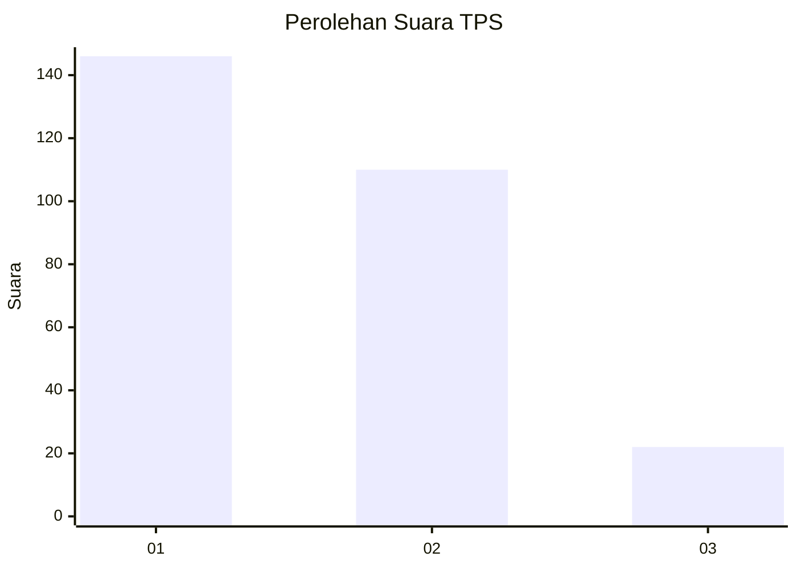
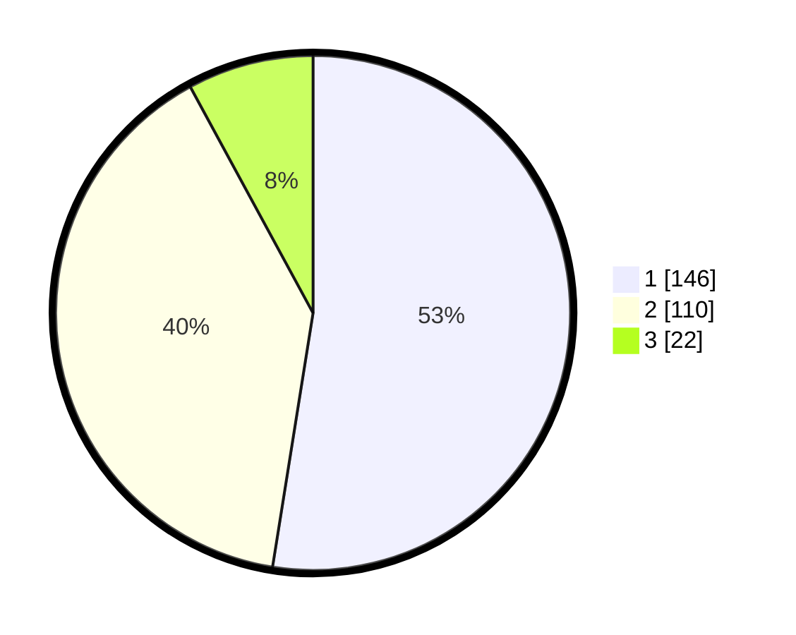

# Hasil

## Grafik

## Tabel

| No. | Nama Paslon    | Suara | Suara (raw) | Persentase |
|:--- |:-------------- | -----:| -----------:| ----------:|
| 1   | ANIES MUHAIMIN | 146   | [146][p-1]  | 52,52      |
| 2   | PRABOWO GIBRAN | 110   | [110][p-2]  | 39,57      |
| 3   | GANJAR MAHFUD  | 22    | [22][p-3]   | 7,91       |

[p-1]: https://github.com/gigit-pemilu/pemilu-2024-35-jawa-timur/blob/main/pilpres/hitung-suara/sub/35-jawa-timur/sub/27-sampang/sub/03-sampang/sub/1003-polagan/sub/001-tps/sub/paslon-1.txt
[p-2]: https://github.com/gigit-pemilu/pemilu-2024-35-jawa-timur/blob/main/pilpres/hitung-suara/sub/35-jawa-timur/sub/27-sampang/sub/03-sampang/sub/1003-polagan/sub/001-tps/sub/paslon-2.txt
[p-3]: https://github.com/gigit-pemilu/pemilu-2024-35-jawa-timur/blob/main/pilpres/hitung-suara/sub/35-jawa-timur/sub/27-sampang/sub/03-sampang/sub/1003-polagan/sub/001-tps/sub/paslon-3.txt

## Foto C Plano

https://sirekap-obj-formc.kpu.go.id/209e/pemilu/ppwp/35/27/03/10/03/3527031003001-20240214-220024--976869d9-b3c7-4032-af93-8bef830d26b8.jpg

https://sirekap-obj-formc.kpu.go.id/209e/pemilu/ppwp/35/27/03/10/03/3527031003001-20240214-220120--14b103b2-ad52-47e1-890a-f996ae976522.jpg

https://sirekap-obj-formc.kpu.go.id/209e/pemilu/ppwp/35/27/03/10/03/3527031003001-20240214-220200--78366563-9366-4390-aa5e-065a602fb346.jpg

## Metadata

| Key        | Value               |
| ---------- | ------------------- |
| Time Stamp | 2024-02-15 21:30:27 |

