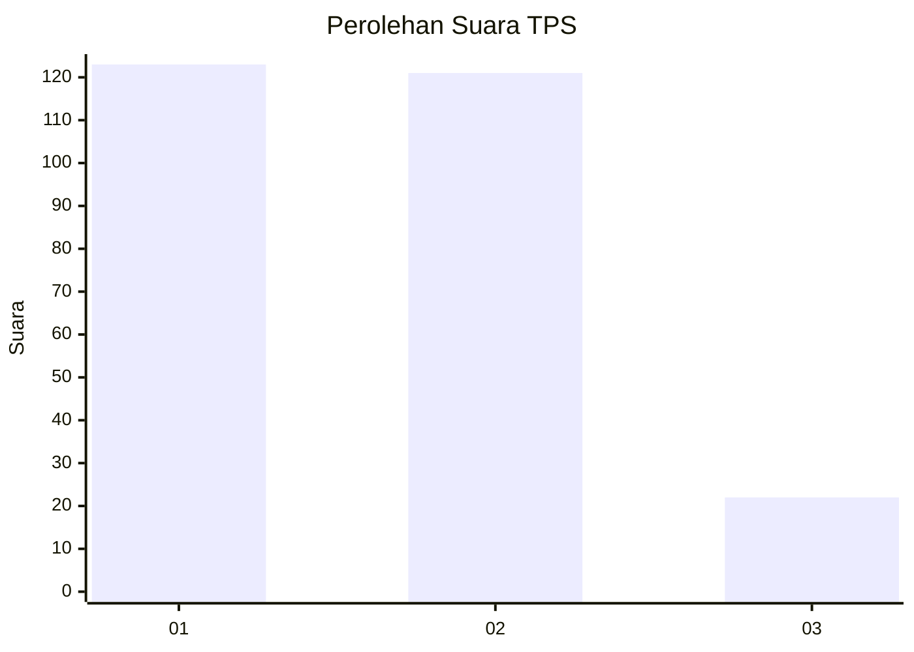
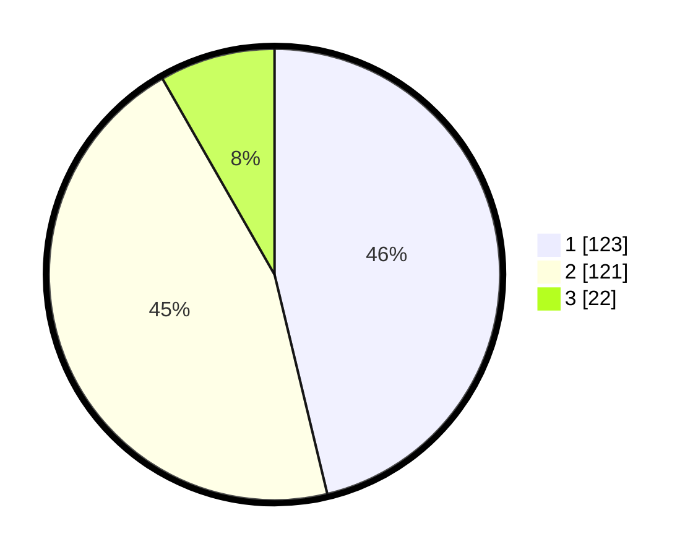

# Hasil

## Grafik

## Tabel

| No. | Nama Paslon    | Suara | Suara (raw) | Persentase |
|:--- |:-------------- | -----:| -----------:| ----------:|
| 1   | ANIES MUHAIMIN | 123   | [123][p-1]  | 46,24      |
| 2   | PRABOWO GIBRAN | 121   | [121][p-2]  | 45,49      |
| 3   | GANJAR MAHFUD  | 22    | [22][p-3]   | 8,27       |

[p-1]: https://github.com/gigit-pemilu/pemilu-2024/blob/main/pilpres/hitung-suara/sub/35-jawa-timur/sub/27-sampang/sub/03-sampang/sub/1003-polagan/sub/002-tps/sub/paslon-1.txt
[p-2]: https://github.com/gigit-pemilu/pemilu-2024/blob/main/pilpres/hitung-suara/sub/35-jawa-timur/sub/27-sampang/sub/03-sampang/sub/1003-polagan/sub/002-tps/sub/paslon-2.txt
[p-3]: https://github.com/gigit-pemilu/pemilu-2024/blob/main/pilpres/hitung-suara/sub/35-jawa-timur/sub/27-sampang/sub/03-sampang/sub/1003-polagan/sub/002-tps/sub/paslon-3.txt

## Foto C Plano

https://sirekap-obj-formc.kpu.go.id/4ae3/pemilu/ppwp/35/27/03/10/03/3527031003002-20240215-005452--8670c804-e24e-4ea0-87f1-7ecac3677670.jpg

https://sirekap-obj-formc.kpu.go.id/4ae3/pemilu/ppwp/35/27/03/10/03/3527031003002-20240215-005539--42e4c982-adf4-48dd-a643-458cfd08457f.jpg

https://sirekap-obj-formc.kpu.go.id/4ae3/pemilu/ppwp/35/27/03/10/03/3527031003002-20240215-005627--172dfc9d-d74b-4790-9c76-cd322eeb649b.jpg

## Metadata

| Key        | Value               |
| ---------- | ------------------- |
| Time Stamp | 2024-02-15 21:30:27 |

