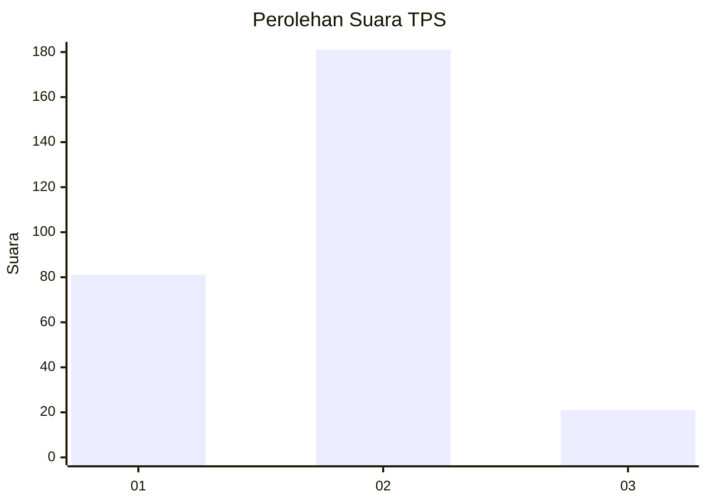
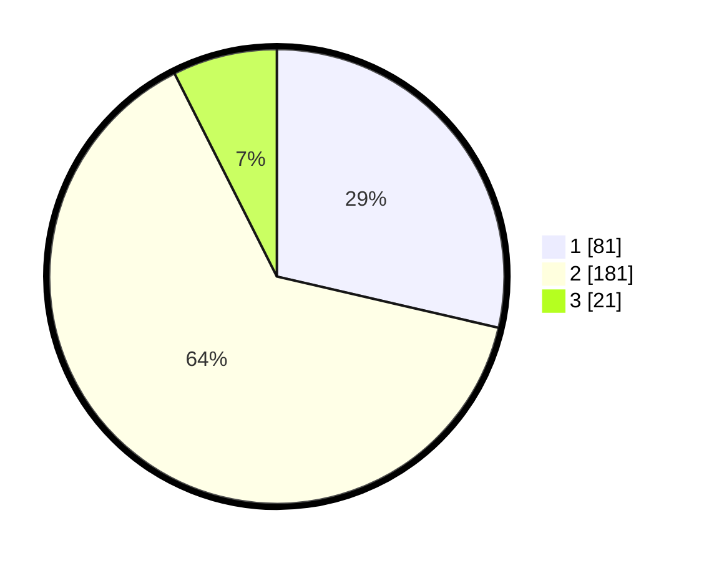

# Hasil

## Grafik

## Tabel

| No. | Nama Paslon    | Suara | Suara (raw) | Persentase |
|:--- |:-------------- | -----:| -----------:| ----------:|
| 1   | ANIES MUHAIMIN | 81    | [81][p-1]   | 28,62      |
| 2   | PRABOWO GIBRAN | 181   | [181][p-2]  | 63,96      |
| 3   | GANJAR MAHFUD  | 21    | [21][p-3]   | 7,42       |

[p-1]: https://github.com/gigit-pemilu/pemilu-2024-35-jawa-timur/blob/main/pilpres/hitung-suara/sub/35-jawa-timur/sub/27-sampang/sub/03-sampang/sub/1003-polagan/sub/004-tps/sub/paslon-1.txt
[p-2]: https://github.com/gigit-pemilu/pemilu-2024-35-jawa-timur/blob/main/pilpres/hitung-suara/sub/35-jawa-timur/sub/27-sampang/sub/03-sampang/sub/1003-polagan/sub/004-tps/sub/paslon-2.txt
[p-3]: https://github.com/gigit-pemilu/pemilu-2024-35-jawa-timur/blob/main/pilpres/hitung-suara/sub/35-jawa-timur/sub/27-sampang/sub/03-sampang/sub/1003-polagan/sub/004-tps/sub/paslon-3.txt

## Foto C Plano

https://sirekap-obj-formc.kpu.go.id/9a21/pemilu/ppwp/35/27/03/10/03/3527031003004-20240215-104828--9a9de840-1f1b-4b37-a2d7-6cc3aa21b195.jpg

https://sirekap-obj-formc.kpu.go.id/9a21/pemilu/ppwp/35/27/03/10/03/3527031003004-20240215-104955--44448e3b-5454-4bbb-afee-20b2a866122e.jpg

https://sirekap-obj-formc.kpu.go.id/9a21/pemilu/ppwp/35/27/03/10/03/3527031003004-20240215-105046--bb912b93-05ab-4386-b20f-6fff802496d2.jpg

## Metadata

| Key        | Value               |
| ---------- | ------------------- |
| Time Stamp | 2024-02-16 12:51:22 |

