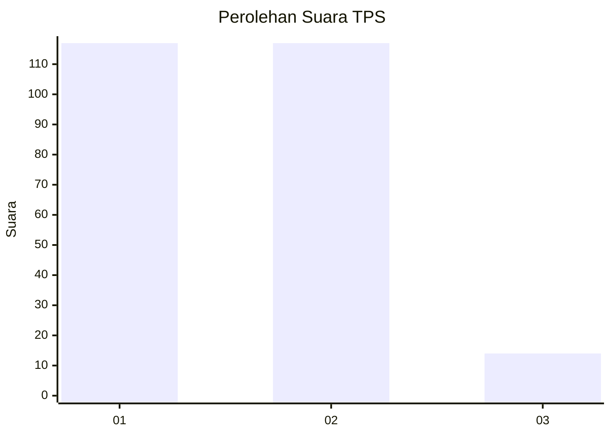
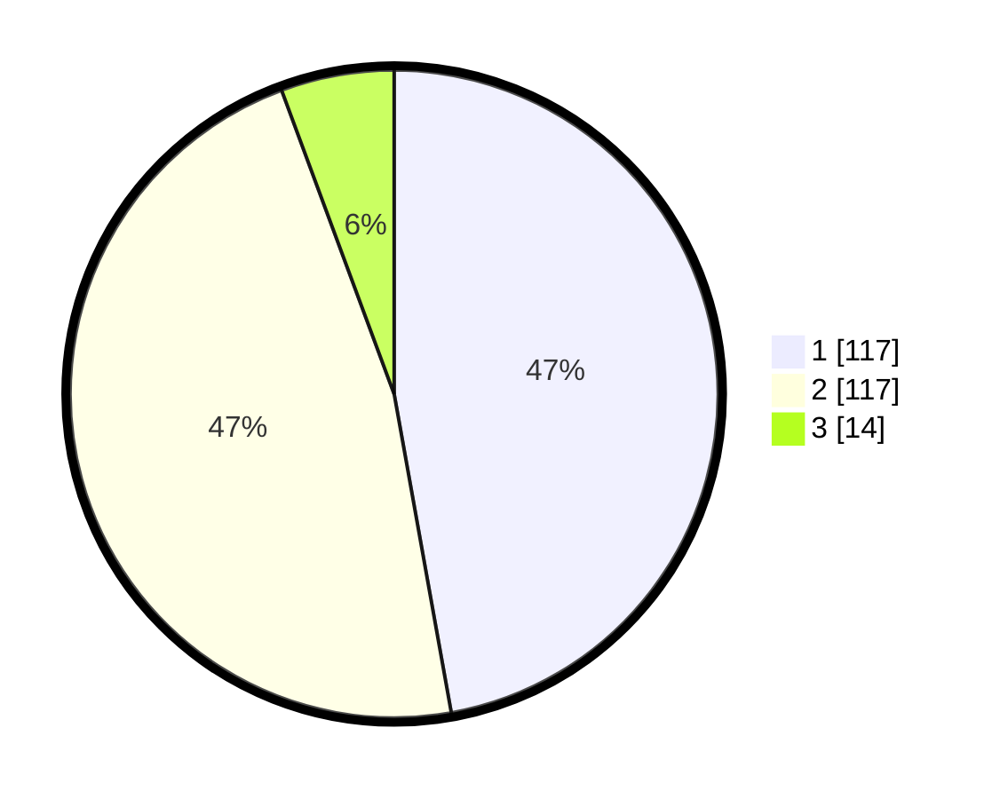

# Hasil

## Grafik

## Tabel

| No. | Nama Paslon    | Suara | Suara (raw) | Persentase |
|:--- |:-------------- | -----:| -----------:| ----------:|
| 1   | ANIES MUHAIMIN | 117   | [117][p-1]  | 47,18      |
| 2   | PRABOWO GIBRAN | 117   | [117][p-2]  | 47,18      |
| 3   | GANJAR MAHFUD  | 14    | [14][p-3]   | 5,65       |

[p-1]: https://github.com/gigit-pemilu/pemilu-2024/blob/main/pilpres/hitung-suara/sub/35-jawa-timur/sub/27-sampang/sub/03-sampang/sub/1003-polagan/sub/006-tps/sub/paslon-1.txt
[p-2]: https://github.com/gigit-pemilu/pemilu-2024/blob/main/pilpres/hitung-suara/sub/35-jawa-timur/sub/27-sampang/sub/03-sampang/sub/1003-polagan/sub/006-tps/sub/paslon-2.txt
[p-3]: https://github.com/gigit-pemilu/pemilu-2024/blob/main/pilpres/hitung-suara/sub/35-jawa-timur/sub/27-sampang/sub/03-sampang/sub/1003-polagan/sub/006-tps/sub/paslon-3.txt

## Foto C Plano

https://sirekap-obj-formc.kpu.go.id/7510/pemilu/ppwp/35/27/03/10/03/3527031003006-20240214-224436--5c24621a-6337-4683-ac55-b2bba47140d9.jpg

https://sirekap-obj-formc.kpu.go.id/7510/pemilu/ppwp/35/27/03/10/03/3527031003006-20240214-224622--ef420d61-cdfb-44f3-80a2-baa326bf105b.jpg

https://sirekap-obj-formc.kpu.go.id/7510/pemilu/ppwp/35/27/03/10/03/3527031003006-20240214-224703--b8379f5e-06e9-447f-9c5b-56110eaeeea6.jpg

## Metadata

| Key        | Value               |
| ---------- | ------------------- |
| Time Stamp | 2024-02-15 22:00:27 |

