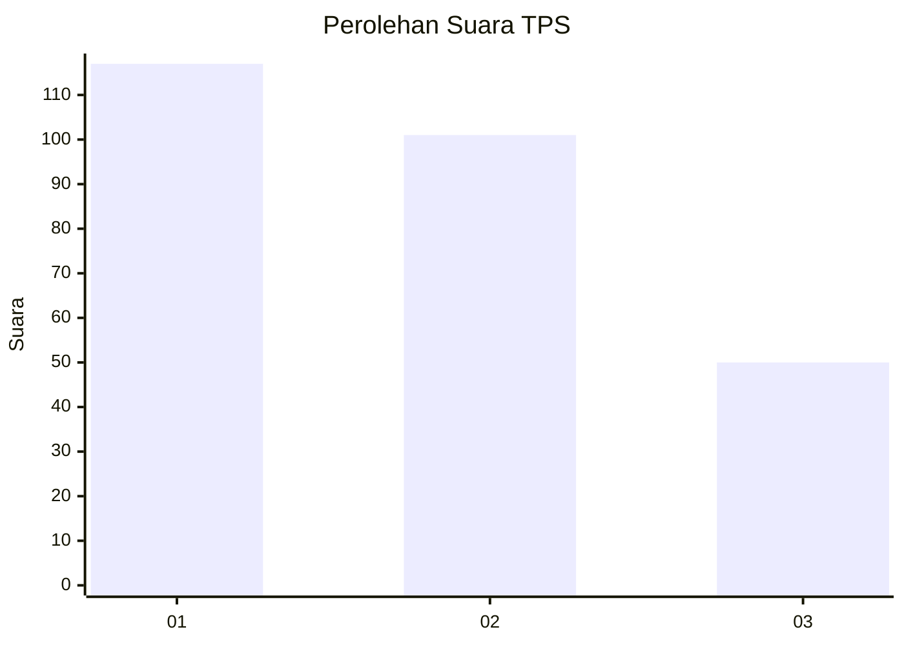
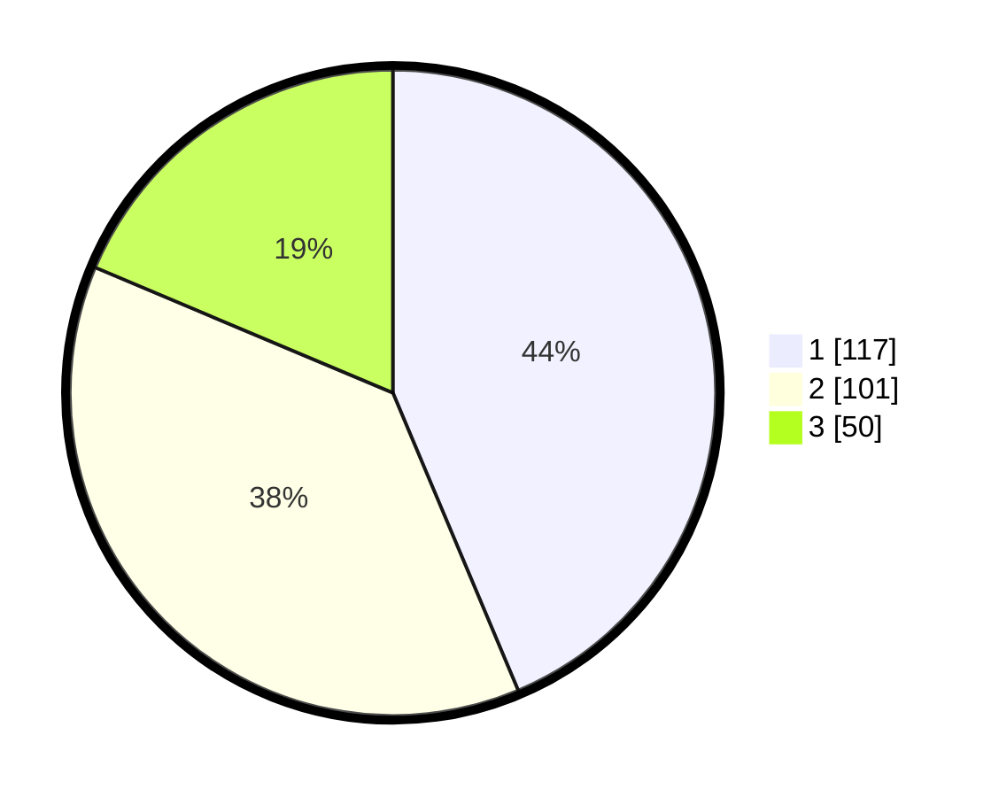

# Hasil

## Grafik

## Tabel

| No. | Nama Paslon    | Suara | Suara (raw) | Persentase |
|:--- |:-------------- | -----:| -----------:| ----------:|
| 1   | ANIES MUHAIMIN | 117   | [117][p-1]  | 43,66      |
| 2   | PRABOWO GIBRAN | 101   | [101][p-2]  | 37,69      |
| 3   | GANJAR MAHFUD  | 50    | [50][p-3]   | 18,66      |

[p-1]: https://github.com/gigit-pemilu/pemilu-2024/blob/main/pilpres/hitung-suara/sub/35-jawa-timur/sub/27-sampang/sub/03-sampang/sub/1003-polagan/sub/013-tps/sub/paslon-1.txt
[p-2]: https://github.com/gigit-pemilu/pemilu-2024/blob/main/pilpres/hitung-suara/sub/35-jawa-timur/sub/27-sampang/sub/03-sampang/sub/1003-polagan/sub/013-tps/sub/paslon-2.txt
[p-3]: https://github.com/gigit-pemilu/pemilu-2024/blob/main/pilpres/hitung-suara/sub/35-jawa-timur/sub/27-sampang/sub/03-sampang/sub/1003-polagan/sub/013-tps/sub/paslon-3.txt

## Foto C Plano

https://sirekap-obj-formc.kpu.go.id/91e3/pemilu/ppwp/35/27/03/10/03/3527031003013-20240214-223110--aa51f23f-3f4a-4af6-8203-4694357802ed.jpg

https://sirekap-obj-formc.kpu.go.id/91e3/pemilu/ppwp/35/27/03/10/03/3527031003013-20240214-223536--39214952-e0a2-42fc-9336-8006b54cab92.jpg

https://sirekap-obj-formc.kpu.go.id/91e3/pemilu/ppwp/35/27/03/10/03/3527031003013-20240214-232213--7c889dcf-a2b8-41f8-ba0b-23f087f9a989.jpg

## Metadata

| Key        | Value               |
| ---------- | ------------------- |
| Time Stamp | 2024-02-16 10:30:29 |

