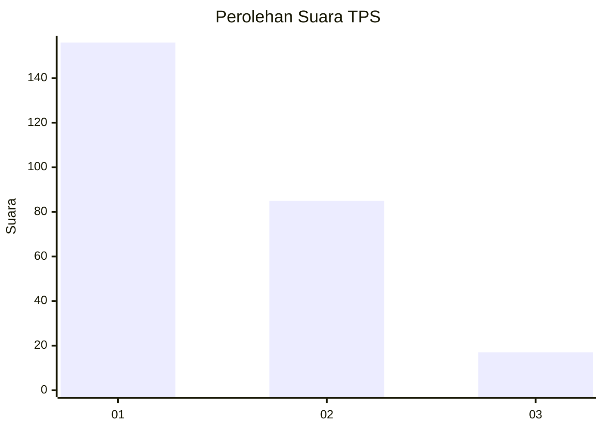
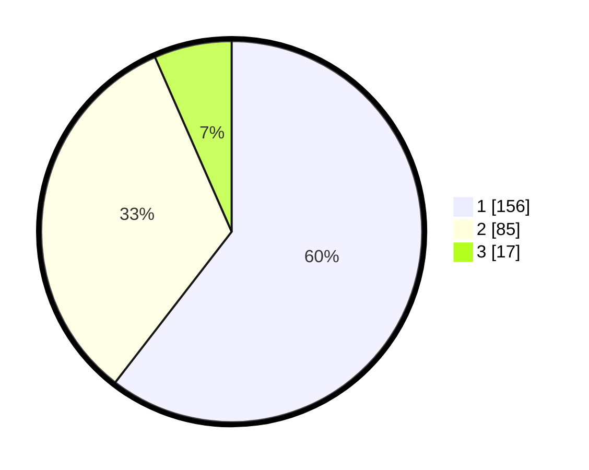

# Hasil

## Grafik

## Tabel

| No. | Nama Paslon    | Suara | Suara (raw) | Persentase |
|:--- |:-------------- | -----:| -----------:| ----------:|
| 1   | ANIES MUHAIMIN | 156   | [156][p-1]  | 60,47      |
| 2   | PRABOWO GIBRAN | 85    | [85][p-2]   | 32,95      |
| 3   | GANJAR MAHFUD  | 17    | [17][p-3]   | 6,59       |

[p-1]: https://github.com/gigit-pemilu/pemilu-2024/blob/main/pilpres/hitung-suara/sub/35-jawa-timur/sub/27-sampang/sub/03-sampang/sub/1004-banyuanyar/sub/002-tps/sub/paslon-1.txt
[p-2]: https://github.com/gigit-pemilu/pemilu-2024/blob/main/pilpres/hitung-suara/sub/35-jawa-timur/sub/27-sampang/sub/03-sampang/sub/1004-banyuanyar/sub/002-tps/sub/paslon-2.txt
[p-3]: https://github.com/gigit-pemilu/pemilu-2024/blob/main/pilpres/hitung-suara/sub/35-jawa-timur/sub/27-sampang/sub/03-sampang/sub/1004-banyuanyar/sub/002-tps/sub/paslon-3.txt

## Foto C Plano

https://sirekap-obj-formc.kpu.go.id/c6cf/pemilu/ppwp/35/27/03/10/04/3527031004002-20240214-230106--c3d51455-321f-4de0-b7cc-145748429b46.jpg

https://sirekap-obj-formc.kpu.go.id/c6cf/pemilu/ppwp/35/27/03/10/04/3527031004002-20240214-223652--299eeca2-53fa-49d1-862b-3ea91f3ff6b4.jpg

https://sirekap-obj-formc.kpu.go.id/c6cf/pemilu/ppwp/35/27/03/10/04/3527031004002-20240214-225353--41c003c2-6369-4c1f-8f40-de25225ae9cc.jpg

## Metadata

| Key        | Value               |
| ---------- | ------------------- |
| Time Stamp | 2024-02-24 22:31:28 |

