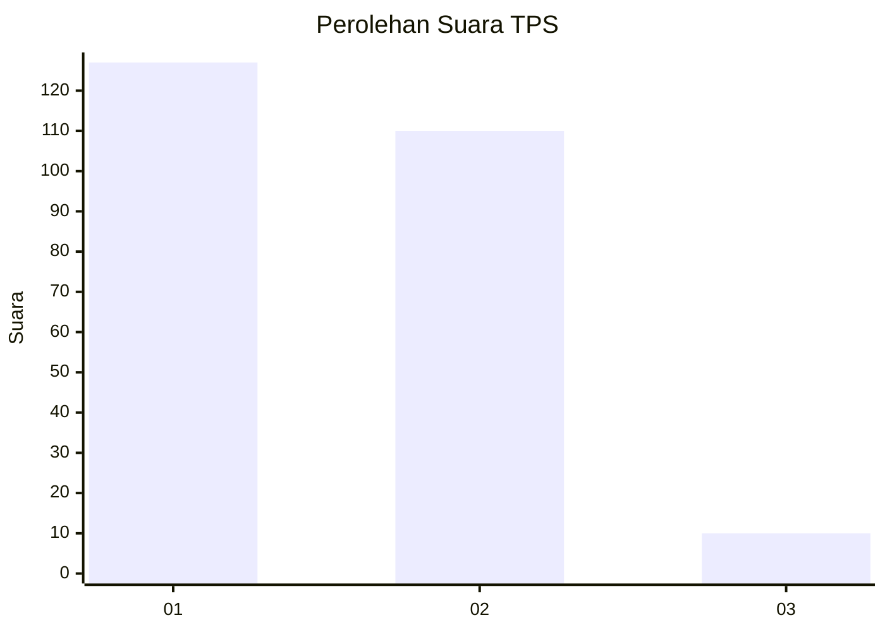
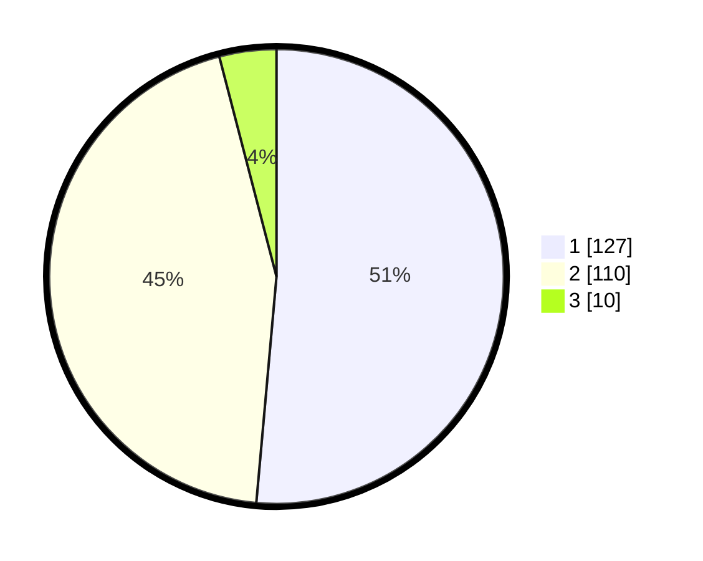

# Hasil

## Grafik

## Tabel

| No. | Nama Paslon    | Suara | Suara (raw) | Persentase |
|:--- |:-------------- | -----:| -----------:| ----------:|
| 1   | ANIES MUHAIMIN | 127   | [127][p-1]  | 51,42      |
| 2   | PRABOWO GIBRAN | 110   | [110][p-2]  | 44,53      |
| 3   | GANJAR MAHFUD  | 10    | [10][p-3]   | 4,05       |

[p-1]: https://github.com/gigit-pemilu/pemilu-2024-35-jawa-timur/blob/main/pilpres/hitung-suara/sub/35-jawa-timur/sub/27-sampang/sub/03-sampang/sub/1004-banyuanyar/sub/003-tps/sub/paslon-1.txt
[p-2]: https://github.com/gigit-pemilu/pemilu-2024-35-jawa-timur/blob/main/pilpres/hitung-suara/sub/35-jawa-timur/sub/27-sampang/sub/03-sampang/sub/1004-banyuanyar/sub/003-tps/sub/paslon-2.txt
[p-3]: https://github.com/gigit-pemilu/pemilu-2024-35-jawa-timur/blob/main/pilpres/hitung-suara/sub/35-jawa-timur/sub/27-sampang/sub/03-sampang/sub/1004-banyuanyar/sub/003-tps/sub/paslon-3.txt

## Foto C Plano

https://sirekap-obj-formc.kpu.go.id/7212/pemilu/ppwp/35/27/03/10/04/3527031004003-20240214-222707--7136cbf9-ba14-4b28-ba3b-676f3d0276e6.jpg

https://sirekap-obj-formc.kpu.go.id/7212/pemilu/ppwp/35/27/03/10/04/3527031004003-20240215-021902--55b330be-2a68-4c88-8942-21ff9811f6a5.jpg

https://sirekap-obj-formc.kpu.go.id/7212/pemilu/ppwp/35/27/03/10/04/3527031004003-20240215-013712--a8374070-e5ec-4cde-9852-8e8af004db0a.jpg

## Metadata

| Key        | Value               |
| ---------- | ------------------- |
| Time Stamp | 2024-02-16 10:30:29 |

