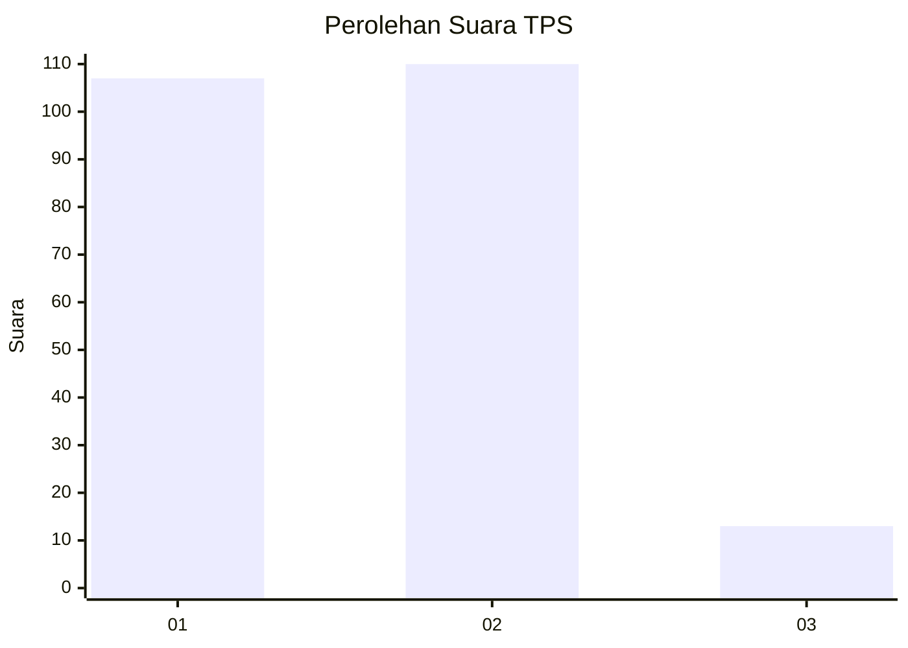
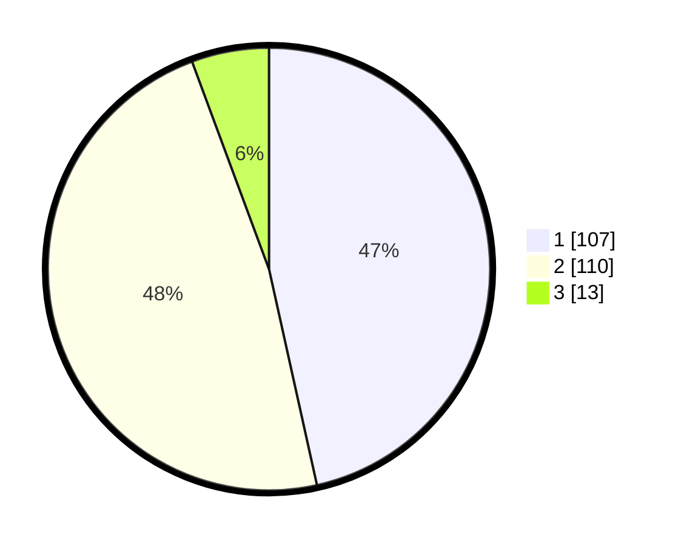

# Hasil

## Grafik

## Tabel

| No. | Nama Paslon    | Suara | Suara (raw) | Persentase |
|:--- |:-------------- | -----:| -----------:| ----------:|
| 1   | ANIES MUHAIMIN | 107   | [107][p-1]  | 46,52      |
| 2   | PRABOWO GIBRAN | 110   | [110][p-2]  | 47,83      |
| 3   | GANJAR MAHFUD  | 13    | [13][p-3]   | 5,65       |

[p-1]: https://github.com/gigit-pemilu/pemilu-2024/blob/main/pilpres/hitung-suara/sub/35-jawa-timur/sub/27-sampang/sub/03-sampang/sub/1004-banyuanyar/sub/004-tps/sub/paslon-1.txt
[p-2]: https://github.com/gigit-pemilu/pemilu-2024/blob/main/pilpres/hitung-suara/sub/35-jawa-timur/sub/27-sampang/sub/03-sampang/sub/1004-banyuanyar/sub/004-tps/sub/paslon-2.txt
[p-3]: https://github.com/gigit-pemilu/pemilu-2024/blob/main/pilpres/hitung-suara/sub/35-jawa-timur/sub/27-sampang/sub/03-sampang/sub/1004-banyuanyar/sub/004-tps/sub/paslon-3.txt

## Foto C Plano

https://sirekap-obj-formc.kpu.go.id/7348/pemilu/ppwp/35/27/03/10/04/3527031004004-20240214-222930--52da4d68-2456-46bf-8e07-2c503c436f3e.jpg

https://sirekap-obj-formc.kpu.go.id/7348/pemilu/ppwp/35/27/03/10/04/3527031004004-20240214-223029--b67e7f4a-0304-4f02-9645-7959bf985879.jpg

https://sirekap-obj-formc.kpu.go.id/7348/pemilu/ppwp/35/27/03/10/04/3527031004004-20240214-223104--80852ec4-9062-48dc-9cf2-308a222f1623.jpg

## Metadata

| Key        | Value               |
| ---------- | ------------------- |
| Time Stamp | 2024-02-16 10:30:29 |

