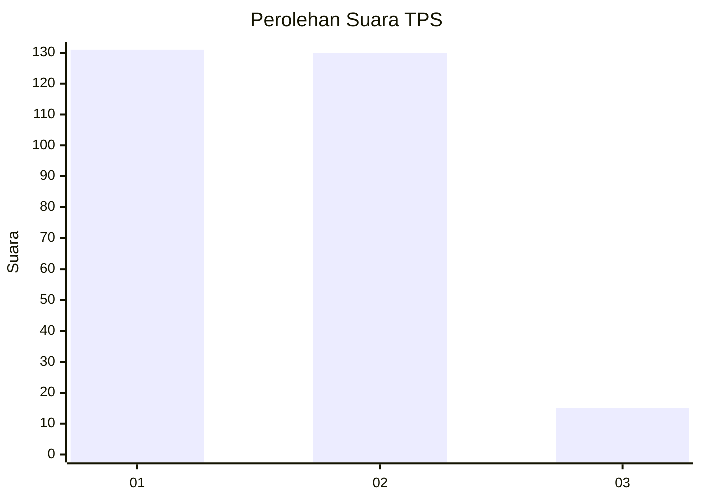
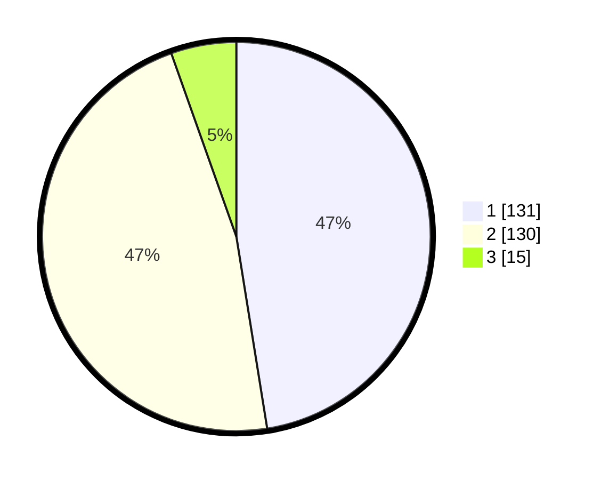

# Hasil

## Grafik

## Tabel

| No. | Nama Paslon    | Suara | Suara (raw) | Persentase |
|:--- |:-------------- | -----:| -----------:| ----------:|
| 1   | ANIES MUHAIMIN | 131   | [131][p-1]  | 47,46      |
| 2   | PRABOWO GIBRAN | 130   | [130][p-2]  | 47,10      |
| 3   | GANJAR MAHFUD  | 15    | [15][p-3]   | 5,43       |

[p-1]: https://github.com/gigit-pemilu/pemilu-2024/blob/main/pilpres/hitung-suara/sub/35-jawa-timur/sub/27-sampang/sub/03-sampang/sub/1004-banyuanyar/sub/008-tps/sub/paslon-1.txt
[p-2]: https://github.com/gigit-pemilu/pemilu-2024/blob/main/pilpres/hitung-suara/sub/35-jawa-timur/sub/27-sampang/sub/03-sampang/sub/1004-banyuanyar/sub/008-tps/sub/paslon-2.txt
[p-3]: https://github.com/gigit-pemilu/pemilu-2024/blob/main/pilpres/hitung-suara/sub/35-jawa-timur/sub/27-sampang/sub/03-sampang/sub/1004-banyuanyar/sub/008-tps/sub/paslon-3.txt

## Foto C Plano

https://sirekap-obj-formc.kpu.go.id/c032/pemilu/ppwp/35/27/03/10/04/3527031004008-20240215-003153--07bcf3b5-acee-489d-9e2d-5efe08b93f13.jpg

https://sirekap-obj-formc.kpu.go.id/c032/pemilu/ppwp/35/27/03/10/04/3527031004008-20240215-003421--2b338584-85a9-4a7a-ad2d-99cf77952653.jpg

https://sirekap-obj-formc.kpu.go.id/c032/pemilu/ppwp/35/27/03/10/04/3527031004008-20240215-003510--10c65540-99d3-448a-972e-e2ea58c879b3.jpg

## Metadata

| Key        | Value               |
| ---------- | ------------------- |
| Time Stamp | 2024-02-26 14:00:00 |

