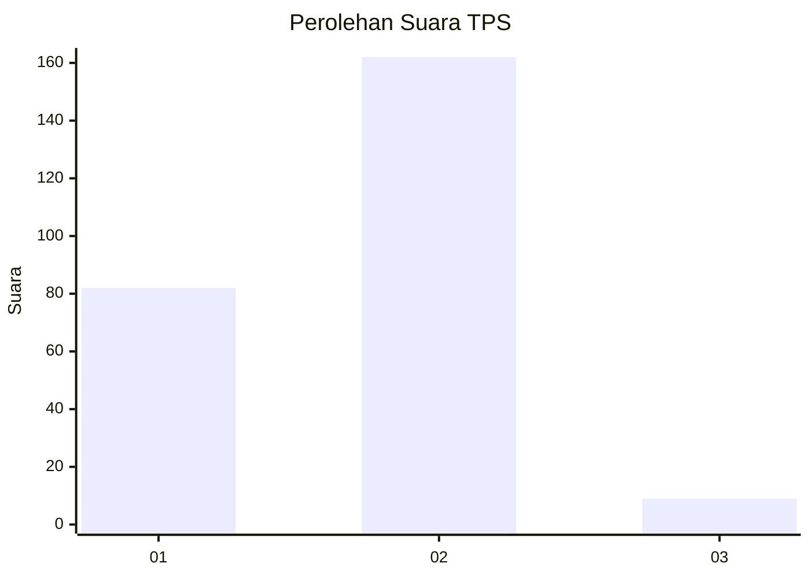
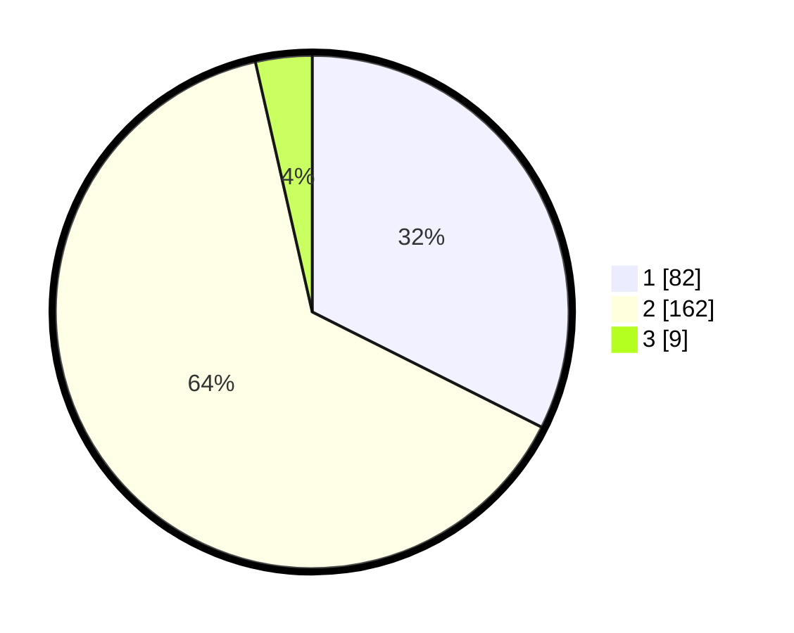

# Hasil

## Grafik

## Tabel

| No. | Nama Paslon    | Suara | Suara (raw) | Persentase |
|:--- |:-------------- | -----:| -----------:| ----------:|
| 1   | ANIES MUHAIMIN | 82    | [82][p-1]   | 32,41      |
| 2   | PRABOWO GIBRAN | 162   | [162][p-2]  | 64,03      |
| 3   | GANJAR MAHFUD  | 9     | [9][p-3]    | 3,56       |

[p-1]: https://github.com/gigit-pemilu/pemilu-2024/blob/main/pilpres/hitung-suara/sub/35-jawa-timur/sub/27-sampang/sub/03-sampang/sub/1004-banyuanyar/sub/011-tps/sub/paslon-1.txt
[p-2]: https://github.com/gigit-pemilu/pemilu-2024/blob/main/pilpres/hitung-suara/sub/35-jawa-timur/sub/27-sampang/sub/03-sampang/sub/1004-banyuanyar/sub/011-tps/sub/paslon-2.txt
[p-3]: https://github.com/gigit-pemilu/pemilu-2024/blob/main/pilpres/hitung-suara/sub/35-jawa-timur/sub/27-sampang/sub/03-sampang/sub/1004-banyuanyar/sub/011-tps/sub/paslon-3.txt

## Foto C Plano

https://sirekap-obj-formc.kpu.go.id/d8a3/pemilu/ppwp/35/27/03/10/04/3527031004011-20240215-015232--3c9d5473-f69c-44cf-a398-37f4857613a9.jpg

https://sirekap-obj-formc.kpu.go.id/d8a3/pemilu/ppwp/35/27/03/10/04/3527031004011-20240215-015345--81dbee88-310f-49d9-880d-2ea2521fa8b8.jpg

https://sirekap-obj-formc.kpu.go.id/d8a3/pemilu/ppwp/35/27/03/10/04/3527031004011-20240215-015438--2fe88211-8c0e-446f-9871-d52231e32ffc.jpg

## Metadata

| Key        | Value               |
| ---------- | ------------------- |
| Time Stamp | 2024-02-16 10:30:29 |

