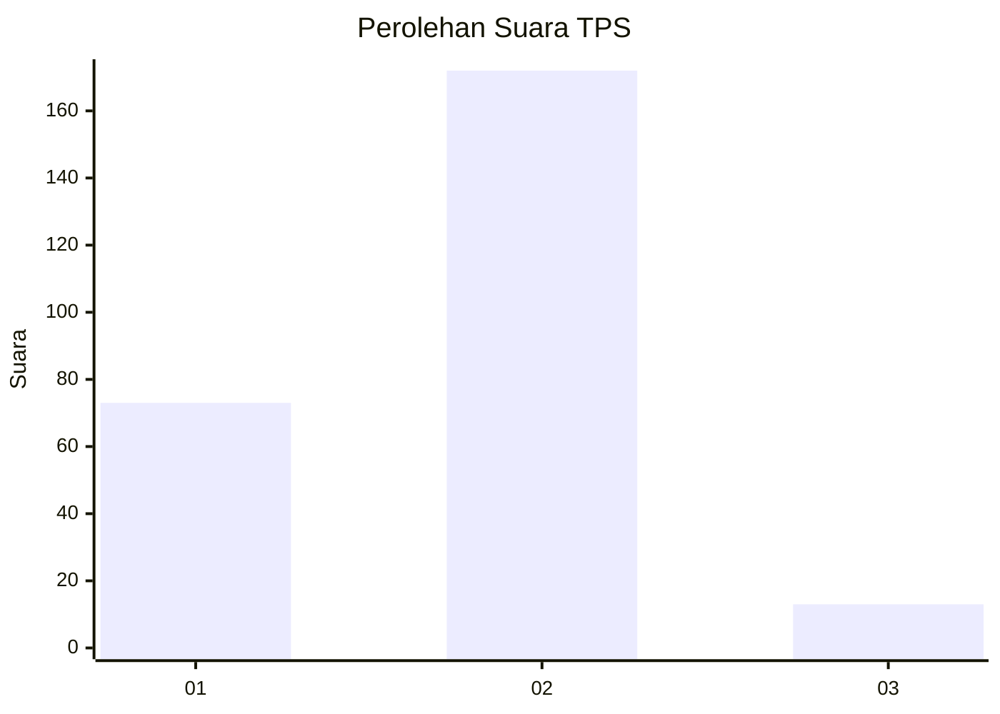
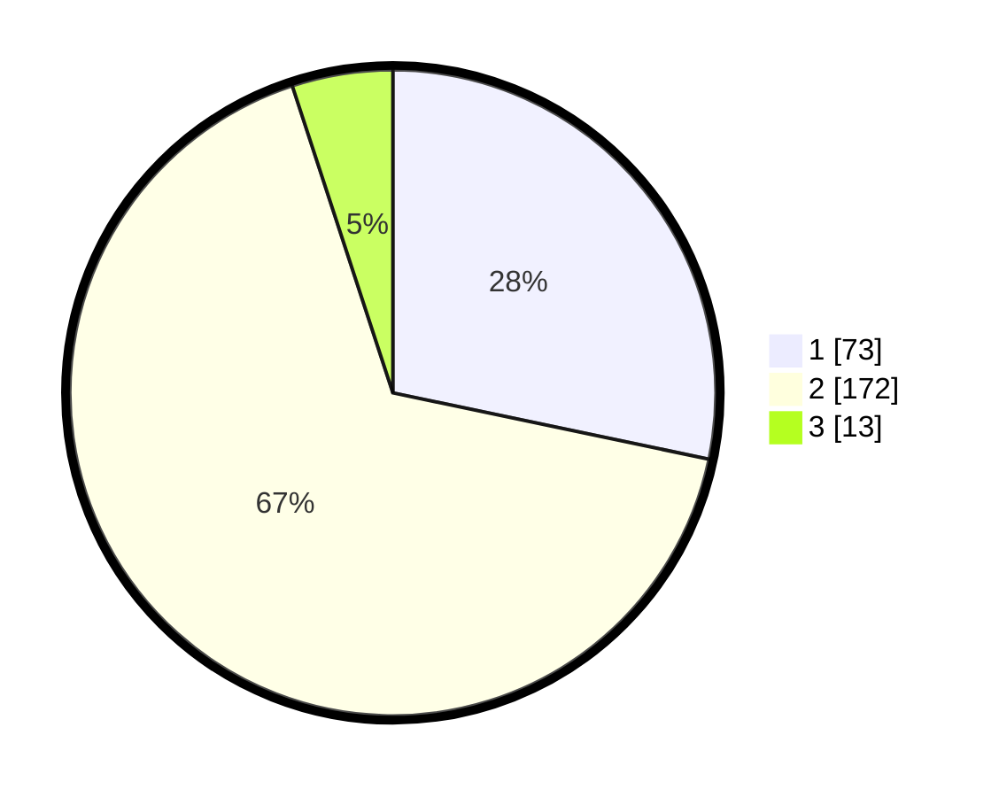

# Hasil

## Grafik

## Tabel

| No. | Nama Paslon    | Suara | Suara (raw) | Persentase |
|:--- |:-------------- | -----:| -----------:| ----------:|
| 1   | ANIES MUHAIMIN | 73    | [73][p-1]   | 28,29      |
| 2   | PRABOWO GIBRAN | 172   | [172][p-2]  | 66,67      |
| 3   | GANJAR MAHFUD  | 13    | [13][p-3]   | 5,04       |

[p-1]: https://github.com/gigit-pemilu/pemilu-2024-35-jawa-timur/blob/main/pilpres/hitung-suara/sub/35-jawa-timur/sub/27-sampang/sub/03-sampang/sub/1004-banyuanyar/sub/012-tps/sub/paslon-1.txt
[p-2]: https://github.com/gigit-pemilu/pemilu-2024-35-jawa-timur/blob/main/pilpres/hitung-suara/sub/35-jawa-timur/sub/27-sampang/sub/03-sampang/sub/1004-banyuanyar/sub/012-tps/sub/paslon-2.txt
[p-3]: https://github.com/gigit-pemilu/pemilu-2024-35-jawa-timur/blob/main/pilpres/hitung-suara/sub/35-jawa-timur/sub/27-sampang/sub/03-sampang/sub/1004-banyuanyar/sub/012-tps/sub/paslon-3.txt

## Foto C Plano

https://sirekap-obj-formc.kpu.go.id/0234/pemilu/ppwp/35/27/03/10/04/3527031004012-20240214-200403--679ba999-6ba5-43bb-815c-2adda87232ed.jpg

https://sirekap-obj-formc.kpu.go.id/0234/pemilu/ppwp/35/27/03/10/04/3527031004012-20240214-200438--af31911a-13ea-4f94-b2da-8de50a55809b.jpg

https://sirekap-obj-formc.kpu.go.id/0234/pemilu/ppwp/35/27/03/10/04/3527031004012-20240214-200502--4ff71da0-4625-49c7-ab8e-9671ca1b4cef.jpg

## Metadata

| Key        | Value               |
| ---------- | ------------------- |
| Time Stamp | 2024-02-16 10:30:29 |

