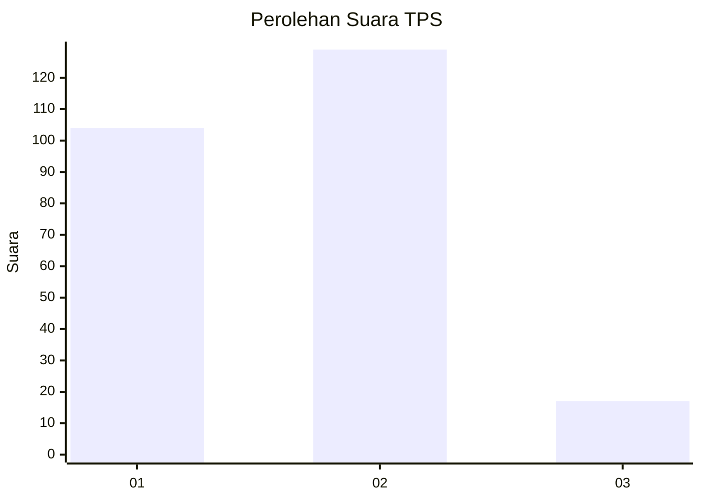

# Hasil

## Grafik

## Tabel

| No. | Nama Paslon    | Suara | Suara (raw) | Persentase |
|:--- |:-------------- | -----:| -----------:| ----------:|
| 1   | ANIES MUHAIMIN | 104   | [104][p-1]  | 41,60      |
| 2   | PRABOWO GIBRAN | 129   | [129][p-2]  | 51,60      |
| 3   | GANJAR MAHFUD  | 17    | [17][p-3]   | 6,80       |

[p-1]: https://github.com/gigit-pemilu/pemilu-2024-35-jawa-timur/blob/main/pilpres/hitung-suara/sub/35-jawa-timur/sub/27-sampang/sub/03-sampang/sub/1004-banyuanyar/sub/021-tps/sub/paslon-1.txt
[p-2]: https://github.com/gigit-pemilu/pemilu-2024-35-jawa-timur/blob/main/pilpres/hitung-suara/sub/35-jawa-timur/sub/27-sampang/sub/03-sampang/sub/1004-banyuanyar/sub/021-tps/sub/paslon-2.txt
[p-3]: https://github.com/gigit-pemilu/pemilu-2024-35-jawa-timur/blob/main/pilpres/hitung-suara/sub/35-jawa-timur/sub/27-sampang/sub/03-sampang/sub/1004-banyuanyar/sub/021-tps/sub/paslon-3.txt

## Foto C Plano

https://sirekap-obj-formc.kpu.go.id/f0c3/pemilu/ppwp/35/27/03/10/04/3527031004021-20240214-222521--f27b2c7c-1cc3-43ae-8cb7-8366a7375191.jpg

https://sirekap-obj-formc.kpu.go.id/f0c3/pemilu/ppwp/35/27/03/10/04/3527031004021-20240214-222637--405eb508-d80c-441b-b174-df2322ab7e87.jpg

https://sirekap-obj-formc.kpu.go.id/f0c3/pemilu/ppwp/35/27/03/10/04/3527031004021-20240214-222831--0088372b-8903-4a72-9e31-359002219e83.jpg

## Metadata

| Key        | Value               |
| ---------- | ------------------- |
| Time Stamp | 2024-02-16 10:30:29 |

