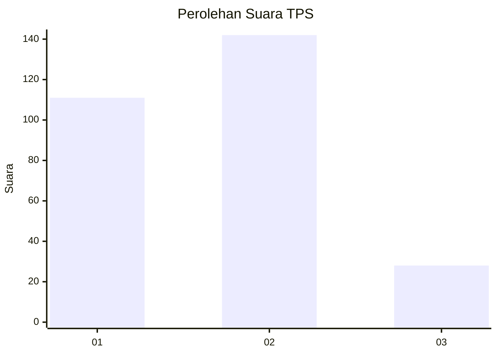
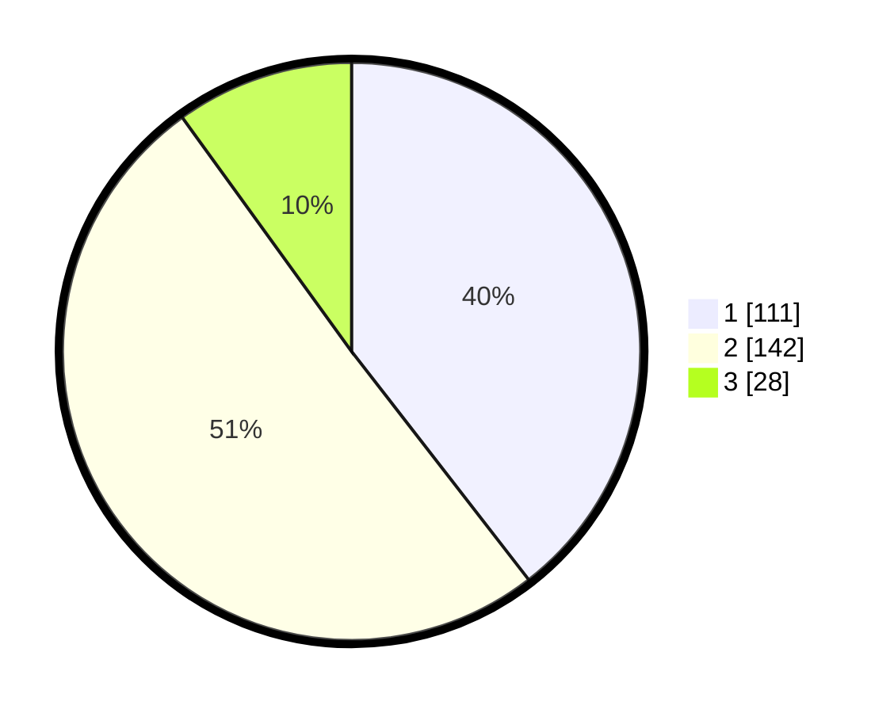

# Hasil

## Grafik

## Tabel

| No. | Nama Paslon    | Suara | Suara (raw) | Persentase |
|:--- |:-------------- | -----:| -----------:| ----------:|
| 1   | ANIES MUHAIMIN | 111   | [111][p-1]  | 39,50      |
| 2   | PRABOWO GIBRAN | 142   | [142][p-2]  | 50,53      |
| 3   | GANJAR MAHFUD  | 28    | [28][p-3]   | 9,96       |

[p-1]: https://github.com/gigit-pemilu/pemilu-2024/blob/main/pilpres/hitung-suara/sub/35-jawa-timur/sub/27-sampang/sub/03-sampang/sub/1006-rongtengah/sub/007-tps/sub/paslon-1.txt
[p-2]: https://github.com/gigit-pemilu/pemilu-2024/blob/main/pilpres/hitung-suara/sub/35-jawa-timur/sub/27-sampang/sub/03-sampang/sub/1006-rongtengah/sub/007-tps/sub/paslon-2.txt
[p-3]: https://github.com/gigit-pemilu/pemilu-2024/blob/main/pilpres/hitung-suara/sub/35-jawa-timur/sub/27-sampang/sub/03-sampang/sub/1006-rongtengah/sub/007-tps/sub/paslon-3.txt

## Foto C Plano

https://sirekap-obj-formc.kpu.go.id/0471/pemilu/ppwp/35/27/03/10/06/3527031006007-20240214-223024--f7a3e262-2713-4c2d-8686-1639cdd1ddb5.jpg

https://sirekap-obj-formc.kpu.go.id/0471/pemilu/ppwp/35/27/03/10/06/3527031006007-20240214-223136--3452490e-cfed-4547-a2fd-04957e4b9a4d.jpg

https://sirekap-obj-formc.kpu.go.id/0471/pemilu/ppwp/35/27/03/10/06/3527031006007-20240214-223242--6a9a0b64-0f4c-46ec-9c1c-0c04e5965a70.jpg

## Metadata

| Key        | Value               |
| ---------- | ------------------- |
| Time Stamp | 2024-02-16 12:51:22 |

