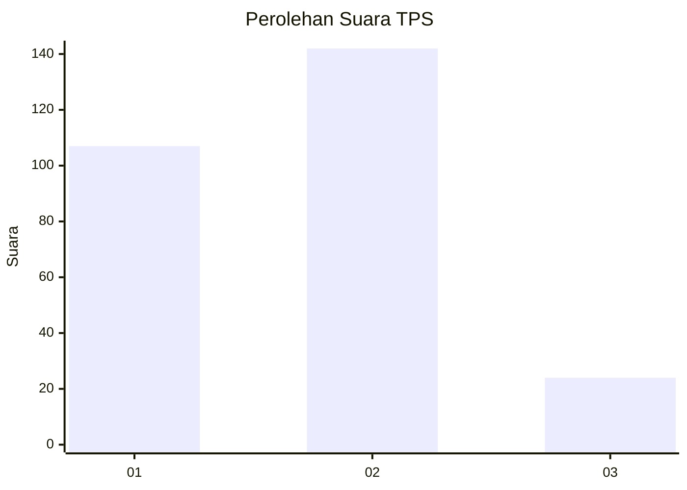
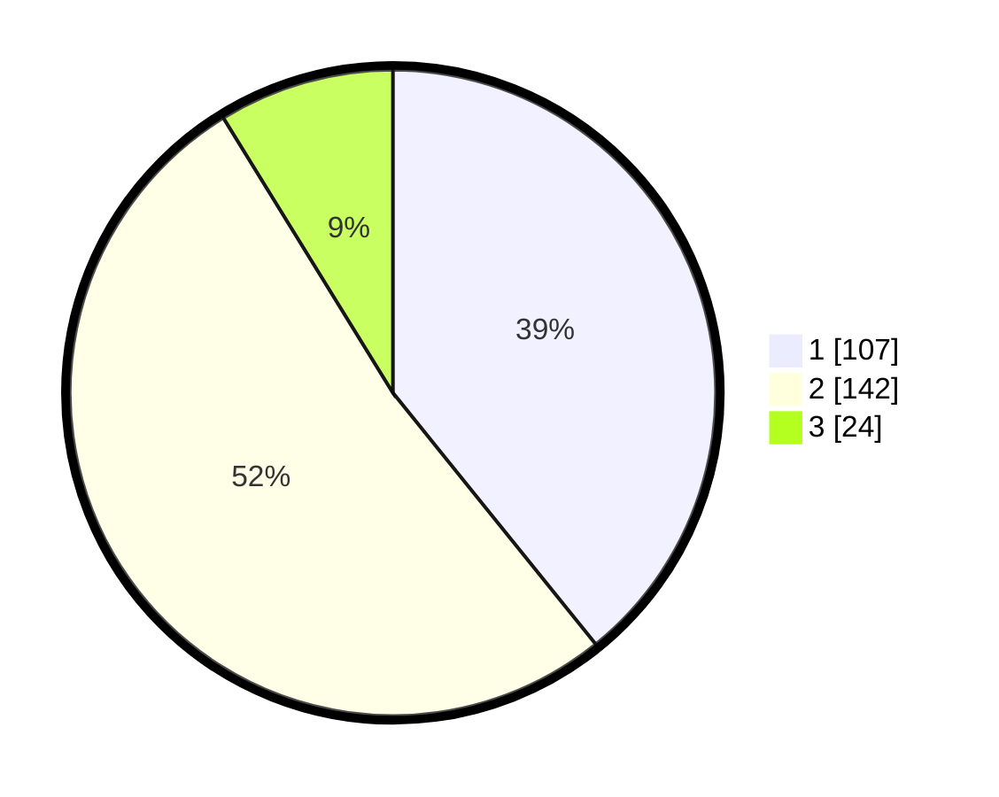

# Hasil

## Grafik

## Tabel

| No. | Nama Paslon    | Suara | Suara (raw) | Persentase |
|:--- |:-------------- | -----:| -----------:| ----------:|
| 1   | ANIES MUHAIMIN | 107   | [107][p-1]  | 39,19      |
| 2   | PRABOWO GIBRAN | 142   | [142][p-2]  | 52,01      |
| 3   | GANJAR MAHFUD  | 24    | [24][p-3]   | 8,79       |

[p-1]: https://github.com/gigit-pemilu/pemilu-2024-35-jawa-timur/blob/main/pilpres/hitung-suara/sub/35-jawa-timur/sub/27-sampang/sub/03-sampang/sub/1006-rongtengah/sub/009-tps/sub/paslon-1.txt
[p-2]: https://github.com/gigit-pemilu/pemilu-2024-35-jawa-timur/blob/main/pilpres/hitung-suara/sub/35-jawa-timur/sub/27-sampang/sub/03-sampang/sub/1006-rongtengah/sub/009-tps/sub/paslon-2.txt
[p-3]: https://github.com/gigit-pemilu/pemilu-2024-35-jawa-timur/blob/main/pilpres/hitung-suara/sub/35-jawa-timur/sub/27-sampang/sub/03-sampang/sub/1006-rongtengah/sub/009-tps/sub/paslon-3.txt

## Foto C Plano

https://sirekap-obj-formc.kpu.go.id/71a9/pemilu/ppwp/35/27/03/10/06/3527031006009-20240217-205703--59d05301-cb27-4439-aa3f-16c2b4177d08.jpg

https://sirekap-obj-formc.kpu.go.id/71a9/pemilu/ppwp/35/27/03/10/06/3527031006009-20240217-211020--66e8e46b-9907-41cf-bbbf-c976be14f014.jpg

https://sirekap-obj-formc.kpu.go.id/71a9/pemilu/ppwp/35/27/03/10/06/3527031006009-20240217-211401--532024c2-75c7-4124-b5dd-cd2db6291d0b.jpg

## Metadata

| Key        | Value               |
| ---------- | ------------------- |
| Time Stamp | 2024-02-21 17:00:00 |

