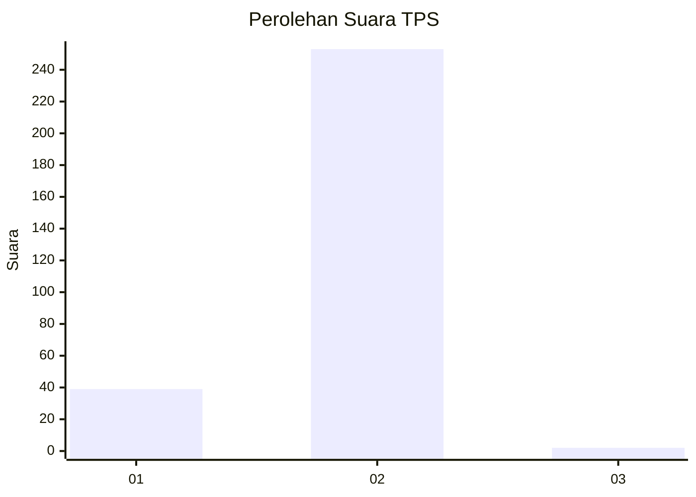
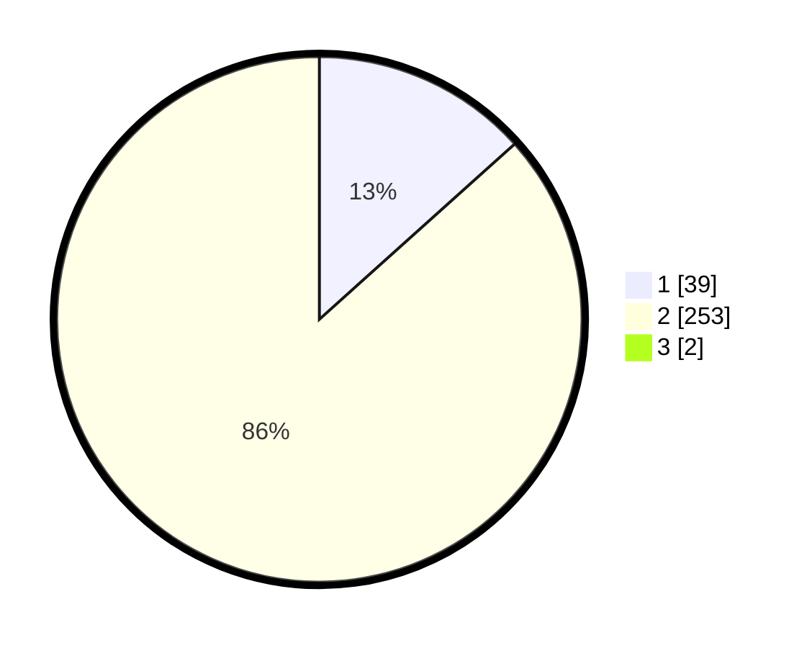

# Hasil

## Grafik

## Tabel

| No. | Nama Paslon    | Suara | Suara (raw) | Persentase |
|:--- |:-------------- | -----:| -----------:| ----------:|
| 1   | ANIES MUHAIMIN | 39    | [39][p-1]   | 13,27      |
| 2   | PRABOWO GIBRAN | 253   | [253][p-2]  | 86,05      |
| 3   | GANJAR MAHFUD  | 2     | [2][p-3]    | 0,68       |

[p-1]: https://github.com/gigit-pemilu/pemilu-2024/blob/main/pilpres/hitung-suara/sub/35-jawa-timur/sub/27-sampang/sub/03-sampang/sub/1007-karang-dalam/sub/013-tps/sub/paslon-1.txt
[p-2]: https://github.com/gigit-pemilu/pemilu-2024/blob/main/pilpres/hitung-suara/sub/35-jawa-timur/sub/27-sampang/sub/03-sampang/sub/1007-karang-dalam/sub/013-tps/sub/paslon-2.txt
[p-3]: https://github.com/gigit-pemilu/pemilu-2024/blob/main/pilpres/hitung-suara/sub/35-jawa-timur/sub/27-sampang/sub/03-sampang/sub/1007-karang-dalam/sub/013-tps/sub/paslon-3.txt

## Foto C Plano

https://sirekap-obj-formc.kpu.go.id/2317/pemilu/ppwp/35/27/03/10/07/3527031007013-20240214-225216--2e73e405-96d1-4ad3-b973-5f98dc74e987.jpg

https://sirekap-obj-formc.kpu.go.id/2317/pemilu/ppwp/35/27/03/10/07/3527031007013-20240214-225328--7f7f9131-c9a2-4059-9fb3-9bdeaf1b5d14.jpg

## Metadata

| Key        | Value               |
| ---------- | ------------------- |
| Time Stamp | 2024-02-25 15:00:00 |

