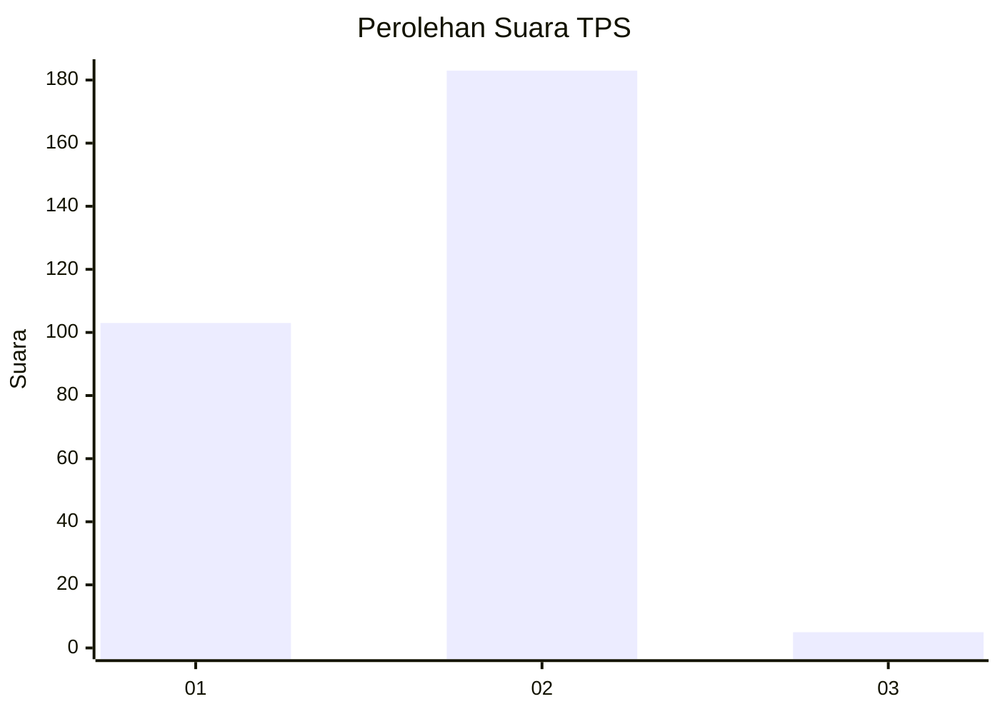
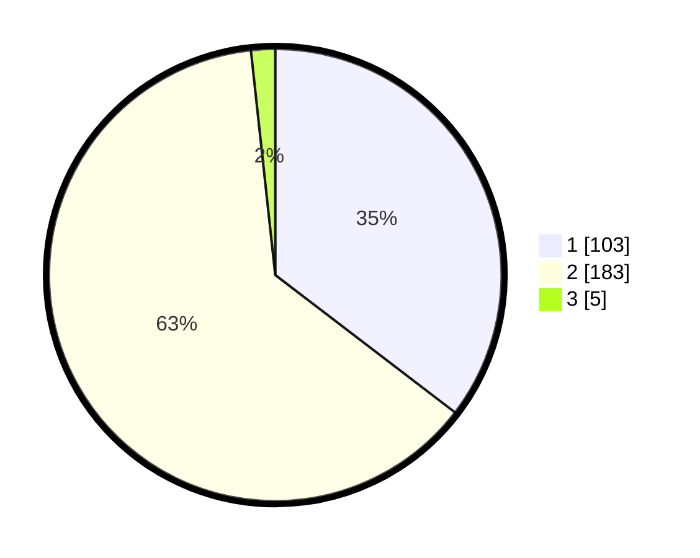

# Hasil

## Grafik

## Tabel

| No. | Nama Paslon    | Suara | Suara (raw) | Persentase |
|:--- |:-------------- | -----:| -----------:| ----------:|
| 1   | ANIES MUHAIMIN | 103   | [103][p-1]  | 35,40      |
| 2   | PRABOWO GIBRAN | 183   | [183][p-2]  | 62,89      |
| 3   | GANJAR MAHFUD  | 5     | [5][p-3]    | 1,72       |

[p-1]: https://github.com/gigit-pemilu/pemilu-2024/blob/main/pilpres/hitung-suara/sub/35-jawa-timur/sub/27-sampang/sub/03-sampang/sub/1007-karang-dalam/sub/014-tps/sub/paslon-1.txt
[p-2]: https://github.com/gigit-pemilu/pemilu-2024/blob/main/pilpres/hitung-suara/sub/35-jawa-timur/sub/27-sampang/sub/03-sampang/sub/1007-karang-dalam/sub/014-tps/sub/paslon-2.txt
[p-3]: https://github.com/gigit-pemilu/pemilu-2024/blob/main/pilpres/hitung-suara/sub/35-jawa-timur/sub/27-sampang/sub/03-sampang/sub/1007-karang-dalam/sub/014-tps/sub/paslon-3.txt

## Foto C Plano

https://sirekap-obj-formc.kpu.go.id/e5c3/pemilu/ppwp/35/27/03/10/07/3527031007014-20240214-204526--189ae52a-163a-4a2b-8d30-e788790655f7.jpg

https://sirekap-obj-formc.kpu.go.id/e5c3/pemilu/ppwp/35/27/03/10/07/3527031007014-20240214-204623--ff0be8c0-08c1-4ed0-92ec-fae741f60af6.jpg

## Metadata

| Key        | Value               |
| ---------- | ------------------- |
| Time Stamp | 2024-02-25 14:00:00 |

