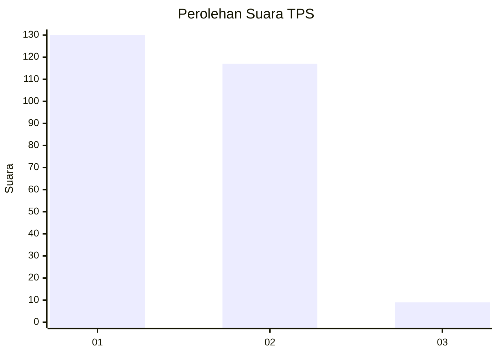
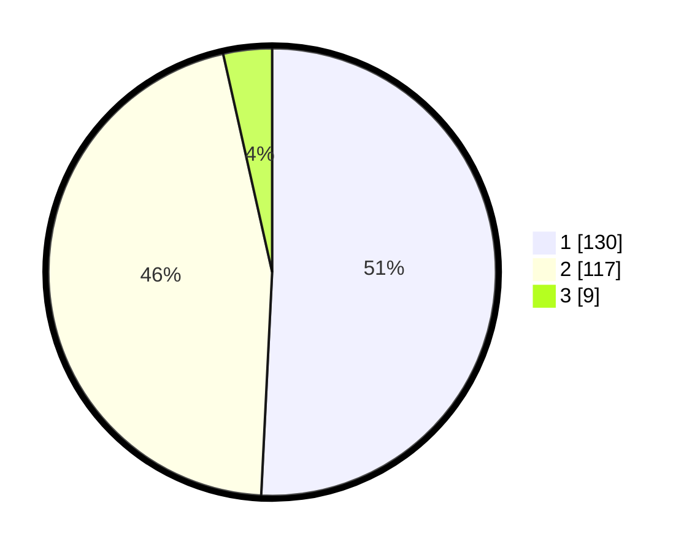

# Hasil

## Grafik

## Tabel

| No. | Nama Paslon    | Suara | Suara (raw) | Persentase |
|:--- |:-------------- | -----:| -----------:| ----------:|
| 1   | ANIES MUHAIMIN | 130   | [130][p-1]  | 50,78      |
| 2   | PRABOWO GIBRAN | 117   | [117][p-2]  | 45,70      |
| 3   | GANJAR MAHFUD  | 9     | [9][p-3]    | 3,52       |

[p-1]: https://github.com/gigit-pemilu/pemilu-2024/blob/main/pilpres/hitung-suara/sub/35-jawa-timur/sub/27-sampang/sub/03-sampang/sub/1007-karang-dalam/sub/016-tps/sub/paslon-1.txt
[p-2]: https://github.com/gigit-pemilu/pemilu-2024/blob/main/pilpres/hitung-suara/sub/35-jawa-timur/sub/27-sampang/sub/03-sampang/sub/1007-karang-dalam/sub/016-tps/sub/paslon-2.txt
[p-3]: https://github.com/gigit-pemilu/pemilu-2024/blob/main/pilpres/hitung-suara/sub/35-jawa-timur/sub/27-sampang/sub/03-sampang/sub/1007-karang-dalam/sub/016-tps/sub/paslon-3.txt

## Foto C Plano

https://sirekap-obj-formc.kpu.go.id/a982/pemilu/ppwp/35/27/03/10/07/3527031007016-20240214-213205--f57a5abf-158a-41d7-a1fd-bc4054a7e5e5.jpg

https://sirekap-obj-formc.kpu.go.id/a982/pemilu/ppwp/35/27/03/10/07/3527031007016-20240214-213037--54a21f98-a265-49ba-9fe5-97548ee0a6a8.jpg

https://sirekap-obj-formc.kpu.go.id/a982/pemilu/ppwp/35/27/03/10/07/3527031007016-20240214-210521--7595db37-e4eb-4a3a-bd63-5e3333dc4217.jpg

## Metadata

| Key        | Value               |
| ---------- | ------------------- |
| Time Stamp | 2024-02-25 20:00:00 |

