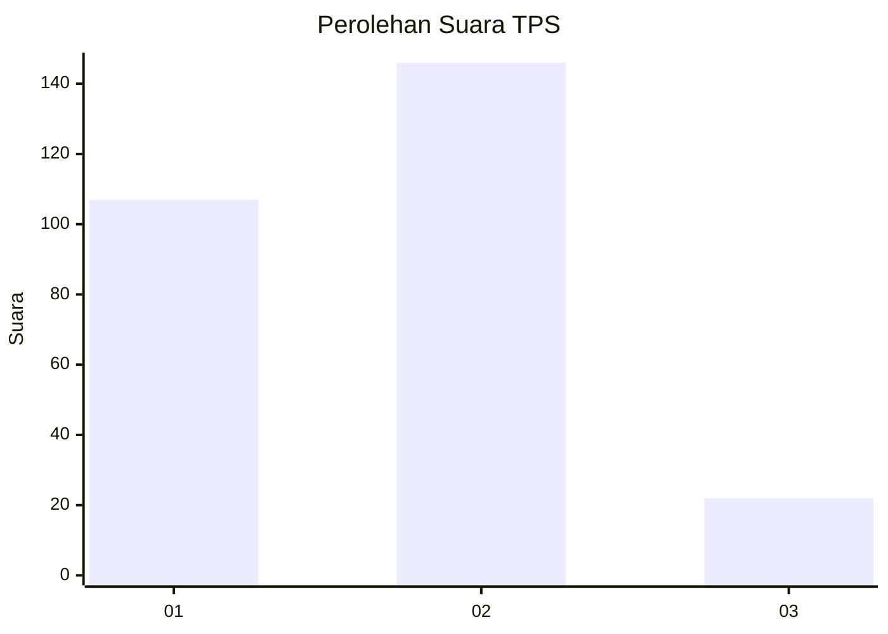
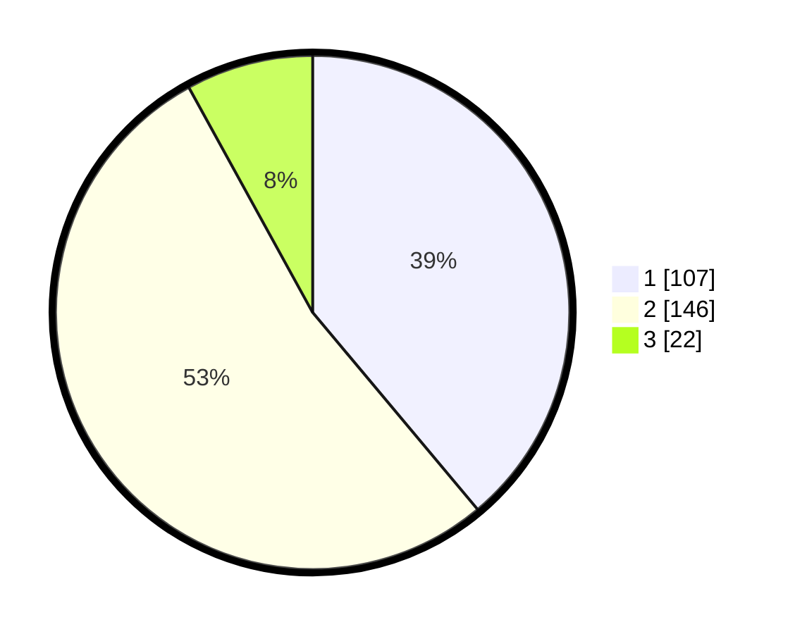

# Hasil

## Grafik

## Tabel

| No. | Nama Paslon    | Suara | Suara (raw) | Persentase |
|:--- |:-------------- | -----:| -----------:| ----------:|
| 1   | ANIES MUHAIMIN | 107   | [107][p-1]  | 38,91      |
| 2   | PRABOWO GIBRAN | 146   | [146][p-2]  | 53,09      |
| 3   | GANJAR MAHFUD  | 22    | [22][p-3]   | 8,00       |

[p-1]: https://github.com/gigit-pemilu/pemilu-2024/blob/main/pilpres/hitung-suara/sub/35-jawa-timur/sub/27-sampang/sub/03-sampang/sub/1008-gunung-sekar/sub/002-tps/sub/paslon-1.txt
[p-2]: https://github.com/gigit-pemilu/pemilu-2024/blob/main/pilpres/hitung-suara/sub/35-jawa-timur/sub/27-sampang/sub/03-sampang/sub/1008-gunung-sekar/sub/002-tps/sub/paslon-2.txt
[p-3]: https://github.com/gigit-pemilu/pemilu-2024/blob/main/pilpres/hitung-suara/sub/35-jawa-timur/sub/27-sampang/sub/03-sampang/sub/1008-gunung-sekar/sub/002-tps/sub/paslon-3.txt

## Foto C Plano

https://sirekap-obj-formc.kpu.go.id/d57e/pemilu/ppwp/35/27/03/10/08/3527031008002-20240214-230726--9df77b69-11fe-4298-bb72-d0598a34af3c.jpg

https://sirekap-obj-formc.kpu.go.id/d57e/pemilu/ppwp/35/27/03/10/08/3527031008002-20240214-160132--b5f598c4-bbba-499a-a768-9c6534d16456.jpg

https://sirekap-obj-formc.kpu.go.id/d57e/pemilu/ppwp/35/27/03/10/08/3527031008002-20240214-230757--e9d8e364-f63c-4601-bb08-404ea56f4be6.jpg

## Metadata

| Key        | Value               |
| ---------- | ------------------- |
| Time Stamp | 2024-02-15 22:00:27 |

