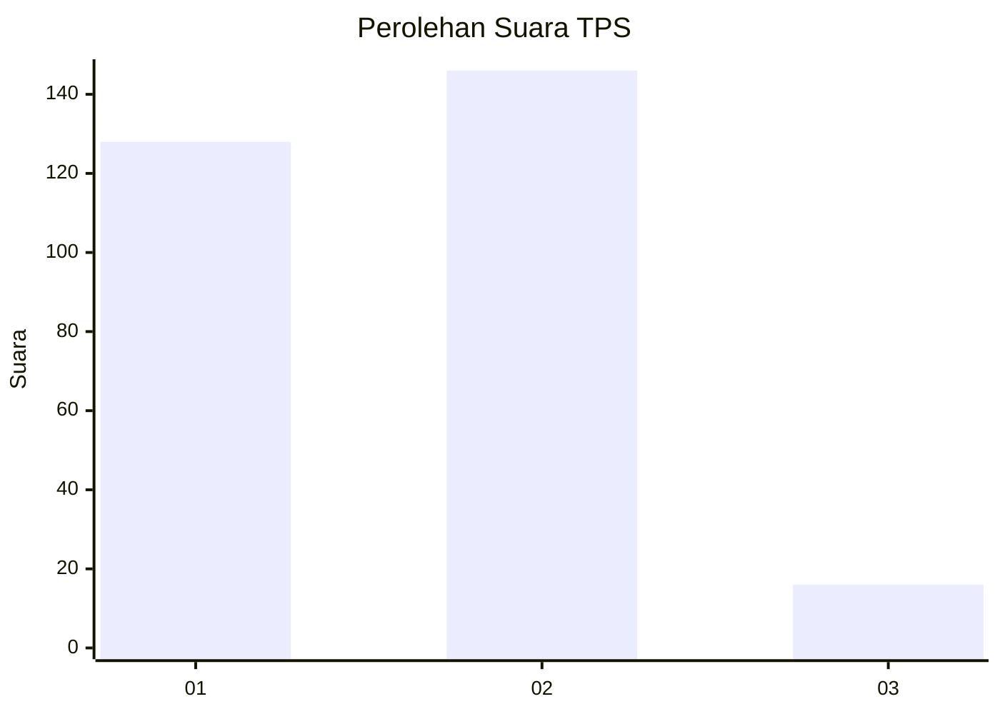
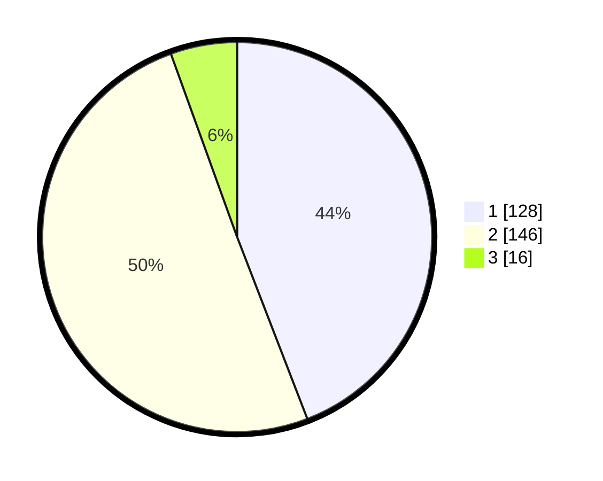

# Hasil

## Grafik

## Tabel

| No. | Nama Paslon    | Suara | Suara (raw) | Persentase |
|:--- |:-------------- | -----:| -----------:| ----------:|
| 1   | ANIES MUHAIMIN | 128   | [128][p-1]  | 44,14      |
| 2   | PRABOWO GIBRAN | 146   | [146][p-2]  | 50,34      |
| 3   | GANJAR MAHFUD  | 16    | [16][p-3]   | 5,52       |

[p-1]: https://github.com/gigit-pemilu/pemilu-2024-35-jawa-timur/blob/main/pilpres/hitung-suara/sub/35-jawa-timur/sub/27-sampang/sub/03-sampang/sub/1008-gunung-sekar/sub/003-tps/sub/paslon-1.txt
[p-2]: https://github.com/gigit-pemilu/pemilu-2024-35-jawa-timur/blob/main/pilpres/hitung-suara/sub/35-jawa-timur/sub/27-sampang/sub/03-sampang/sub/1008-gunung-sekar/sub/003-tps/sub/paslon-2.txt
[p-3]: https://github.com/gigit-pemilu/pemilu-2024-35-jawa-timur/blob/main/pilpres/hitung-suara/sub/35-jawa-timur/sub/27-sampang/sub/03-sampang/sub/1008-gunung-sekar/sub/003-tps/sub/paslon-3.txt

## Foto C Plano

https://sirekap-obj-formc.kpu.go.id/ae86/pemilu/ppwp/35/27/03/10/08/3527031008003-20240214-211125--5b5a7362-57f3-4a0e-abb3-8ad94b605dd2.jpg

https://sirekap-obj-formc.kpu.go.id/ae86/pemilu/ppwp/35/27/03/10/08/3527031008003-20240214-211519--2399b09a-d6ed-4cf8-85cd-6fd263c0225d.jpg

https://sirekap-obj-formc.kpu.go.id/ae86/pemilu/ppwp/35/27/03/10/08/3527031008003-20240214-211431--305ef66e-9628-4ff2-b3d5-1e5b6a2214aa.jpg

## Metadata

| Key        | Value               |
| ---------- | ------------------- |
| Time Stamp | 2024-02-16 10:30:29 |

