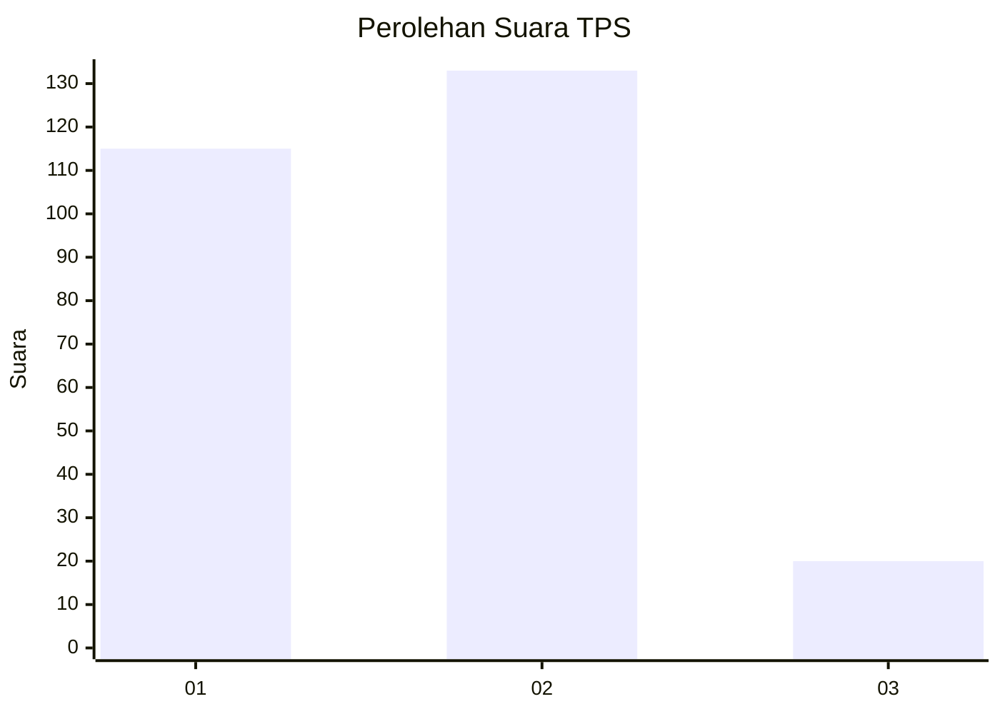
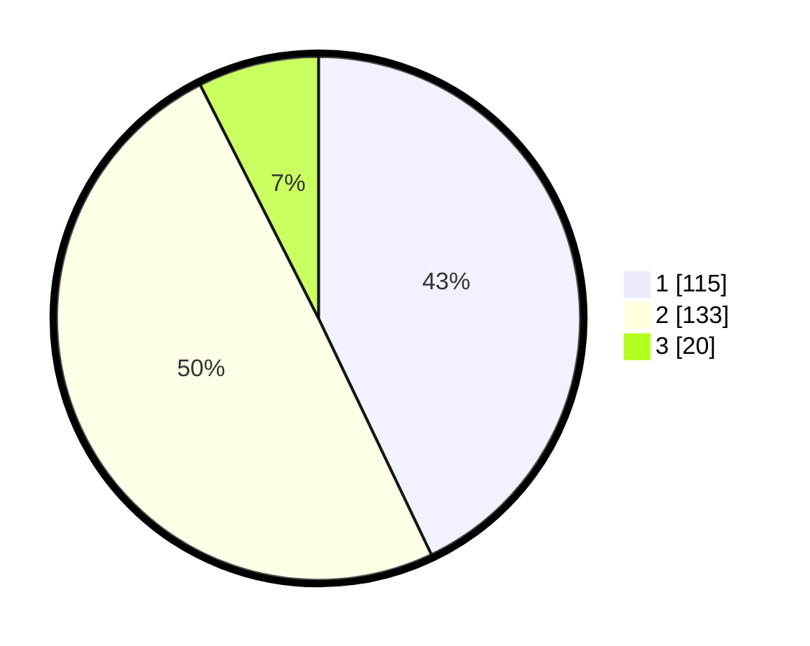

# Hasil

## Grafik

## Tabel

| No. | Nama Paslon    | Suara | Suara (raw) | Persentase |
|:--- |:-------------- | -----:| -----------:| ----------:|
| 1   | ANIES MUHAIMIN | 115   | [115][p-1]  | 42,91      |
| 2   | PRABOWO GIBRAN | 133   | [133][p-2]  | 49,63      |
| 3   | GANJAR MAHFUD  | 20    | [20][p-3]   | 7,46       |

[p-1]: https://github.com/gigit-pemilu/pemilu-2024/blob/main/pilpres/hitung-suara/sub/35-jawa-timur/sub/27-sampang/sub/03-sampang/sub/1008-gunung-sekar/sub/004-tps/sub/paslon-1.txt
[p-2]: https://github.com/gigit-pemilu/pemilu-2024/blob/main/pilpres/hitung-suara/sub/35-jawa-timur/sub/27-sampang/sub/03-sampang/sub/1008-gunung-sekar/sub/004-tps/sub/paslon-2.txt
[p-3]: https://github.com/gigit-pemilu/pemilu-2024/blob/main/pilpres/hitung-suara/sub/35-jawa-timur/sub/27-sampang/sub/03-sampang/sub/1008-gunung-sekar/sub/004-tps/sub/paslon-3.txt

## Foto C Plano

https://sirekap-obj-formc.kpu.go.id/56c5/pemilu/ppwp/35/27/03/10/08/3527031008004-20240215-014817--111dbb98-8b4a-4d18-a0c0-f9e64ca3d7eb.jpg

https://sirekap-obj-formc.kpu.go.id/56c5/pemilu/ppwp/35/27/03/10/08/3527031008004-20240215-014900--896e8743-93c1-47b5-82a4-8b813da3dca9.jpg

https://sirekap-obj-formc.kpu.go.id/56c5/pemilu/ppwp/35/27/03/10/08/3527031008004-20240215-014934--533aba79-c6cc-4641-9a81-62c7ddde70f7.jpg

## Metadata

| Key        | Value               |
| ---------- | ------------------- |
| Time Stamp | 2024-02-16 10:30:29 |

