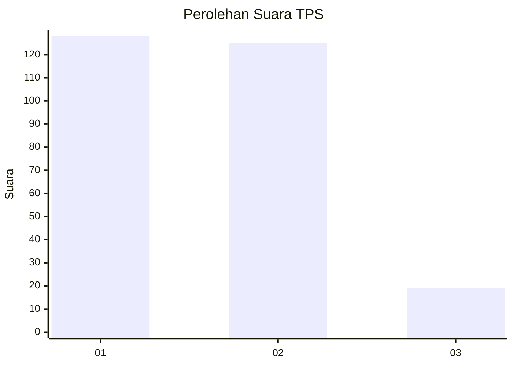
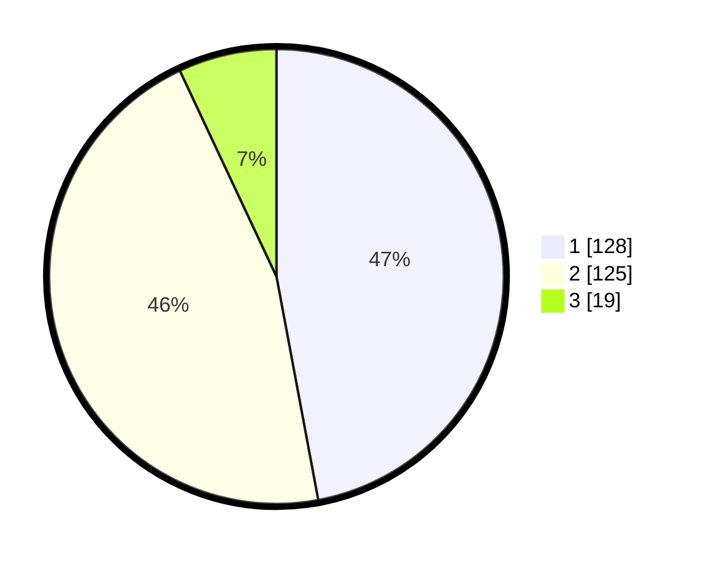

# Hasil

## Grafik

## Tabel

| No. | Nama Paslon    | Suara | Suara (raw) | Persentase |
|:--- |:-------------- | -----:| -----------:| ----------:|
| 1   | ANIES MUHAIMIN | 128   | [128][p-1]  | 47,06      |
| 2   | PRABOWO GIBRAN | 125   | [125][p-2]  | 45,96      |
| 3   | GANJAR MAHFUD  | 19    | [19][p-3]   | 6,99       |

[p-1]: https://github.com/gigit-pemilu/pemilu-2024-35-jawa-timur/blob/main/pilpres/hitung-suara/sub/35-jawa-timur/sub/27-sampang/sub/03-sampang/sub/1008-gunung-sekar/sub/005-tps/sub/paslon-1.txt
[p-2]: https://github.com/gigit-pemilu/pemilu-2024-35-jawa-timur/blob/main/pilpres/hitung-suara/sub/35-jawa-timur/sub/27-sampang/sub/03-sampang/sub/1008-gunung-sekar/sub/005-tps/sub/paslon-2.txt
[p-3]: https://github.com/gigit-pemilu/pemilu-2024-35-jawa-timur/blob/main/pilpres/hitung-suara/sub/35-jawa-timur/sub/27-sampang/sub/03-sampang/sub/1008-gunung-sekar/sub/005-tps/sub/paslon-3.txt

## Foto C Plano

https://sirekap-obj-formc.kpu.go.id/3ebe/pemilu/ppwp/35/27/03/10/08/3527031008005-20240215-013733--38754644-2deb-427c-af8e-0684c6b3ce6b.jpg

https://sirekap-obj-formc.kpu.go.id/3ebe/pemilu/ppwp/35/27/03/10/08/3527031008005-20240219-055633--7eabec95-5c53-4bd1-9646-5b624c355957.jpg

https://sirekap-obj-formc.kpu.go.id/3ebe/pemilu/ppwp/35/27/03/10/08/3527031008005-20240215-014058--719d4846-dc98-4028-a299-c5e5cd10527b.jpg

## Metadata

| Key        | Value               |
| ---------- | ------------------- |
| Time Stamp | 2024-02-25 23:00:00 |

