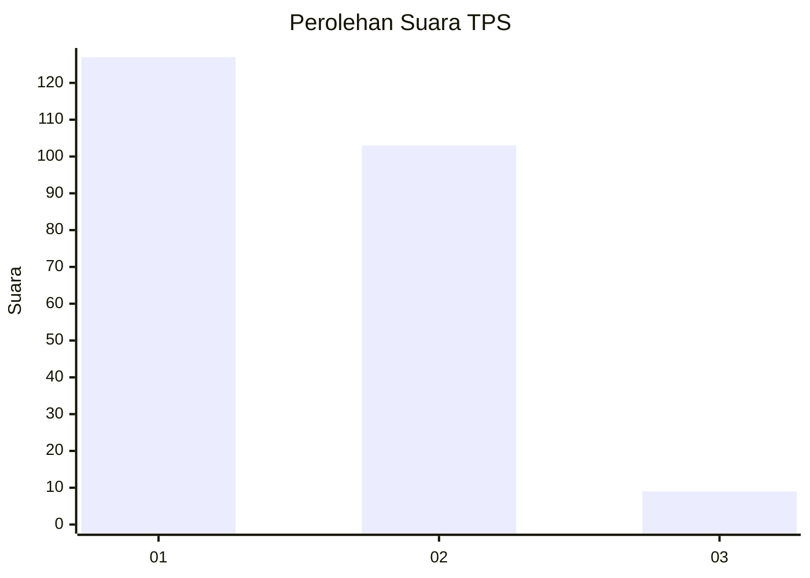
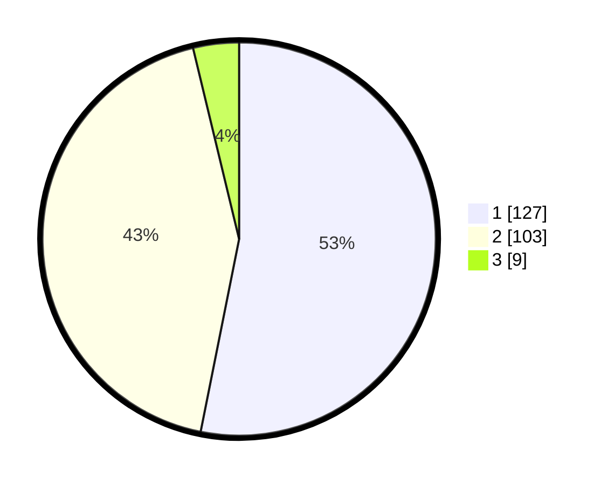

# Hasil

## Grafik

## Tabel

| No. | Nama Paslon    | Suara | Suara (raw) | Persentase |
|:--- |:-------------- | -----:| -----------:| ----------:|
| 1   | ANIES MUHAIMIN | 127   | [127][p-1]  | 53,14      |
| 2   | PRABOWO GIBRAN | 103   | [103][p-2]  | 43,10      |
| 3   | GANJAR MAHFUD  | 9     | [9][p-3]    | 3,77       |

[p-1]: https://github.com/gigit-pemilu/pemilu-2024/blob/main/pilpres/hitung-suara/sub/35-jawa-timur/sub/27-sampang/sub/03-sampang/sub/1008-gunung-sekar/sub/008-tps/sub/paslon-1.txt
[p-2]: https://github.com/gigit-pemilu/pemilu-2024/blob/main/pilpres/hitung-suara/sub/35-jawa-timur/sub/27-sampang/sub/03-sampang/sub/1008-gunung-sekar/sub/008-tps/sub/paslon-2.txt
[p-3]: https://github.com/gigit-pemilu/pemilu-2024/blob/main/pilpres/hitung-suara/sub/35-jawa-timur/sub/27-sampang/sub/03-sampang/sub/1008-gunung-sekar/sub/008-tps/sub/paslon-3.txt

## Foto C Plano

https://sirekap-obj-formc.kpu.go.id/a80e/pemilu/ppwp/35/27/03/10/08/3527031008008-20240222-143459--ce60a9ac-45eb-4eed-bd65-e56fefcd399d.jpg

https://sirekap-obj-formc.kpu.go.id/a80e/pemilu/ppwp/35/27/03/10/08/3527031008008-20240222-143826--97d7fbfc-2f6d-4684-a490-fad58a8d4dba.jpg

https://sirekap-obj-formc.kpu.go.id/a80e/pemilu/ppwp/35/27/03/10/08/3527031008008-20240222-144003--8f6d1520-bf42-4cf7-9012-d9751baae0bc.jpg

## Metadata

| Key        | Value               |
| ---------- | ------------------- |
| Time Stamp | 2024-02-22 16:00:00 |

