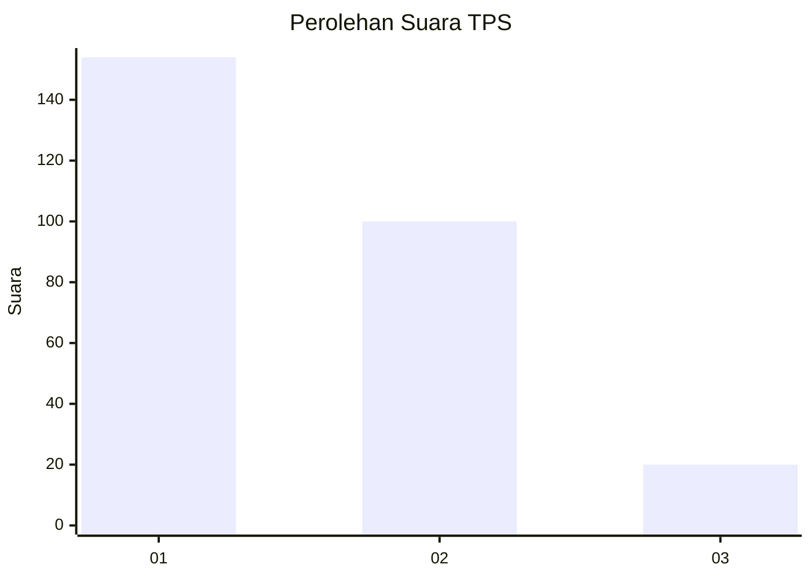
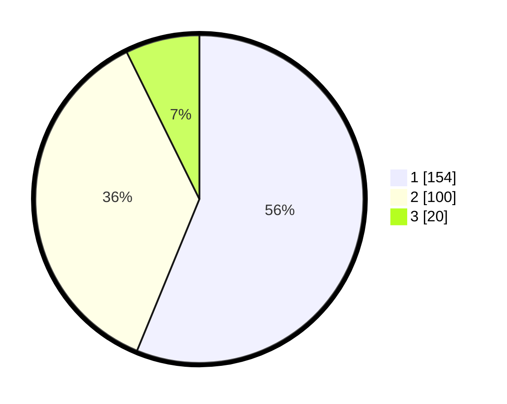

# Hasil

## Grafik

## Tabel

| No. | Nama Paslon    | Suara | Suara (raw) | Persentase |
|:--- |:-------------- | -----:| -----------:| ----------:|
| 1   | ANIES MUHAIMIN | 154   | [154][p-1]  | 56,20      |
| 2   | PRABOWO GIBRAN | 100   | [100][p-2]  | 36,50      |
| 3   | GANJAR MAHFUD  | 20    | [20][p-3]   | 7,30       |

[p-1]: https://github.com/gigit-pemilu/pemilu-2024/blob/main/pilpres/hitung-suara/sub/35-jawa-timur/sub/27-sampang/sub/03-sampang/sub/1008-gunung-sekar/sub/012-tps/sub/paslon-1.txt
[p-2]: https://github.com/gigit-pemilu/pemilu-2024/blob/main/pilpres/hitung-suara/sub/35-jawa-timur/sub/27-sampang/sub/03-sampang/sub/1008-gunung-sekar/sub/012-tps/sub/paslon-2.txt
[p-3]: https://github.com/gigit-pemilu/pemilu-2024/blob/main/pilpres/hitung-suara/sub/35-jawa-timur/sub/27-sampang/sub/03-sampang/sub/1008-gunung-sekar/sub/012-tps/sub/paslon-3.txt

## Foto C Plano

https://sirekap-obj-formc.kpu.go.id/5796/pemilu/ppwp/35/27/03/10/08/3527031008012-20240215-022606--bf155e5f-aa08-4563-a508-679cf259e920.jpg

https://sirekap-obj-formc.kpu.go.id/5796/pemilu/ppwp/35/27/03/10/08/3527031008012-20240215-022652--7972a7e0-4011-4dc1-b17d-25fcd2974186.jpg

https://sirekap-obj-formc.kpu.go.id/5796/pemilu/ppwp/35/27/03/10/08/3527031008012-20240215-022723--5dd523da-e73d-41de-b858-67e2c1baebf8.jpg

## Metadata

| Key        | Value               |
| ---------- | ------------------- |
| Time Stamp | 2024-02-16 10:30:29 |

