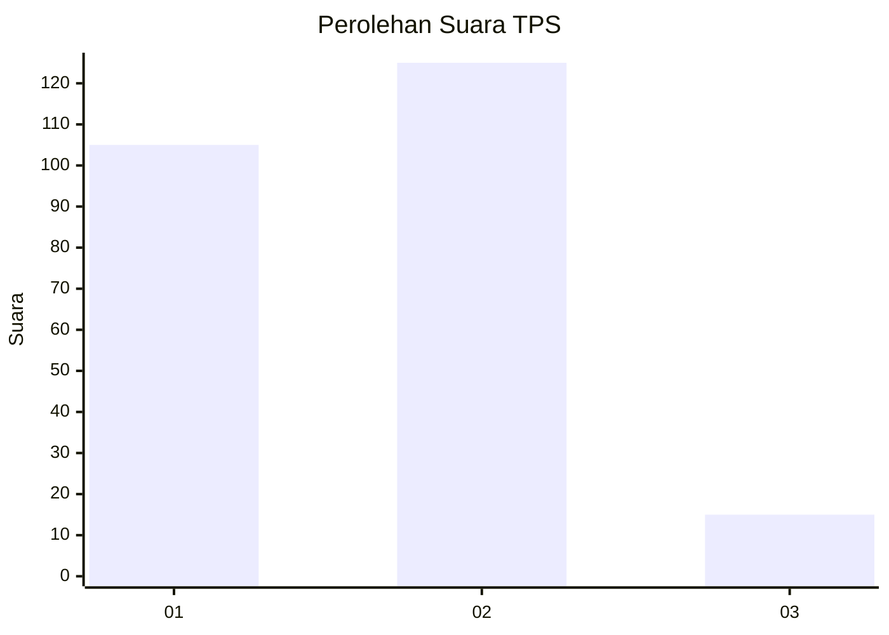
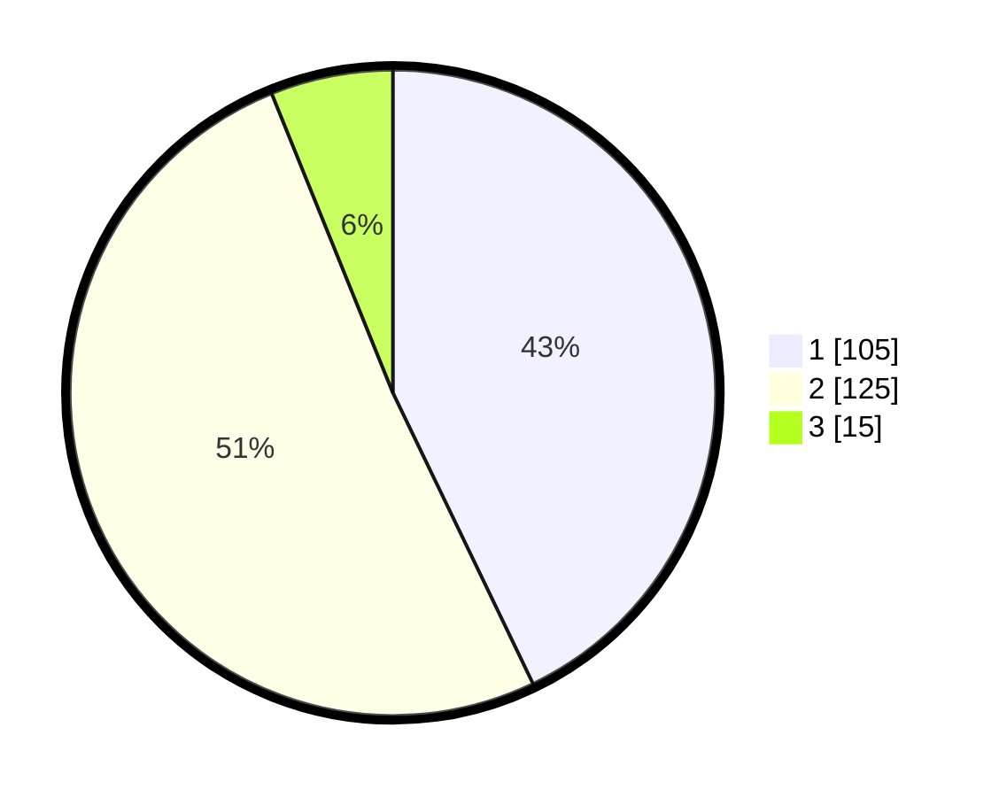

# Hasil

## Grafik

## Tabel

| No. | Nama Paslon    | Suara | Suara (raw) | Persentase |
|:--- |:-------------- | -----:| -----------:| ----------:|
| 1   | ANIES MUHAIMIN | 105   | [105][p-1]  | 42,86      |
| 2   | PRABOWO GIBRAN | 125   | [125][p-2]  | 51,02      |
| 3   | GANJAR MAHFUD  | 15    | [15][p-3]   | 6,12       |

[p-1]: https://github.com/gigit-pemilu/pemilu-2024-35-jawa-timur/blob/main/pilpres/hitung-suara/sub/35-jawa-timur/sub/27-sampang/sub/03-sampang/sub/1008-gunung-sekar/sub/018-tps/sub/paslon-1.txt
[p-2]: https://github.com/gigit-pemilu/pemilu-2024-35-jawa-timur/blob/main/pilpres/hitung-suara/sub/35-jawa-timur/sub/27-sampang/sub/03-sampang/sub/1008-gunung-sekar/sub/018-tps/sub/paslon-2.txt
[p-3]: https://github.com/gigit-pemilu/pemilu-2024-35-jawa-timur/blob/main/pilpres/hitung-suara/sub/35-jawa-timur/sub/27-sampang/sub/03-sampang/sub/1008-gunung-sekar/sub/018-tps/sub/paslon-3.txt

## Foto C Plano

https://sirekap-obj-formc.kpu.go.id/faf0/pemilu/ppwp/35/27/03/10/08/3527031008018-20240214-222523--613b1ab5-aaf1-4ebc-bc5a-f1fc65698900.jpg

https://sirekap-obj-formc.kpu.go.id/faf0/pemilu/ppwp/35/27/03/10/08/3527031008018-20240214-222809--fe81f498-c26a-4b2a-9b13-76ece901371a.jpg

https://sirekap-obj-formc.kpu.go.id/faf0/pemilu/ppwp/35/27/03/10/08/3527031008018-20240214-222957--e24c7463-9af2-4b3e-a4b8-764a65222add.jpg

## Metadata

| Key        | Value               |
| ---------- | ------------------- |
| Time Stamp | 2024-02-16 12:51:22 |

