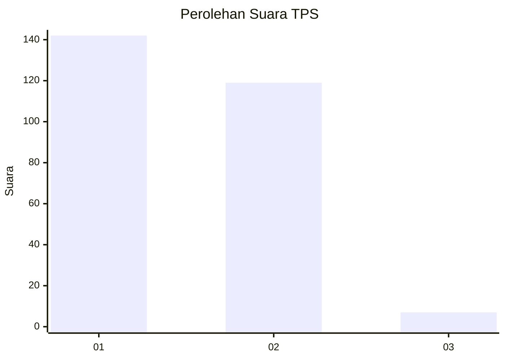
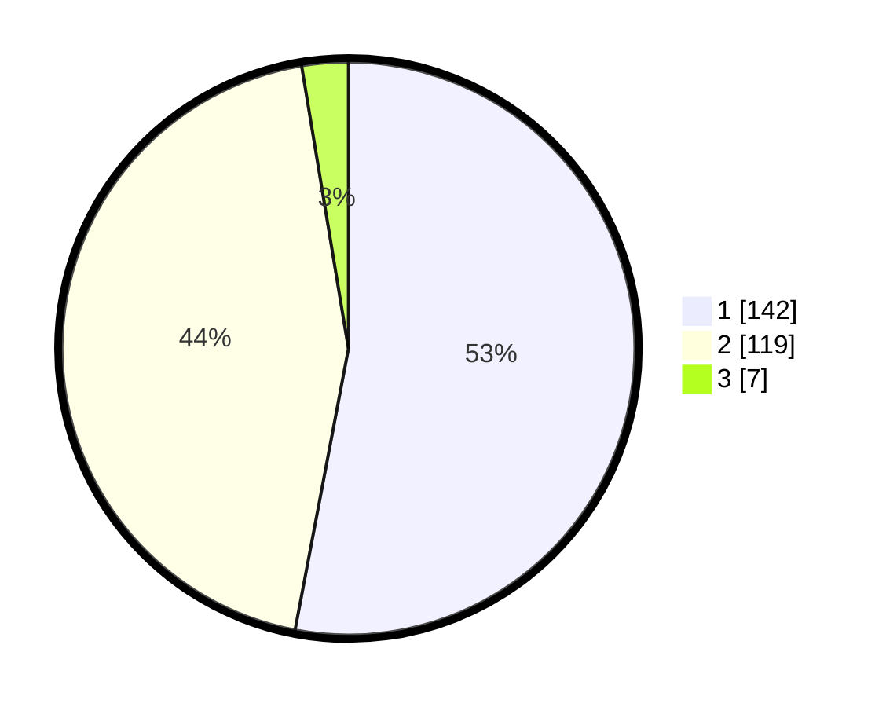

# Hasil

## Grafik

## Tabel

| No. | Nama Paslon    | Suara | Suara (raw) | Persentase |
|:--- |:-------------- | -----:| -----------:| ----------:|
| 1   | ANIES MUHAIMIN | 142   | [142][p-1]  | 52,99      |
| 2   | PRABOWO GIBRAN | 119   | [119][p-2]  | 44,40      |
| 3   | GANJAR MAHFUD  | 7     | [7][p-3]    | 2,61       |

[p-1]: https://github.com/gigit-pemilu/pemilu-2024/blob/main/pilpres/hitung-suara/sub/35-jawa-timur/sub/27-sampang/sub/03-sampang/sub/1008-gunung-sekar/sub/022-tps/sub/paslon-1.txt
[p-2]: https://github.com/gigit-pemilu/pemilu-2024/blob/main/pilpres/hitung-suara/sub/35-jawa-timur/sub/27-sampang/sub/03-sampang/sub/1008-gunung-sekar/sub/022-tps/sub/paslon-2.txt
[p-3]: https://github.com/gigit-pemilu/pemilu-2024/blob/main/pilpres/hitung-suara/sub/35-jawa-timur/sub/27-sampang/sub/03-sampang/sub/1008-gunung-sekar/sub/022-tps/sub/paslon-3.txt

## Foto C Plano

https://sirekap-obj-formc.kpu.go.id/7041/pemilu/ppwp/35/27/03/10/08/3527031008022-20240214-221100--3d2135e2-c721-46e0-941a-9b09547851b7.jpg

https://sirekap-obj-formc.kpu.go.id/7041/pemilu/ppwp/35/27/03/10/08/3527031008022-20240214-221209--ab07a734-b234-415c-a9c3-b15514c36aaa.jpg

https://sirekap-obj-formc.kpu.go.id/7041/pemilu/ppwp/35/27/03/10/08/3527031008022-20240214-221309--439e4fa3-5539-4cf1-a243-ab87cfc0d564.jpg

## Metadata

| Key        | Value               |
| ---------- | ------------------- |
| Time Stamp | 2024-02-15 21:01:18 |

