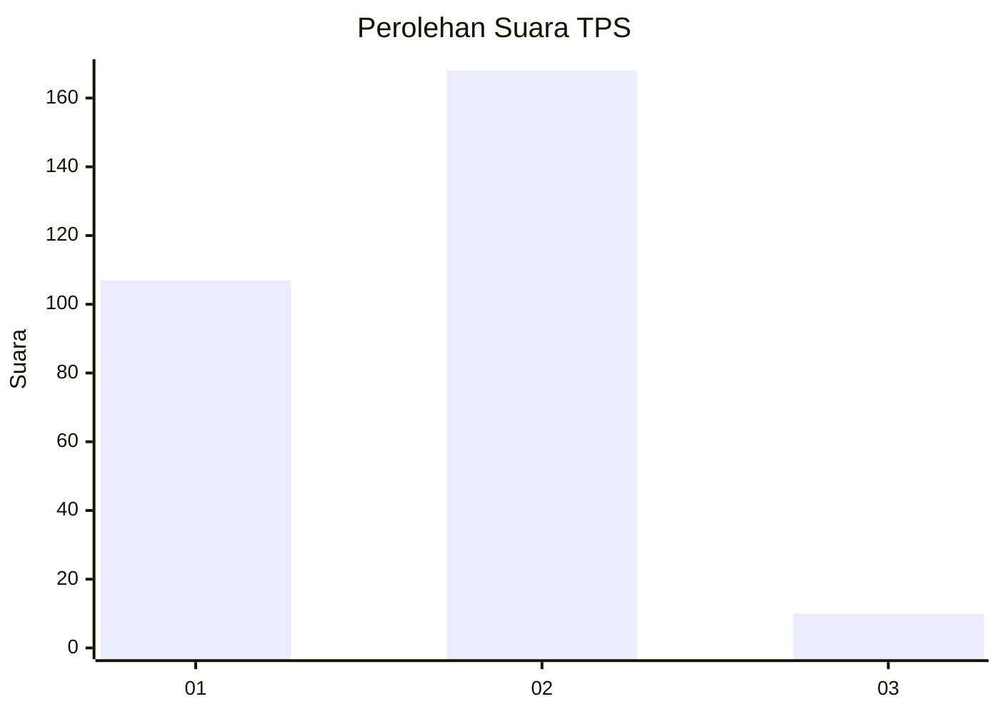
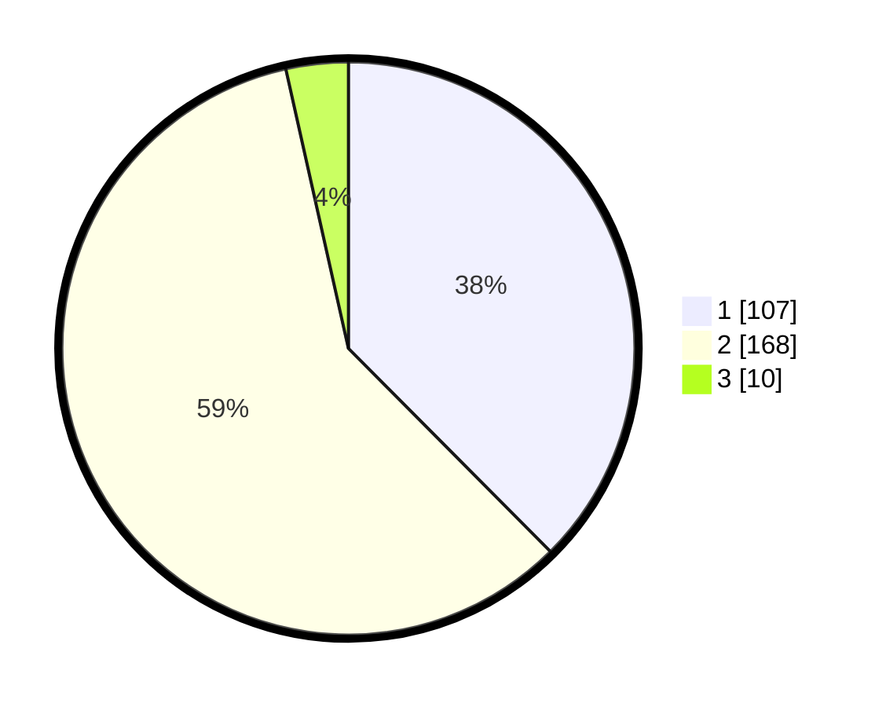

# Hasil

## Grafik

## Tabel

| No. | Nama Paslon    | Suara | Suara (raw) | Persentase |
|:--- |:-------------- | -----:| -----------:| ----------:|
| 1   | ANIES MUHAIMIN | 107   | [107][p-1]  | 37,54      |
| 2   | PRABOWO GIBRAN | 168   | [168][p-2]  | 58,95      |
| 3   | GANJAR MAHFUD  | 10    | [10][p-3]   | 3,51       |

[p-1]: https://github.com/gigit-pemilu/pemilu-2024/blob/main/pilpres/hitung-suara/sub/35-jawa-timur/sub/27-sampang/sub/03-sampang/sub/1008-gunung-sekar/sub/025-tps/sub/paslon-1.txt
[p-2]: https://github.com/gigit-pemilu/pemilu-2024/blob/main/pilpres/hitung-suara/sub/35-jawa-timur/sub/27-sampang/sub/03-sampang/sub/1008-gunung-sekar/sub/025-tps/sub/paslon-2.txt
[p-3]: https://github.com/gigit-pemilu/pemilu-2024/blob/main/pilpres/hitung-suara/sub/35-jawa-timur/sub/27-sampang/sub/03-sampang/sub/1008-gunung-sekar/sub/025-tps/sub/paslon-3.txt

## Foto C Plano

https://sirekap-obj-formc.kpu.go.id/7494/pemilu/ppwp/35/27/03/10/08/3527031008025-20240222-165225--ad6bfade-4ad0-4ef9-b313-c95be41576e9.jpg

https://sirekap-obj-formc.kpu.go.id/7494/pemilu/ppwp/35/27/03/10/08/3527031008025-20240222-165405--bab8d314-69f0-4711-ac8f-39f6e0494348.jpg

https://sirekap-obj-formc.kpu.go.id/7494/pemilu/ppwp/35/27/03/10/08/3527031008025-20240222-165529--c1ea4614-301b-4a99-9648-571082029331.jpg

## Metadata

| Key        | Value               |
| ---------- | ------------------- |
| Time Stamp | 2024-02-25 16:00:00 |

