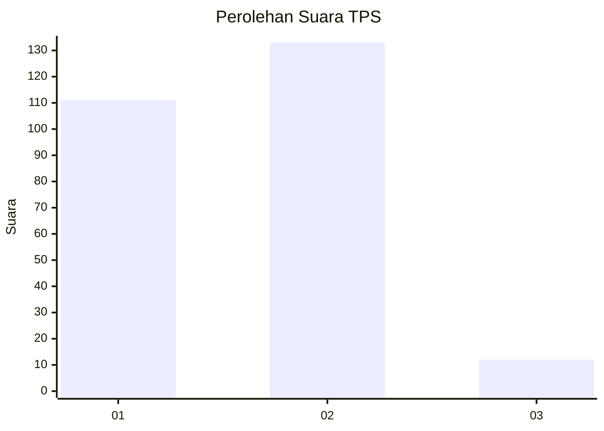
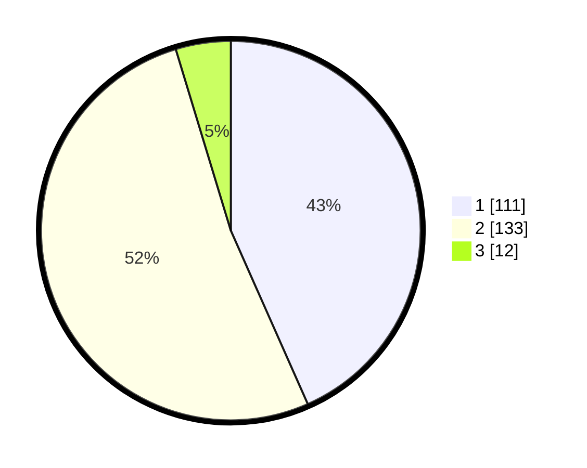

# Hasil

## Grafik

## Tabel

| No. | Nama Paslon    | Suara | Suara (raw) | Persentase |
|:--- |:-------------- | -----:| -----------:| ----------:|
| 1   | ANIES MUHAIMIN | 111   | [111][p-1]  | 43,36      |
| 2   | PRABOWO GIBRAN | 133   | [133][p-2]  | 51,95      |
| 3   | GANJAR MAHFUD  | 12    | [12][p-3]   | 4,69       |

[p-1]: https://github.com/gigit-pemilu/pemilu-2024/blob/main/pilpres/hitung-suara/sub/35-jawa-timur/sub/27-sampang/sub/03-sampang/sub/1008-gunung-sekar/sub/026-tps/sub/paslon-1.txt
[p-2]: https://github.com/gigit-pemilu/pemilu-2024/blob/main/pilpres/hitung-suara/sub/35-jawa-timur/sub/27-sampang/sub/03-sampang/sub/1008-gunung-sekar/sub/026-tps/sub/paslon-2.txt
[p-3]: https://github.com/gigit-pemilu/pemilu-2024/blob/main/pilpres/hitung-suara/sub/35-jawa-timur/sub/27-sampang/sub/03-sampang/sub/1008-gunung-sekar/sub/026-tps/sub/paslon-3.txt

## Foto C Plano

https://sirekap-obj-formc.kpu.go.id/3d93/pemilu/ppwp/35/27/03/10/08/3527031008026-20240215-011211--1af066d8-1ae9-4383-baf5-6e24e768a430.jpg

https://sirekap-obj-formc.kpu.go.id/3d93/pemilu/ppwp/35/27/03/10/08/3527031008026-20240215-011244--2f1f0119-58ee-4e62-84e1-17b009b379d6.jpg

https://sirekap-obj-formc.kpu.go.id/3d93/pemilu/ppwp/35/27/03/10/08/3527031008026-20240215-011341--b6e7f226-406f-4796-811d-0b0fce8b25db.jpg

## Metadata

| Key        | Value               |
| ---------- | ------------------- |
| Time Stamp | 2024-02-16 14:00:34 |

