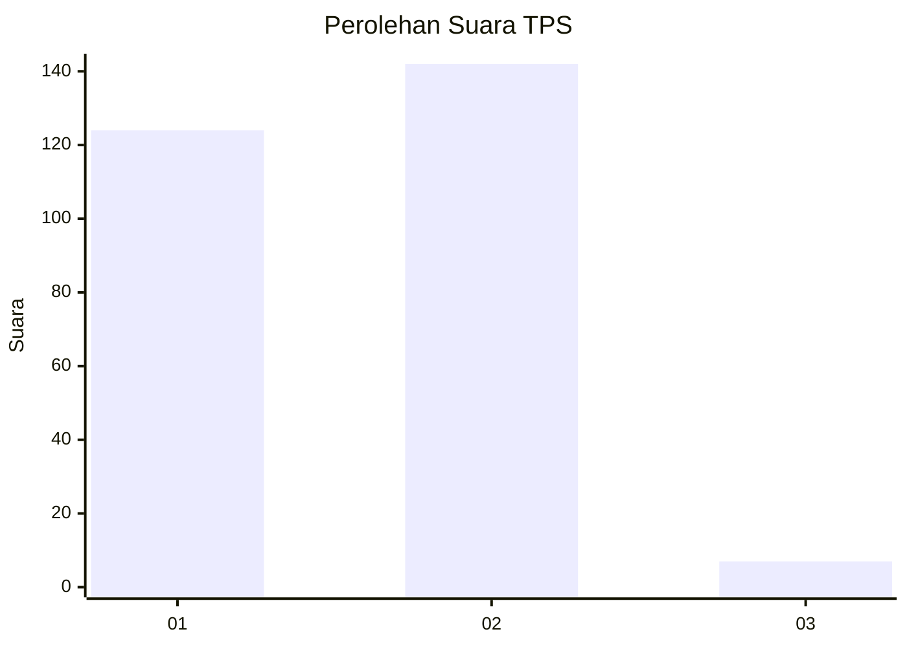
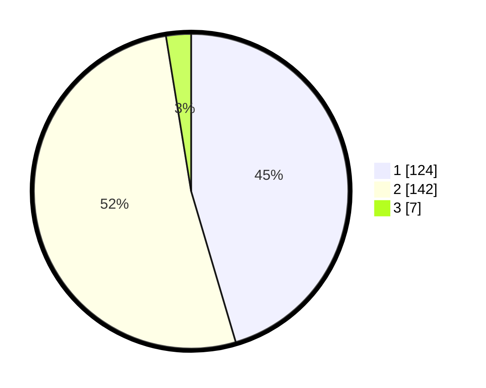

# Hasil

## Grafik

## Tabel

| No. | Nama Paslon    | Suara | Suara (raw) | Persentase |
|:--- |:-------------- | -----:| -----------:| ----------:|
| 1   | ANIES MUHAIMIN | 124   | [124][p-1]  | 45,42      |
| 2   | PRABOWO GIBRAN | 142   | [142][p-2]  | 52,01      |
| 3   | GANJAR MAHFUD  | 7     | [7][p-3]    | 2,56       |

[p-1]: https://github.com/gigit-pemilu/pemilu-2024-35-jawa-timur/blob/main/pilpres/hitung-suara/sub/35-jawa-timur/sub/27-sampang/sub/03-sampang/sub/1008-gunung-sekar/sub/029-tps/sub/paslon-1.txt
[p-2]: https://github.com/gigit-pemilu/pemilu-2024-35-jawa-timur/blob/main/pilpres/hitung-suara/sub/35-jawa-timur/sub/27-sampang/sub/03-sampang/sub/1008-gunung-sekar/sub/029-tps/sub/paslon-2.txt
[p-3]: https://github.com/gigit-pemilu/pemilu-2024-35-jawa-timur/blob/main/pilpres/hitung-suara/sub/35-jawa-timur/sub/27-sampang/sub/03-sampang/sub/1008-gunung-sekar/sub/029-tps/sub/paslon-3.txt

## Foto C Plano

https://sirekap-obj-formc.kpu.go.id/27ed/pemilu/ppwp/35/27/03/10/08/3527031008029-20240214-190250--abb4227e-f926-41df-ad08-8df4c6995cd1.jpg

https://sirekap-obj-formc.kpu.go.id/27ed/pemilu/ppwp/35/27/03/10/08/3527031008029-20240214-190204--ab7c765c-5324-4adb-852e-1dea5e055ae9.jpg

https://sirekap-obj-formc.kpu.go.id/27ed/pemilu/ppwp/35/27/03/10/08/3527031008029-20240214-185518--6c2b6009-21f8-4948-898c-b3ff0d39494e.jpg

## Metadata

| Key        | Value               |
| ---------- | ------------------- |
| Time Stamp | 2024-02-15 23:29:50 |

## DATA PEMILIH TETAP

Jumlah pemilih dalam DPT: **344**.
 * L: **753**.
 * P: **553**.

## DATA PENGGUNA HAK PILIH

Jumlah pengguna hak pilih dalam DPT: **298**.
 * L: **522**.
 * P: **575**.

Jumlah pengguna hak pilih dalam DPTb: **6**.
 * L: **333**.
 * P: **535**.

Jumlah pengguna hak pilih dalam DPK: **755**.
 * L: **557**.
 * P: **325**.

Jumlah pengguna hak pilih: **304**.
 * L: **553**.
 * P: **355**.

## JUMLAH SUARA SAH DAN TIDAK SAH

JUMLAH SELURUH SUARA SAH: **273**.

JUMLAH SUARA TIDAK SAH: **31**.

JUMLAH SELURUH SUARA SAH DAN SUARA TIDAK SAH: **304**.

