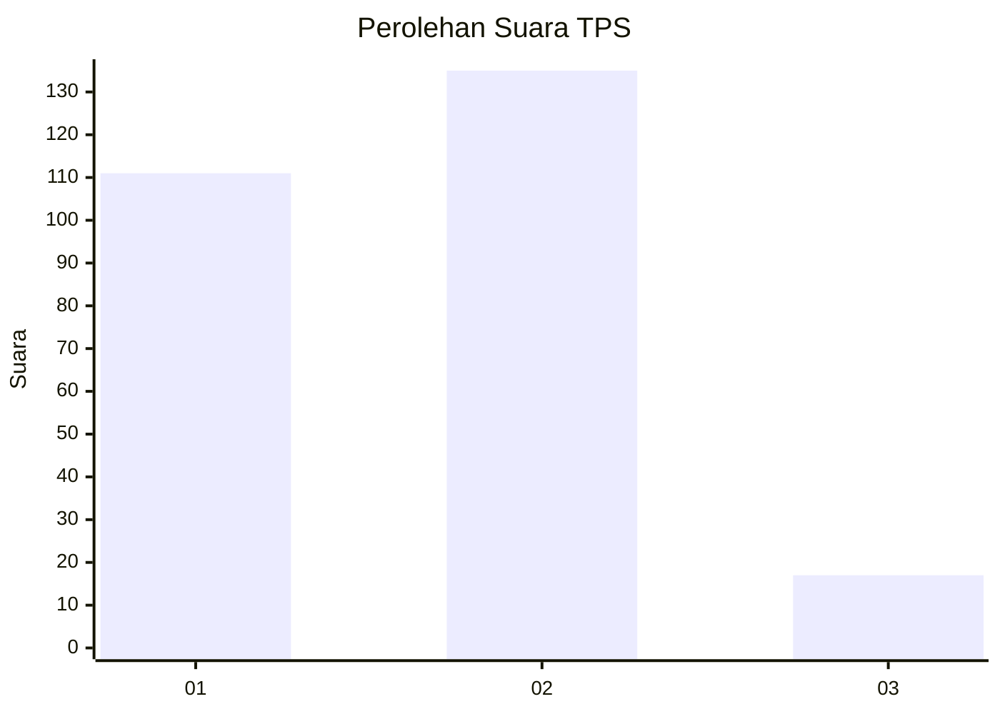

# Hasil

## Grafik

## Tabel

| No. | Nama Paslon    | Suara | Suara (raw) | Persentase |
|:--- |:-------------- | -----:| -----------:| ----------:|
| 1   | ANIES MUHAIMIN | 111   | [111][p-1]  | 42,21      |
| 2   | PRABOWO GIBRAN | 135   | [135][p-2]  | 51,33      |
| 3   | GANJAR MAHFUD  | 17    | [17][p-3]   | 6,46       |

[p-1]: https://github.com/gigit-pemilu/pemilu-2024-35-jawa-timur/blob/main/pilpres/hitung-suara/sub/35-jawa-timur/sub/27-sampang/sub/03-sampang/sub/1008-gunung-sekar/sub/031-tps/sub/paslon-1.txt
[p-2]: https://github.com/gigit-pemilu/pemilu-2024-35-jawa-timur/blob/main/pilpres/hitung-suara/sub/35-jawa-timur/sub/27-sampang/sub/03-sampang/sub/1008-gunung-sekar/sub/031-tps/sub/paslon-2.txt
[p-3]: https://github.com/gigit-pemilu/pemilu-2024-35-jawa-timur/blob/main/pilpres/hitung-suara/sub/35-jawa-timur/sub/27-sampang/sub/03-sampang/sub/1008-gunung-sekar/sub/031-tps/sub/paslon-3.txt

## Foto C Plano

https://sirekap-obj-formc.kpu.go.id/5f32/pemilu/ppwp/35/27/03/10/08/3527031008031-20240214-235416--0f09d65f-78f1-4ba0-9f78-165e62e868d1.jpg

https://sirekap-obj-formc.kpu.go.id/5f32/pemilu/ppwp/35/27/03/10/08/3527031008031-20240215-000033--abfe5680-6986-4328-90ac-5277beadf180.jpg

https://sirekap-obj-formc.kpu.go.id/5f32/pemilu/ppwp/35/27/03/10/08/3527031008031-20240215-000221--13c2caa1-a9c7-4298-b202-382d25739026.jpg

## Metadata

| Key        | Value               |
| ---------- | ------------------- |
| Time Stamp | 2024-02-17 09:30:03 |

