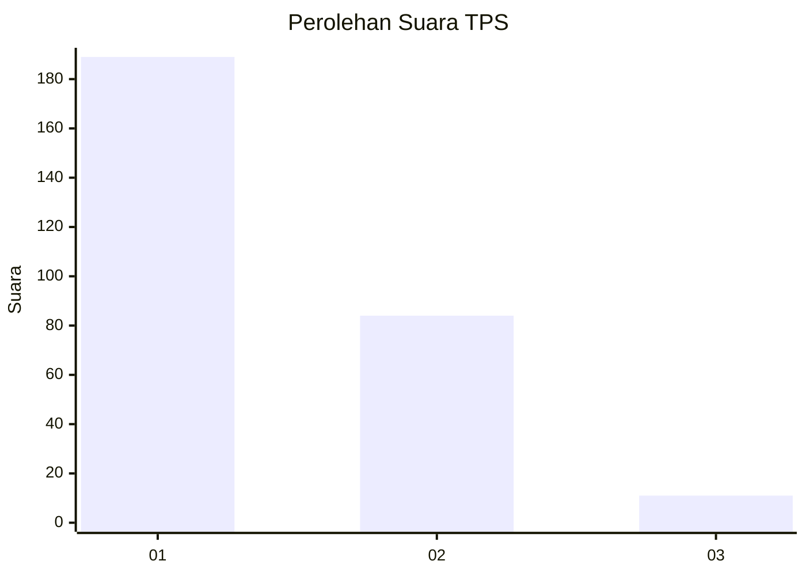
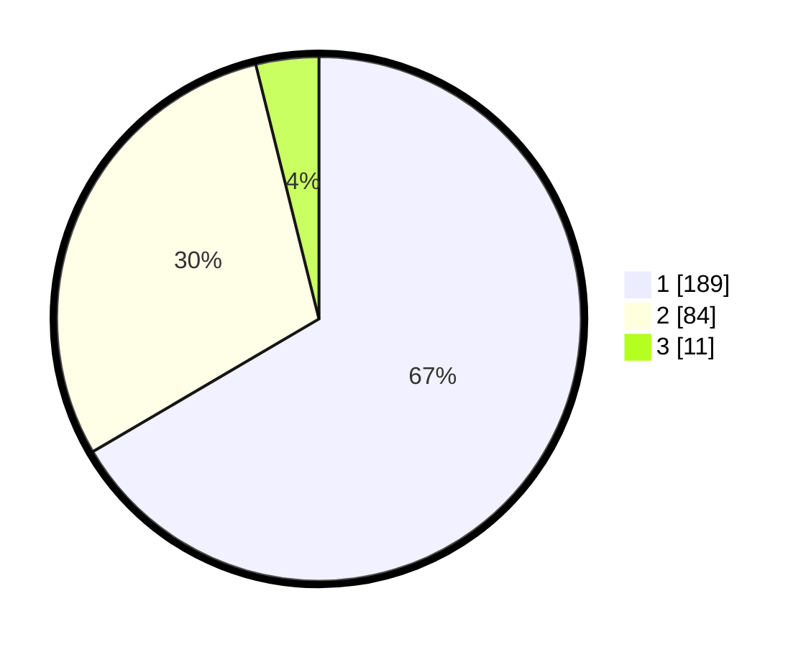

# Hasil

## Grafik

## Tabel

| No. | Nama Paslon    | Suara | Suara (raw) | Persentase |
|:--- |:-------------- | -----:| -----------:| ----------:|
| 1   | ANIES MUHAIMIN | 189   | [189][p-1]  | 66,55      |
| 2   | PRABOWO GIBRAN | 84    | [84][p-2]   | 29,58      |
| 3   | GANJAR MAHFUD  | 11    | [11][p-3]   | 3,87       |

[p-1]: https://github.com/gigit-pemilu/pemilu-2024/blob/main/pilpres/hitung-suara/sub/35-jawa-timur/sub/27-sampang/sub/03-sampang/sub/1008-gunung-sekar/sub/033-tps/sub/paslon-1.txt
[p-2]: https://github.com/gigit-pemilu/pemilu-2024/blob/main/pilpres/hitung-suara/sub/35-jawa-timur/sub/27-sampang/sub/03-sampang/sub/1008-gunung-sekar/sub/033-tps/sub/paslon-2.txt
[p-3]: https://github.com/gigit-pemilu/pemilu-2024/blob/main/pilpres/hitung-suara/sub/35-jawa-timur/sub/27-sampang/sub/03-sampang/sub/1008-gunung-sekar/sub/033-tps/sub/paslon-3.txt

## Foto C Plano

https://sirekap-obj-formc.kpu.go.id/f677/pemilu/ppwp/35/27/03/10/08/3527031008033-20240214-210345--8aee5203-cb65-4229-8a78-36e5cf0e4859.jpg

https://sirekap-obj-formc.kpu.go.id/f677/pemilu/ppwp/35/27/03/10/08/3527031008033-20240214-210438--0a3999a8-0376-4e9b-8250-0bf2a8a139b5.jpg

https://sirekap-obj-formc.kpu.go.id/f677/pemilu/ppwp/35/27/03/10/08/3527031008033-20240214-210513--bf0f978a-56f8-448b-a6da-045209a3d475.jpg

## Metadata

| Key        | Value               |
| ---------- | ------------------- |
| Time Stamp | 2024-02-16 14:30:33 |

