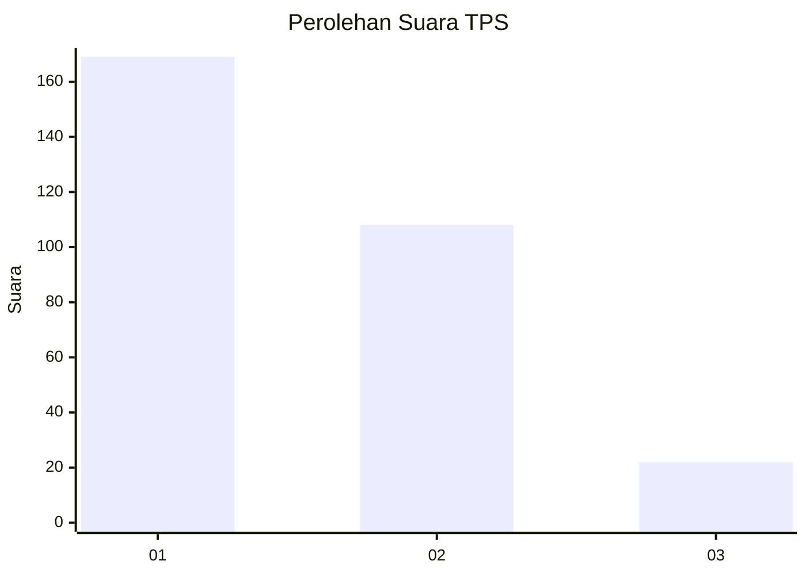
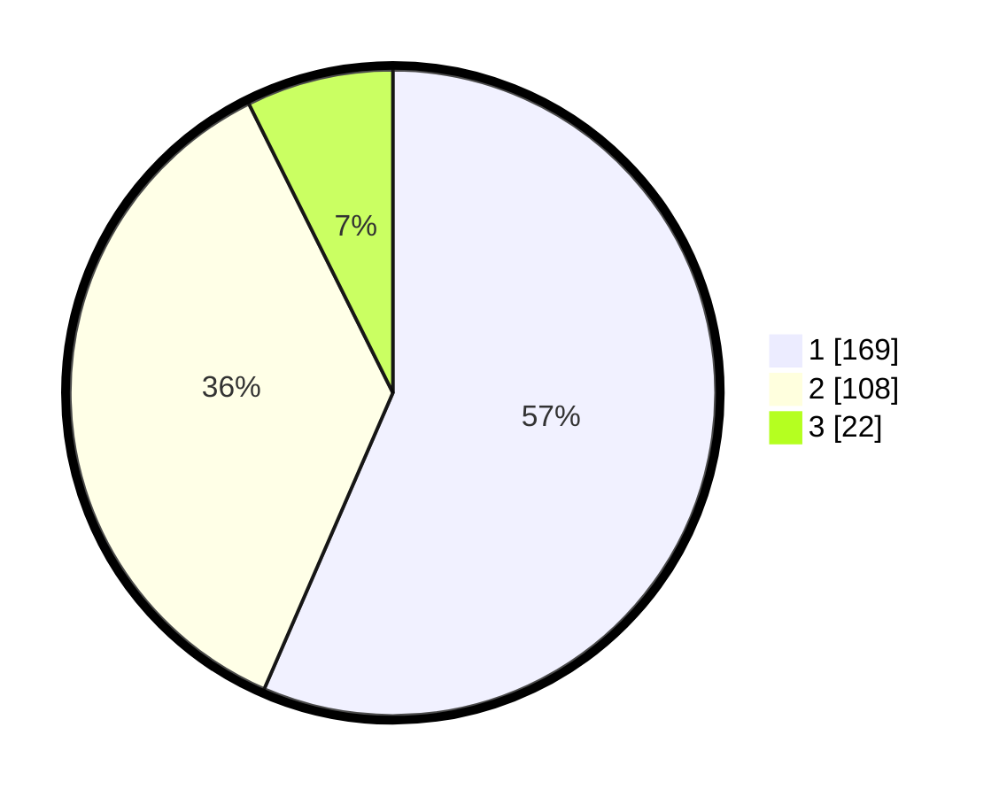

# Hasil

## Grafik

## Tabel

| No. | Nama Paslon    | Suara | Suara (raw) | Persentase |
|:--- |:-------------- | -----:| -----------:| ----------:|
| 1   | ANIES MUHAIMIN | 169   | [169][p-1]  | 56,52      |
| 2   | PRABOWO GIBRAN | 108   | [108][p-2]  | 36,12      |
| 3   | GANJAR MAHFUD  | 22    | [22][p-3]   | 7,36       |

[p-1]: https://github.com/gigit-pemilu/pemilu-2024-35-jawa-timur/blob/main/pilpres/hitung-suara/sub/35-jawa-timur/sub/27-sampang/sub/03-sampang/sub/1008-gunung-sekar/sub/036-tps/sub/paslon-1.txt
[p-2]: https://github.com/gigit-pemilu/pemilu-2024-35-jawa-timur/blob/main/pilpres/hitung-suara/sub/35-jawa-timur/sub/27-sampang/sub/03-sampang/sub/1008-gunung-sekar/sub/036-tps/sub/paslon-2.txt
[p-3]: https://github.com/gigit-pemilu/pemilu-2024-35-jawa-timur/blob/main/pilpres/hitung-suara/sub/35-jawa-timur/sub/27-sampang/sub/03-sampang/sub/1008-gunung-sekar/sub/036-tps/sub/paslon-3.txt

## Foto C Plano

https://sirekap-obj-formc.kpu.go.id/ce80/pemilu/ppwp/35/27/03/10/08/3527031008036-20240214-192140--592731ce-4e9f-4247-a0ee-63637c58c239.jpg

https://sirekap-obj-formc.kpu.go.id/ce80/pemilu/ppwp/35/27/03/10/08/3527031008036-20240214-192225--56547714-b63e-4c7f-b31f-7a633f5e9c3f.jpg

https://sirekap-obj-formc.kpu.go.id/ce80/pemilu/ppwp/35/27/03/10/08/3527031008036-20240214-192306--80584359-1a64-4eb2-9f83-d67b882b53be.jpg

## Metadata

| Key        | Value               |
| ---------- | ------------------- |
| Time Stamp | 2024-02-16 11:00:29 |

