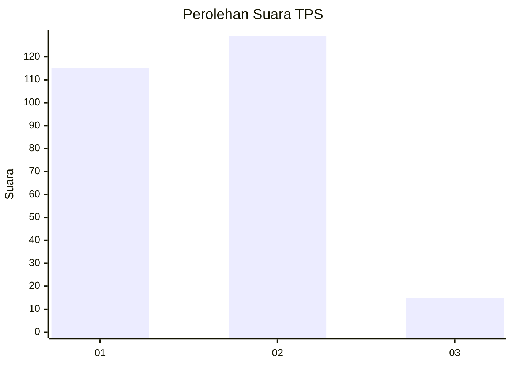
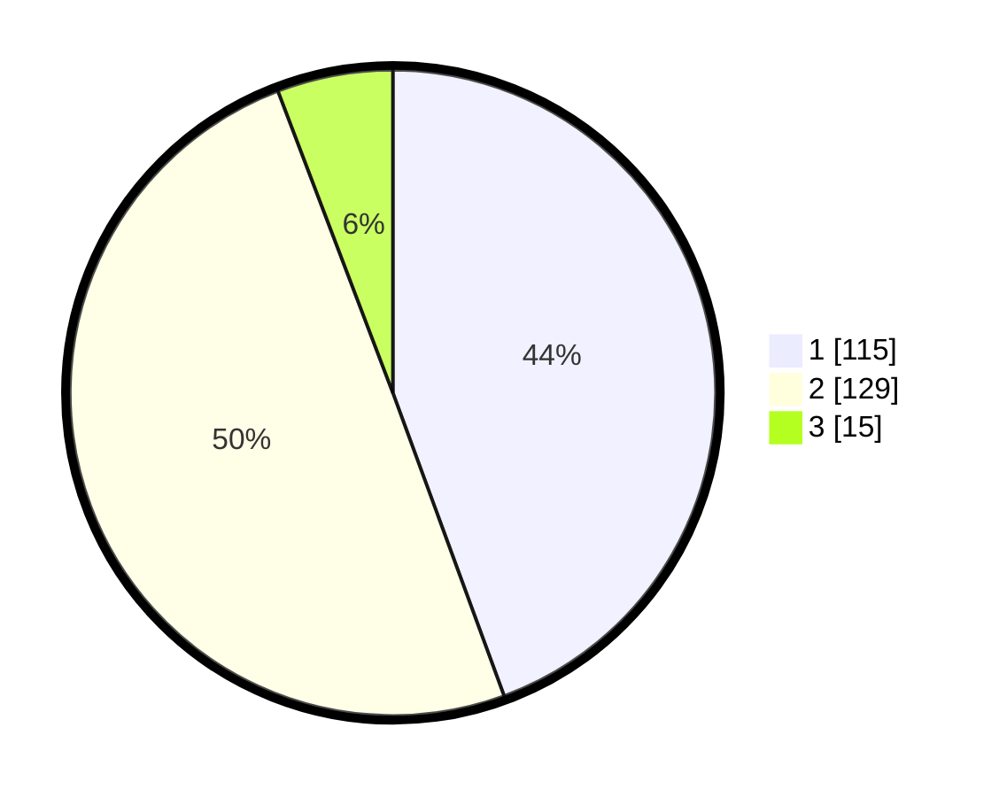

# Hasil

## Grafik

## Tabel

| No. | Nama Paslon    | Suara | Suara (raw) | Persentase |
|:--- |:-------------- | -----:| -----------:| ----------:|
| 1   | ANIES MUHAIMIN | 115   | [115][p-1]  | 44,40      |
| 2   | PRABOWO GIBRAN | 129   | [129][p-2]  | 49,81      |
| 3   | GANJAR MAHFUD  | 15    | [15][p-3]   | 5,79       |

[p-1]: https://github.com/gigit-pemilu/pemilu-2024-35-jawa-timur/blob/main/pilpres/hitung-suara/sub/35-jawa-timur/sub/27-sampang/sub/03-sampang/sub/1008-gunung-sekar/sub/038-tps/sub/paslon-1.txt
[p-2]: https://github.com/gigit-pemilu/pemilu-2024-35-jawa-timur/blob/main/pilpres/hitung-suara/sub/35-jawa-timur/sub/27-sampang/sub/03-sampang/sub/1008-gunung-sekar/sub/038-tps/sub/paslon-2.txt
[p-3]: https://github.com/gigit-pemilu/pemilu-2024-35-jawa-timur/blob/main/pilpres/hitung-suara/sub/35-jawa-timur/sub/27-sampang/sub/03-sampang/sub/1008-gunung-sekar/sub/038-tps/sub/paslon-3.txt

## Foto C Plano

https://sirekap-obj-formc.kpu.go.id/8733/pemilu/ppwp/35/27/03/10/08/3527031008038-20240214-195759--3f2bf688-dc1c-4ed6-b928-fc3b982fbca7.jpg

https://sirekap-obj-formc.kpu.go.id/8733/pemilu/ppwp/35/27/03/10/08/3527031008038-20240214-195837--98cf6529-d735-438a-bf38-212c4bd94aab.jpg

https://sirekap-obj-formc.kpu.go.id/8733/pemilu/ppwp/35/27/03/10/08/3527031008038-20240214-195913--8e922d33-7086-4206-ae90-363677d1bb01.jpg

## Metadata

| Key        | Value               |
| ---------- | ------------------- |
| Time Stamp | 2024-02-16 10:00:28 |

