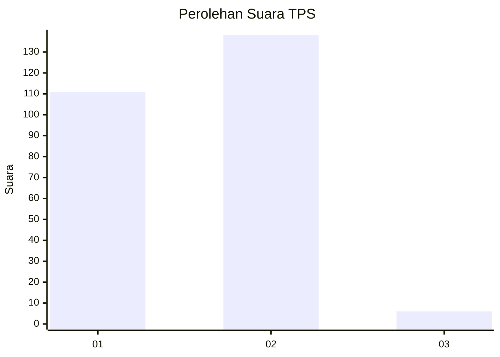
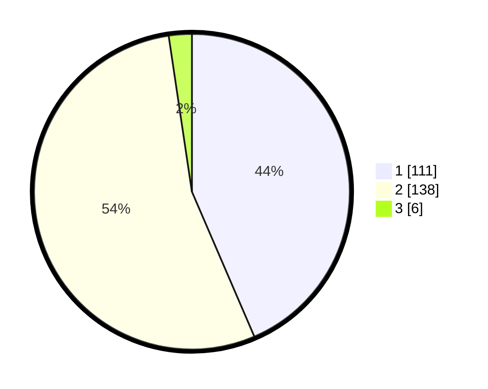

# Hasil

## Grafik

## Tabel

| No. | Nama Paslon    | Suara | Suara (raw) | Persentase |
|:--- |:-------------- | -----:| -----------:| ----------:|
| 1   | ANIES MUHAIMIN | 111   | [111][p-1]  | 43,53      |
| 2   | PRABOWO GIBRAN | 138   | [138][p-2]  | 54,12      |
| 3   | GANJAR MAHFUD  | 6     | [6][p-3]    | 2,35       |

[p-1]: https://github.com/gigit-pemilu/pemilu-2024-35-jawa-timur/blob/main/pilpres/hitung-suara/sub/35-jawa-timur/sub/27-sampang/sub/03-sampang/sub/1008-gunung-sekar/sub/042-tps/sub/paslon-1.txt
[p-2]: https://github.com/gigit-pemilu/pemilu-2024-35-jawa-timur/blob/main/pilpres/hitung-suara/sub/35-jawa-timur/sub/27-sampang/sub/03-sampang/sub/1008-gunung-sekar/sub/042-tps/sub/paslon-2.txt
[p-3]: https://github.com/gigit-pemilu/pemilu-2024-35-jawa-timur/blob/main/pilpres/hitung-suara/sub/35-jawa-timur/sub/27-sampang/sub/03-sampang/sub/1008-gunung-sekar/sub/042-tps/sub/paslon-3.txt

## Foto C Plano

https://sirekap-obj-formc.kpu.go.id/8e49/pemilu/ppwp/35/27/03/10/08/3527031008042-20240214-230133--f4f0fe86-7d8c-4944-9150-3dadb99396ac.jpg

https://sirekap-obj-formc.kpu.go.id/8e49/pemilu/ppwp/35/27/03/10/08/3527031008042-20240214-230227--7aee61b7-f1c7-4a43-a526-692c88832fa0.jpg

https://sirekap-obj-formc.kpu.go.id/8e49/pemilu/ppwp/35/27/03/10/08/3527031008042-20240214-230318--71c0dab2-fa9a-4d08-ab8e-64df79df3f50.jpg

## Metadata

| Key        | Value               |
| ---------- | ------------------- |
| Time Stamp | 2024-02-16 14:00:34 |

