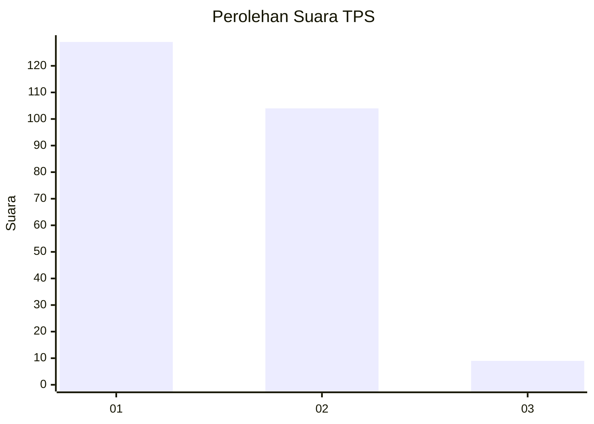
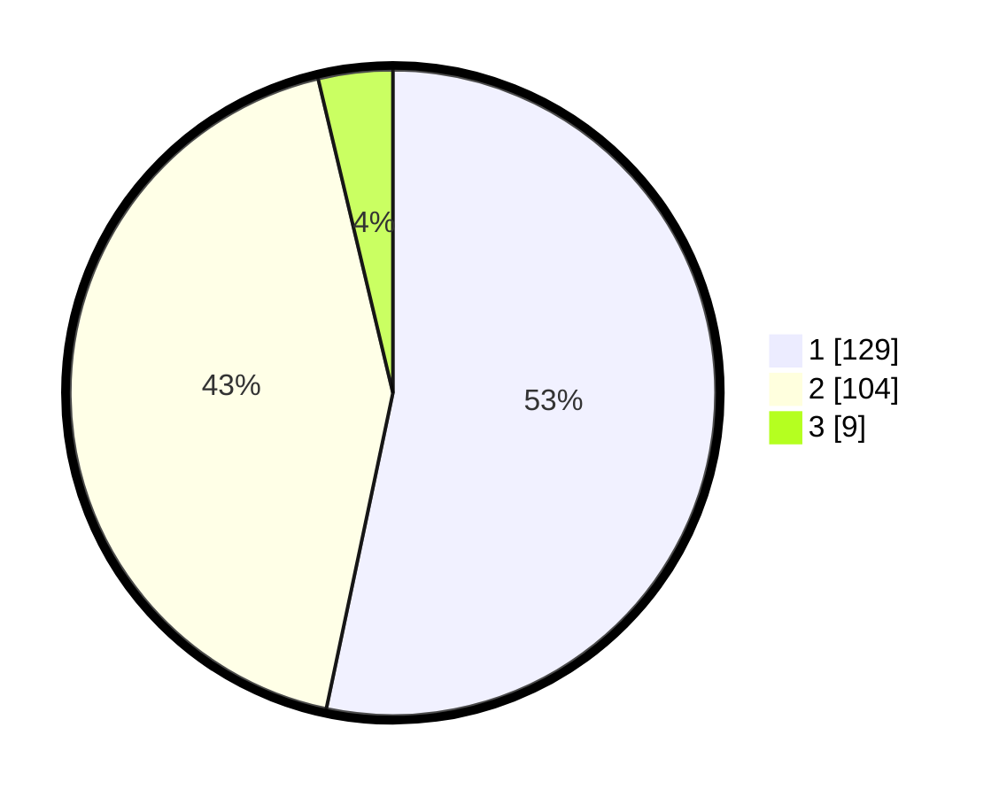

# Hasil

## Grafik

## Tabel

| No. | Nama Paslon    | Suara | Suara (raw) | Persentase |
|:--- |:-------------- | -----:| -----------:| ----------:|
| 1   | ANIES MUHAIMIN | 129   | [129][p-1]  | 53,31      |
| 2   | PRABOWO GIBRAN | 104   | [104][p-2]  | 42,98      |
| 3   | GANJAR MAHFUD  | 9     | [9][p-3]    | 3,72       |

[p-1]: https://github.com/gigit-pemilu/pemilu-2024-35-jawa-timur/blob/main/pilpres/hitung-suara/sub/35-jawa-timur/sub/27-sampang/sub/03-sampang/sub/1009-dalpenang/sub/002-tps/sub/paslon-1.txt
[p-2]: https://github.com/gigit-pemilu/pemilu-2024-35-jawa-timur/blob/main/pilpres/hitung-suara/sub/35-jawa-timur/sub/27-sampang/sub/03-sampang/sub/1009-dalpenang/sub/002-tps/sub/paslon-2.txt
[p-3]: https://github.com/gigit-pemilu/pemilu-2024-35-jawa-timur/blob/main/pilpres/hitung-suara/sub/35-jawa-timur/sub/27-sampang/sub/03-sampang/sub/1009-dalpenang/sub/002-tps/sub/paslon-3.txt

## Foto C Plano

https://sirekap-obj-formc.kpu.go.id/da1b/pemilu/ppwp/35/27/03/10/09/3527031009002-20240214-233556--6151a42e-d45d-4a86-8b2d-a563093fc2d1.jpg

https://sirekap-obj-formc.kpu.go.id/da1b/pemilu/ppwp/35/27/03/10/09/3527031009002-20240214-233846--cefbf2c1-8a28-4eb5-8eab-ff303797d2d7.jpg

https://sirekap-obj-formc.kpu.go.id/da1b/pemilu/ppwp/35/27/03/10/09/3527031009002-20240214-234134--bbb3b867-b2ee-4b33-8e8c-056300643e9f.jpg

## Metadata

| Key        | Value               |
| ---------- | ------------------- |
| Time Stamp | 2024-02-16 11:00:29 |

