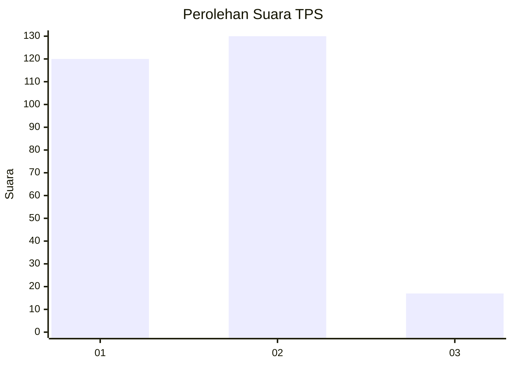
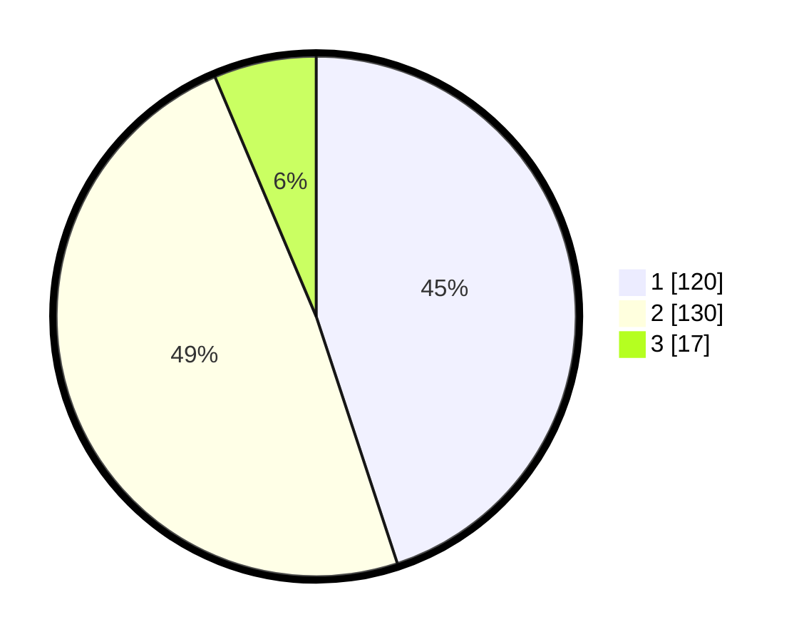

# Hasil

## Grafik

## Tabel

| No. | Nama Paslon    | Suara | Suara (raw) | Persentase |
|:--- |:-------------- | -----:| -----------:| ----------:|
| 1   | ANIES MUHAIMIN | 120   | [120][p-1]  | 44,94      |
| 2   | PRABOWO GIBRAN | 130   | [130][p-2]  | 48,69      |
| 3   | GANJAR MAHFUD  | 17    | [17][p-3]   | 6,37       |

[p-1]: https://github.com/gigit-pemilu/pemilu-2024/blob/main/pilpres/hitung-suara/sub/35-jawa-timur/sub/27-sampang/sub/03-sampang/sub/1009-dalpenang/sub/005-tps/sub/paslon-1.txt
[p-2]: https://github.com/gigit-pemilu/pemilu-2024/blob/main/pilpres/hitung-suara/sub/35-jawa-timur/sub/27-sampang/sub/03-sampang/sub/1009-dalpenang/sub/005-tps/sub/paslon-2.txt
[p-3]: https://github.com/gigit-pemilu/pemilu-2024/blob/main/pilpres/hitung-suara/sub/35-jawa-timur/sub/27-sampang/sub/03-sampang/sub/1009-dalpenang/sub/005-tps/sub/paslon-3.txt

## Foto C Plano

https://sirekap-obj-formc.kpu.go.id/4330/pemilu/ppwp/35/27/03/10/09/3527031009005-20240219-111727--c295b30c-36ff-49da-82f1-086fadd07297.jpg

https://sirekap-obj-formc.kpu.go.id/4330/pemilu/ppwp/35/27/03/10/09/3527031009005-20240219-111318--dac9f5a3-a9fa-45ad-9cdc-a983ee731967.jpg

https://sirekap-obj-formc.kpu.go.id/4330/pemilu/ppwp/35/27/03/10/09/3527031009005-20240219-111456--711106a9-3c27-4501-b8cd-f8dd5a84be9c.jpg

## Metadata

| Key        | Value               |
| ---------- | ------------------- |
| Time Stamp | 2024-02-24 22:31:28 |

