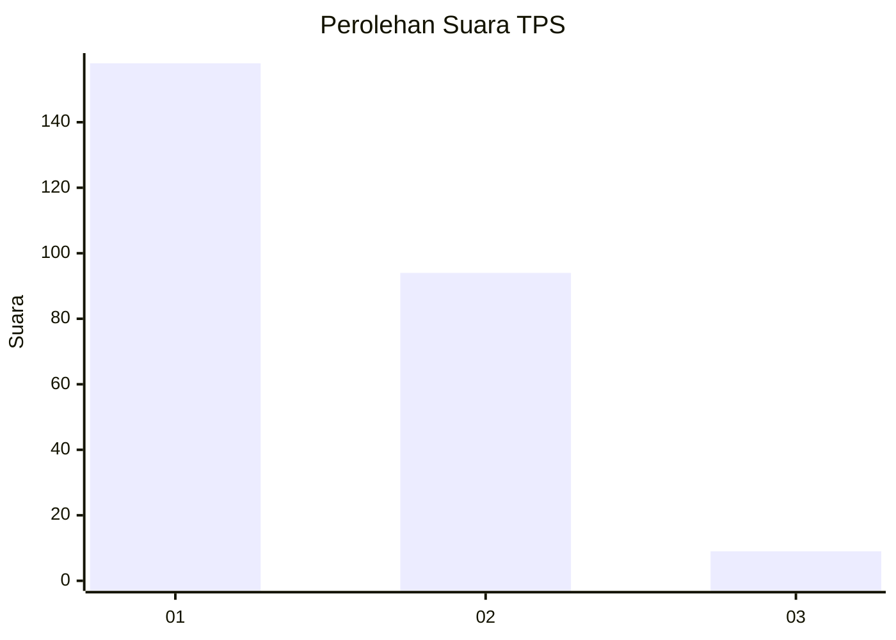
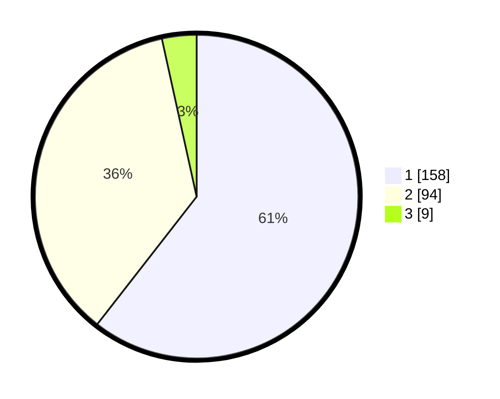

# Hasil

## Grafik

## Tabel

| No. | Nama Paslon    | Suara | Suara (raw) | Persentase |
|:--- |:-------------- | -----:| -----------:| ----------:|
| 1   | ANIES MUHAIMIN | 158   | [158][p-1]  | 60,54      |
| 2   | PRABOWO GIBRAN | 94    | [94][p-2]   | 36,02      |
| 3   | GANJAR MAHFUD  | 9     | [9][p-3]    | 3,45       |

[p-1]: https://github.com/gigit-pemilu/pemilu-2024/blob/main/pilpres/hitung-suara/sub/35-jawa-timur/sub/27-sampang/sub/03-sampang/sub/1009-dalpenang/sub/006-tps/sub/paslon-1.txt
[p-2]: https://github.com/gigit-pemilu/pemilu-2024/blob/main/pilpres/hitung-suara/sub/35-jawa-timur/sub/27-sampang/sub/03-sampang/sub/1009-dalpenang/sub/006-tps/sub/paslon-2.txt
[p-3]: https://github.com/gigit-pemilu/pemilu-2024/blob/main/pilpres/hitung-suara/sub/35-jawa-timur/sub/27-sampang/sub/03-sampang/sub/1009-dalpenang/sub/006-tps/sub/paslon-3.txt

## Foto C Plano

https://sirekap-obj-formc.kpu.go.id/e4af/pemilu/ppwp/35/27/03/10/09/3527031009006-20240215-001955--5dd6104b-967d-4b2e-b652-3185abcec2a1.jpg

https://sirekap-obj-formc.kpu.go.id/e4af/pemilu/ppwp/35/27/03/10/09/3527031009006-20240215-001204--1a4fc1ed-8e0b-477d-970b-ef91327c7461.jpg

https://sirekap-obj-formc.kpu.go.id/e4af/pemilu/ppwp/35/27/03/10/09/3527031009006-20240215-002519--a2e69fbd-1d6b-46a7-93be-496d2be4699b.jpg

## Metadata

| Key        | Value               |
| ---------- | ------------------- |
| Time Stamp | 2024-02-16 11:00:29 |

