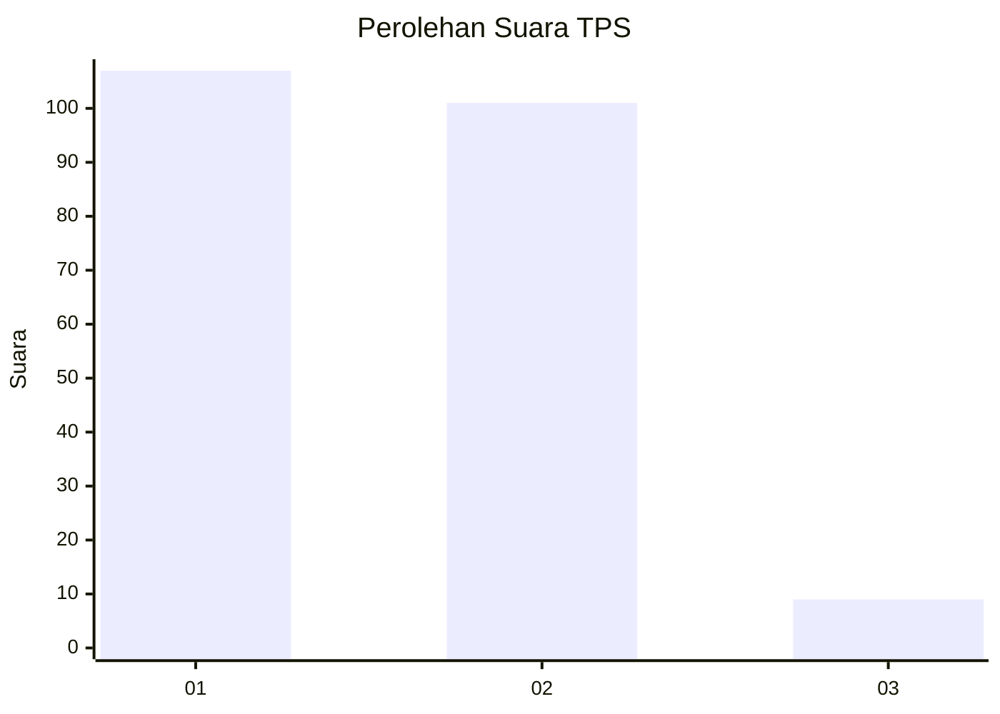
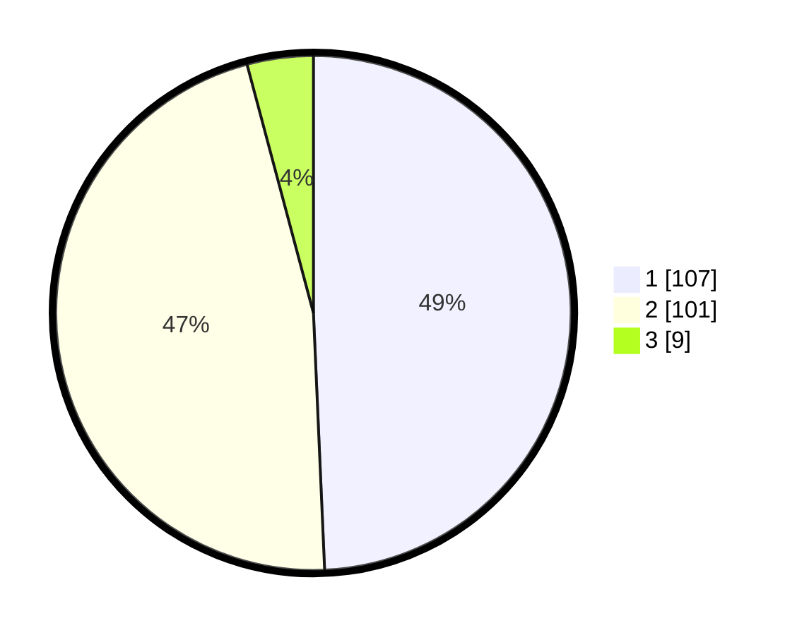

# Hasil

## Grafik

## Tabel

| No. | Nama Paslon    | Suara | Suara (raw) | Persentase |
|:--- |:-------------- | -----:| -----------:| ----------:|
| 1   | ANIES MUHAIMIN | 107   | [107][p-1]  | 49,31      |
| 2   | PRABOWO GIBRAN | 101   | [101][p-2]  | 46,54      |
| 3   | GANJAR MAHFUD  | 9     | [9][p-3]    | 4,15       |

[p-1]: https://github.com/gigit-pemilu/pemilu-2024/blob/main/pilpres/hitung-suara/sub/35-jawa-timur/sub/27-sampang/sub/03-sampang/sub/1009-dalpenang/sub/008-tps/sub/paslon-1.txt
[p-2]: https://github.com/gigit-pemilu/pemilu-2024/blob/main/pilpres/hitung-suara/sub/35-jawa-timur/sub/27-sampang/sub/03-sampang/sub/1009-dalpenang/sub/008-tps/sub/paslon-2.txt
[p-3]: https://github.com/gigit-pemilu/pemilu-2024/blob/main/pilpres/hitung-suara/sub/35-jawa-timur/sub/27-sampang/sub/03-sampang/sub/1009-dalpenang/sub/008-tps/sub/paslon-3.txt

## Foto C Plano

https://sirekap-obj-formc.kpu.go.id/668f/pemilu/ppwp/35/27/03/10/09/3527031009008-20240214-225249--6b882c36-6af6-4265-9ccd-a7353a175c58.jpg

https://sirekap-obj-formc.kpu.go.id/668f/pemilu/ppwp/35/27/03/10/09/3527031009008-20240214-225109--e348f2ce-94f9-4b1e-8107-d53f0a23fc8f.jpg

https://sirekap-obj-formc.kpu.go.id/668f/pemilu/ppwp/35/27/03/10/09/3527031009008-20240214-225215--c5ac2a80-6630-42c6-957e-d7a361b37b1e.jpg

## Metadata

| Key        | Value               |
| ---------- | ------------------- |
| Time Stamp | 2024-02-16 11:00:29 |

