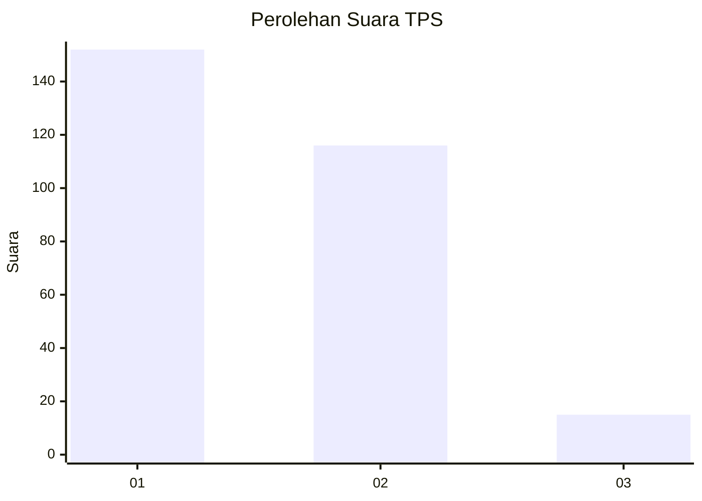
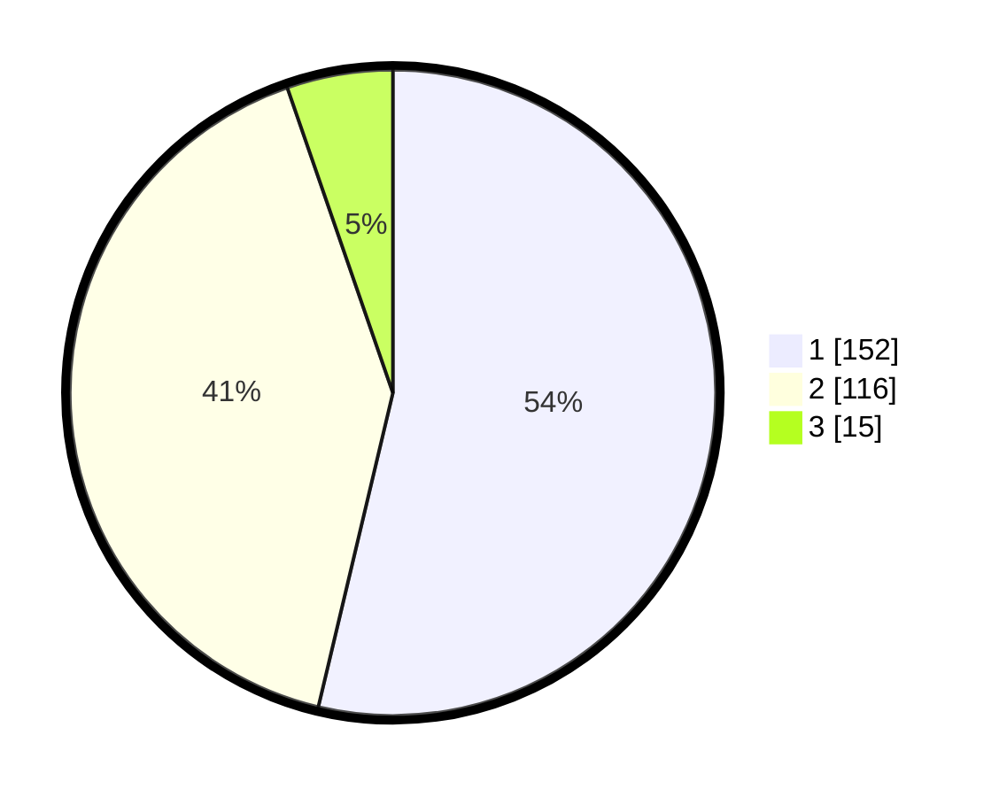

# Hasil

## Grafik

## Tabel

| No. | Nama Paslon    | Suara | Suara (raw) | Persentase |
|:--- |:-------------- | -----:| -----------:| ----------:|
| 1   | ANIES MUHAIMIN | 152   | [152][p-1]  | 53,71      |
| 2   | PRABOWO GIBRAN | 116   | [116][p-2]  | 40,99      |
| 3   | GANJAR MAHFUD  | 15    | [15][p-3]   | 5,30       |

[p-1]: https://github.com/gigit-pemilu/pemilu-2024/blob/main/pilpres/hitung-suara/sub/35-jawa-timur/sub/27-sampang/sub/03-sampang/sub/2001-p-mandangin/sub/021-tps/sub/paslon-1.txt
[p-2]: https://github.com/gigit-pemilu/pemilu-2024/blob/main/pilpres/hitung-suara/sub/35-jawa-timur/sub/27-sampang/sub/03-sampang/sub/2001-p-mandangin/sub/021-tps/sub/paslon-2.txt
[p-3]: https://github.com/gigit-pemilu/pemilu-2024/blob/main/pilpres/hitung-suara/sub/35-jawa-timur/sub/27-sampang/sub/03-sampang/sub/2001-p-mandangin/sub/021-tps/sub/paslon-3.txt

## Foto C Plano

https://sirekap-obj-formc.kpu.go.id/15b7/pemilu/ppwp/35/27/03/20/01/3527032001021-20240214-230051--c760daea-f596-449f-9b94-db29eeb08a4e.jpg

https://sirekap-obj-formc.kpu.go.id/15b7/pemilu/ppwp/35/27/03/20/01/3527032001021-20240214-230214--dd85031a-2cc4-41ef-88a7-8d317a1b1216.jpg

https://sirekap-obj-formc.kpu.go.id/15b7/pemilu/ppwp/35/27/03/20/01/3527032001021-20240214-230319--74235c85-7515-4b97-975d-57e72b92be3a.jpg

## Metadata

| Key        | Value               |
| ---------- | ------------------- |
| Time Stamp | 2024-02-16 11:00:29 |

