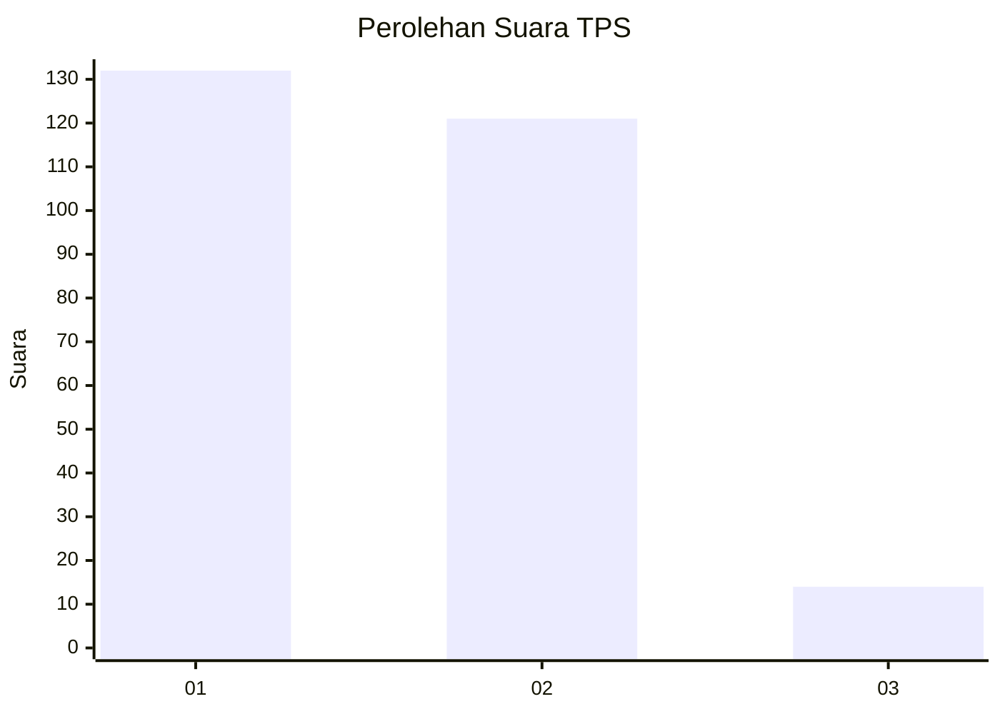
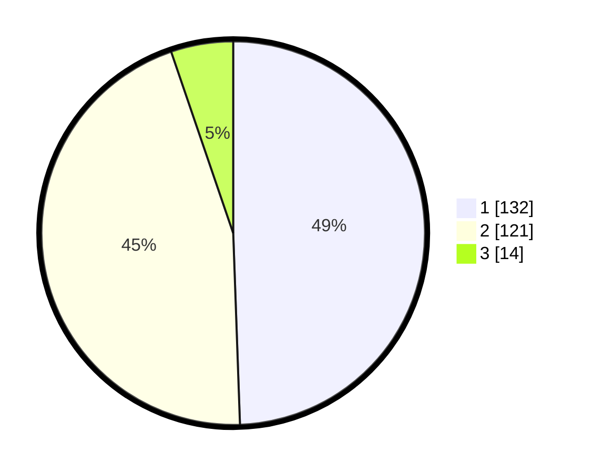

# Hasil

## Grafik

## Tabel

| No. | Nama Paslon    | Suara | Suara (raw) | Persentase |
|:--- |:-------------- | -----:| -----------:| ----------:|
| 1   | ANIES MUHAIMIN | 132   | [132][p-1]  | 49,44      |
| 2   | PRABOWO GIBRAN | 121   | [121][p-2]  | 45,32      |
| 3   | GANJAR MAHFUD  | 14    | [14][p-3]   | 5,24       |

[p-1]: https://github.com/gigit-pemilu/pemilu-2024/blob/main/pilpres/hitung-suara/sub/35-jawa-timur/sub/27-sampang/sub/03-sampang/sub/2001-p-mandangin/sub/045-tps/sub/paslon-1.txt
[p-2]: https://github.com/gigit-pemilu/pemilu-2024/blob/main/pilpres/hitung-suara/sub/35-jawa-timur/sub/27-sampang/sub/03-sampang/sub/2001-p-mandangin/sub/045-tps/sub/paslon-2.txt
[p-3]: https://github.com/gigit-pemilu/pemilu-2024/blob/main/pilpres/hitung-suara/sub/35-jawa-timur/sub/27-sampang/sub/03-sampang/sub/2001-p-mandangin/sub/045-tps/sub/paslon-3.txt

## Foto C Plano

https://sirekap-obj-formc.kpu.go.id/09cd/pemilu/ppwp/35/27/03/20/01/3527032001045-20240215-005406--194b7ef3-4c10-43d1-9629-cfdc95ac31cd.jpg

https://sirekap-obj-formc.kpu.go.id/09cd/pemilu/ppwp/35/27/03/20/01/3527032001045-20240215-003853--7711997b-1566-4201-be42-b3cef9150c20.jpg

https://sirekap-obj-formc.kpu.go.id/09cd/pemilu/ppwp/35/27/03/20/01/3527032001045-20240215-004025--f0b58cac-2b2c-4c92-a0e4-657daf60aed4.jpg

## Metadata

| Key        | Value               |
| ---------- | ------------------- |
| Time Stamp | 2024-02-16 11:00:29 |

