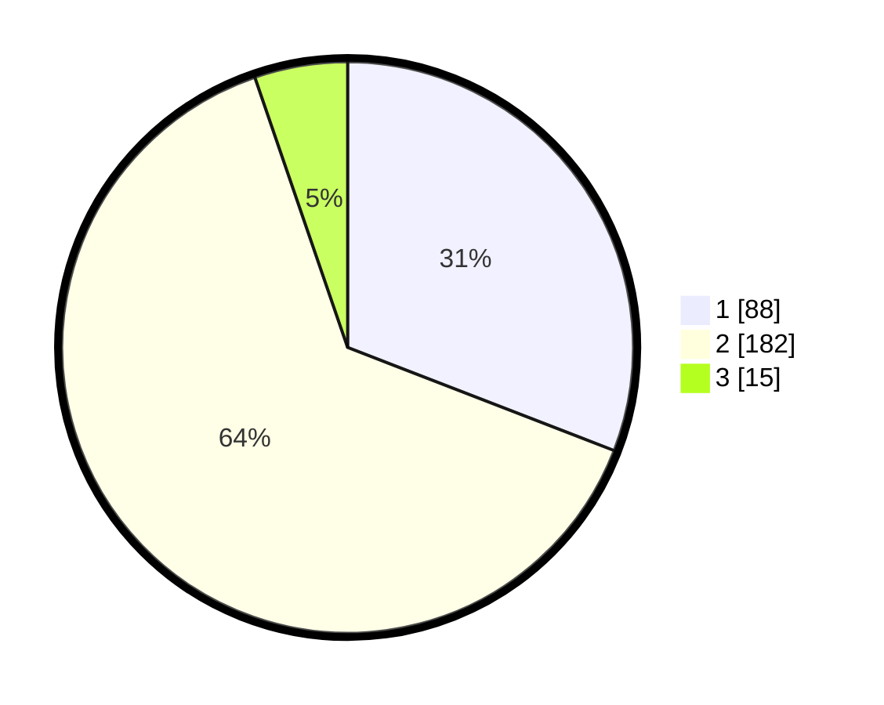

# Hasil

## Grafik

## Tabel

| No. | Nama Paslon    | Suara | Suara (raw) | Persentase |
|:--- |:-------------- | -----:| -----------:| ----------:|
| 1   | ANIES MUHAIMIN | 88    | [88][p-1]   | 30,88      |
| 2   | PRABOWO GIBRAN | 182   | [182][p-2]  | 63,86      |
| 3   | GANJAR MAHFUD  | 15    | [15][p-3]   | 5,26       |

[p-1]: https://github.com/gigit-pemilu/pemilu-2024/blob/main/pilpres/hitung-suara/sub/35-jawa-timur/sub/27-sampang/sub/03-sampang/sub/2002-aengsareh/sub/001-tps/sub/paslon-1.txt
[p-2]: https://github.com/gigit-pemilu/pemilu-2024/blob/main/pilpres/hitung-suara/sub/35-jawa-timur/sub/27-sampang/sub/03-sampang/sub/2002-aengsareh/sub/001-tps/sub/paslon-2.txt
[p-3]: https://github.com/gigit-pemilu/pemilu-2024/blob/main/pilpres/hitung-suara/sub/35-jawa-timur/sub/27-sampang/sub/03-sampang/sub/2002-aengsareh/sub/001-tps/sub/paslon-3.txt

## Foto C Plano

https://sirekap-obj-formc.kpu.go.id/466f/pemilu/ppwp/35/27/03/20/02/3527032002001-20240214-224316--b2f75c28-7e37-4560-bb6b-11b189b2fdbd.jpg

https://sirekap-obj-formc.kpu.go.id/466f/pemilu/ppwp/35/27/03/20/02/3527032002001-20240214-224511--41cb564a-8f3a-4b03-9d71-a9418f6e01e7.jpg

https://sirekap-obj-formc.kpu.go.id/466f/pemilu/ppwp/35/27/03/20/02/3527032002001-20240214-224639--503b5f60-65b7-4194-9ec1-055938482713.jpg

## Metadata

| Key        | Value               |
| ---------- | ------------------- |
| Time Stamp | 2024-02-17 09:30:03 |

